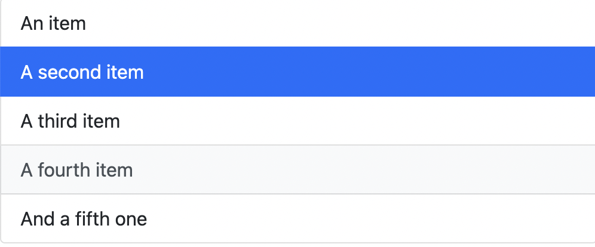

## Dropdown
[드롭다운에 대한 문서와 예제](https://getbootstrap.com/docs/5.1/components/dropdowns/)

### Split button

- 버튼과 메뉴 부분을 좌우로 나누어 구분

```html
<div class="btn-group">
  <button type="button" class="btn btn-danger">Action</button>
  <button type="button" class="btn btn-danger dropdown-toggle dropdown-toggle-split" data-bs-toggle="dropdown" aria-expanded="false">
    <span class="visually-hidden">Toggle Dropdown</span>
  </button>
  <ul class="dropdown-menu">
    <li><a class="dropdown-item" href="#">Action</a></li>
    <li><a class="dropdown-item" href="#">Another action</a></li>
    <li><a class="dropdown-item" href="#">Something else here</a></li>
    <li><hr class="dropdown-divider"></li>
    <li><a class="dropdown-item" href="#">Separated link</a></li>
  </ul>
</div>
```


### List group

- [Docs](https://getbootstrap.com/docs/5.1/components/list-group/)

```html
<ul class="list-group">
  <li class="list-group-item">An item</li>
  <li class="list-group-item">A second item</li>
  <li class="list-group-item">A third item</li>
  <li class="list-group-item">A fourth item</li>
  <li class="list-group-item">And a fifth one</li>
</ul>
```

→ 해당 코드 실행 시 리스트만 나타나고 동작하지 않으므로 동작시키기 위해 Active 클래스 사용해 줘야 함

### Active items

- `.disabled`를 `.list-group-item` 뒤에 추가
- [Docs](https://getbootstrap.com/docs/5.1/components/list-group/#active-items)

```html
<ul class="list-group">
  <li class="list-group-item active" aria-current="true">An active item</li>
  <li class="list-group-item">A second item</li>
  <li class="list-group-item">A third item</li>
  <li class="list-group-item">A fourth item</li>
  <li class="list-group-item">And a fifth one</li>
</ul>
```

### Disabled items

- `.active`를 `.list-group-item` 뒤에 추가
- [Docs](https://getbootstrap.com/docs/5.1/components/list-group/#disabled-items)

```html
<ul class="list-group">
  <li class="list-group-item disabled" aria-disabled="true">A disabled item</li>
  <li class="list-group-item">A second item</li>
  <li class="list-group-item">A third item</li>
  <li class="list-group-item">A fourth item</li>
  <li class="list-group-item">And a fifth one</li>
</ul>
```

### Links and buttons

- 각각의 항목에 `.list-group-item-action`를 추가하면 `hover`나 `disabled`를 active 상태로 추가 가능
- [Docs](https://getbootstrap.com/docs/5.1/components/list-group/#links-and-buttons)

```html
<div class="list-group">
  <a href="#" class="list-group-item list-group-item-action active" aria-current="true">
    The current link item
  </a>
  <a href="#" class="list-group-item list-group-item-action">A second link item</a>
  <a href="#" class="list-group-item list-group-item-action">A third link item</a>
  <a href="#" class="list-group-item list-group-item-action">A fourth link item</a>
  <a class="list-group-item list-group-item-action disabled">A disabled link item</a>
</div>
```

예제

```html
<ul class="list-group">
    <li class="list-group-item list-group-item-action">An item</li>
    <li class="list-group-item list-group-item-action active">A second item</li>
    <li class="list-group-item list-group-item-action">A third item</li>
    <li class="list-group-item list-group-item-action">A fourth item</li>
    <li class="list-group-item list-group-item-action">And a fifth one</li>
  </ul>
```

