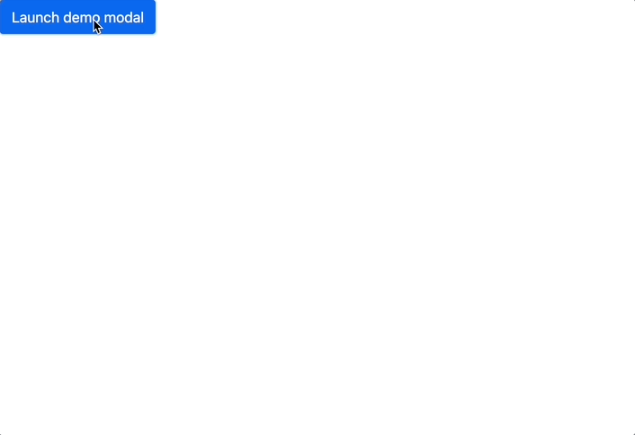
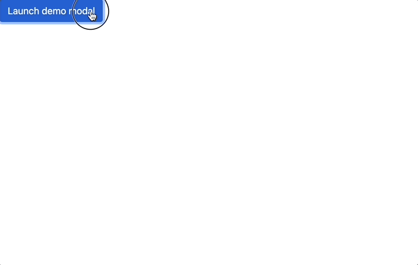

## Modal
[Modal에 대한 문서](https://getbootstrap.com/docs/5.1/components/modal/)

### JS로 모달 만들기

```jsx
var myModal = document.getElementById('myModal')
var myInput = document.getElementById('myInput')

myModal.addEventListener('shown.bs.modal', function () {
  myInput.focus()
})
```

예제

```jsx
<body>
  <!-- Button trigger modal -->
  <button type="button" class="btn btn-primary" data-bs-toggle="modal" data-bs-target="#exampleModal">
    Launch demo modal
  </button>

  <!-- Modal -->
  <div class="modal fade" id="exampleModal" tabindex="-1" aria-labelledby="exampleModalLabel" aria-hidden="true">
    <div class="modal-dialog">
      <div class="modal-content">
        <div class="modal-header">
          <h5 class="modal-title" id="exampleModalLabel">Modal title</h5>
          <button type="button" class="btn-close" data-bs-dismiss="modal" aria-label="Close"></button>
        </div>
        <div class="modal-body">
          <form>
            <div class="mb-3">
              <label for="exampleInputEmail1" class="form-label">Email address</label>
              <input type="email" class="form-control" id="exampleInputEmail1" aria-describedby="emailHelp">
              <div id="emailHelp" class="form-text">We'll never share your email with anyone else.</div>
            </div>
            <div class="mb-3">
              <label for="exampleInputPassword1" class="form-label">Password</label>
              <input type="password" class="form-control" id="exampleInputPassword1">
            </div>
            <div class="mb-3 form-check">
              <input type="checkbox" class="form-check-input" id="exampleCheck1">
              <label class="form-check-label" for="exampleCheck1">Check me out</label>
            </div>
          </form>
        </div>
        <div class="modal-footer">
          <button type="button" class="btn btn-secondary" data-bs-dismiss="modal">Close</button>
          <button type="submit" class="btn btn-primary">Submit</button>
        </div>
      </div>
    </div>
  </div>
</body>
```



### JS 코드 사용하여 focus 기능 추가

```jsx
const emailInputEl = document.querySelector('#exampleInputEmail1')
const modalEl = document.querySelector('#exampleModal')

modalEl.addEventListener('shown.bs.modal', function () {
  emailInputEl.focus()
})
```




### Events

- `show.bs.modal`: 보여지기 시작할 때 이벤트 동작
- `shown.bs.modal`: 보여진 이후 이벤트 동작
- [Docs](https://getbootstrap.com/docs/5.1/components/modal/)