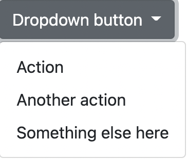
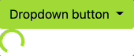

## npm 프로젝트 생성

```bash
npm init -y
npm i -D parcel-bundler
```

bootstrap 설치

```bash
npm install bootstrap@next
```

`package.json` 수정

```json
"scripts": {
    "dev": "parcel index.html",
    "build": "parcel build index.html"
}
```

Scss 코드 추가 후 npm 프로젝트 실행

```scss
$color: orange;

body {
  background-color: $color;
}
```

```bash
npm run dev
```

bootstrap JS 파일 가지고 오기

- `bundle` 파일로 가지고 와 `popper` 기능도 적용

```jsx
import bootstrap from 'bootstrap/dist/js/bootstrap.bundle'
```

Scss에도 마찬가지로 가지고 옴

```scss
@import "../node_modules/bootstrap/scss/bootstrap";
// 확장자 생략 가능
// @import "../node_modules/bootstrap/scss/bootstrap.scss";

// node_modules 폴더로 바로 접근 가능한 것은 JS 파일이므로 SCSS에서는 상대경로로 작성
```

<br/>

### HTML 코드

```html
<!DOCTYPE html>
<html lang="en">
<head>
  <meta charset="UTF-8">
  <meta http-equiv="X-UA-Compatible" content="IE=edge">
  <meta name="viewport" content="width=device-width, initial-scale=1.0">
  <title>Document</title>
  <link rel="stylesheet" href="./scss/main.scss" />
  <script defer src="./main.js"></script>
</head>
<body>
  <div class="dropdown">
    <button class="btn btn-secondary dropdown-toggle" type="button" id="dropdownMenuButton1" data-bs-toggle="dropdown" aria-expanded="false">
      Dropdown button
    </button>
    <ul class="dropdown-menu" aria-labelledby="dropdownMenuButton1">
      <li><a class="dropdown-item" href="#">Action</a></li>
      <li><a class="dropdown-item" href="#">Another action</a></li>
      <li><a class="dropdown-item" href="#">Something else here</a></li>
    </ul>
  </div>
</body>

</html>
```



### npm 프로젝트의 장점

- bootstrap에서 필요로 하는 기능만 가지고 올 수 있음
- 기본적인 bootstrap 테마를 커스터마이징 가능

## 테마 색상 커스터마이징

Theme colors

- 임의적으로 색상 변경 가능
- [Docs](https://getbootstrap.com/docs/5.1/customize/color/#theme-colors)

```sass
$theme-colors: (
  "primary":    $primary,
  "secondary":  $secondary,
  "success":    $success,
  "info":       $info,
  "warning":    $warning,
  "danger":     $danger,
  "light":      $light,
  "dark":       $dark
);
```

Maps and Loops

- 따로 가지고 올 때 사용

```sass
// Required
@import "../node_modules/bootstrap/scss/functions";
@import "../node_modules/bootstrap/scss/variables";
@import "../node_modules/bootstrap/scss/mixins";
```

<br/>

예제

Scss

```sass
@import "../node_modules/bootstrap/scss/functions";
@import "../node_modules/bootstrap/scss/variables";
@import "../node_modules/bootstrap/scss/mixins";

$theme-colors: (
  "primary":    $primary,
  "secondary":  $secondary,
  "success":    $success,
  "info":       $info,
  "warning":    $warning,
  "danger":     $danger,
  "light":      $light,
  "dark":       $dark
);
```

→ 드롭다운의 색깔이 기본값인 회색으로 출력

<br/>

원하는 색으로 수정

```sass
@import "../node_modules/bootstrap/scss/functions";
@import "../node_modules/bootstrap/scss/variables";
@import "../node_modules/bootstrap/scss/mixins";

$theme-colors: (
  "primary":    $primary,
  "secondary":  yellowgreen,
  "success":    $success,
  "info":       $info,
  "warning":    $warning,
  "danger":     $danger,
  "light":      $light,
  "dark":       $dark
);
```

html 코드에 spinner 코드 추가

```html
<div class="spinner-border text-secondary" role="status">
    <span class="visually-hidden">Loading...</span>
</div>
```


