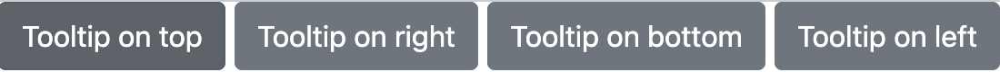

## Tooltips

Tooltips라는 컴포넌트는 성능 상의 이유로 포함되어 있지 않기 때문에 주기적으로 초기화 해 주어야 함

→ 정확히 명시해 주어야 동작한다는 뜻

버튼에 포인터를 올리면 설명을 포함한 말풍선이 뜨게 됨


예제

```html
<button type="button" class="btn btn-secondary" data-bs-toggle="tooltip" data-bs-placement="top" title="Tooltip on top">
    Tooltip on top
  </button>
  <button type="button" class="btn btn-secondary" data-bs-toggle="tooltip" data-bs-placement="right" title="Tooltip on right">
    Tooltip on right
  </button>
  <button type="button" class="btn btn-secondary" data-bs-toggle="tooltip" data-bs-placement="bottom" title="Tooltip on bottom">
    Tooltip on bottom
  </button>
  <button type="button" class="btn btn-secondary" data-bs-toggle="tooltip" data-bs-placement="left" title="Tooltip on left">
    Tooltip on left
  </button>
```



→ 포인터를 올려도 툴팁이 뜨지 않음

→ 툴팁은 정확하게 명시해 주어야 작동하므로 JS 이용하여 코드 작성 필요

### JS 코드 추가

```jsx
var tooltipTriggerList = [].slice.call(document.querySelectorAll('[data-bs-toggle="tooltip"]'))
var tooltipList = tooltipTriggerList.map(function (tooltipTriggerEl) {
  return new bootstrap.Tooltip(tooltipTriggerEl)
})
```

