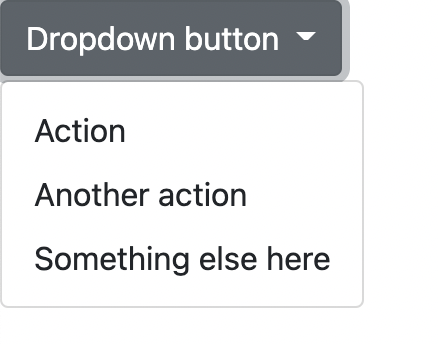

## 개요

[BootStrap에 대한 Docs](https://getbootstrap.com/docs)

- 버튼 클래스를 이용하여 다양한 스타일의 버튼 생성 가능
- 버튼 뿐만 아닌 UI Component 제공

```html
<button type="button" class="btn btn-primary">Primary</button>
<button type="button" class="btn btn-secondary">Secondary</button>
<button type="button" class="btn btn-success">Success</button>
<button type="button" class="btn btn-danger">Danger</button>
<button type="button" class="btn btn-warning">Warning</button>
<button type="button" class="btn btn-info">Info</button>
<button type="button" class="btn btn-light">Light</button>
<button type="button" class="btn btn-dark">Dark</button>

<button type="button" class="btn btn-link">Link</button>
```

<br/>

## CDN 프로젝트 생성

CSS에서 사용하기

```html
<link href="https://cdn.jsdelivr.net/npm/bootstrap@5.1.1/dist/css/bootstrap.min.css" rel="stylesheet" integrity="sha384-F3w7mX95PdgyTmZZMECAngseQB83DfGTowi0iMjiWaeVhAn4FJkqJByhZMI3AhiU" crossorigin="anonymous">
```

JS에서 사용하기

- Bundle([Popper.js](https://popper.js.org/)를 묶어서 가지고 옴)
    - Popper: 팝업창을 쉽게 만들 수 있는 js 라이브러리

```html
<script src="https://cdn.jsdelivr.net/npm/bootstrap@5.1.1/dist/js/bootstrap.bundle.min.js" integrity="sha384-/bQdsTh/da6pkI1MST/rWKFNjaCP5gBSY4sEBT38Q/9RBh9AH40zEOg7Hlq2THRZ" crossorigin="anonymous"></script>
```

- 별도 제공

```html
<script src="https://cdn.jsdelivr.net/npm/@popperjs/core@2.9.3/dist/umd/popper.min.js" integrity="sha384-W8fXfP3gkOKtndU4JGtKDvXbO53Wy8SZCQHczT5FMiiqmQfUpWbYdTil/SxwZgAN" crossorigin="anonymous"></script>
<script src="https://cdn.jsdelivr.net/npm/bootstrap@5.1.1/dist/js/bootstrap.min.js" integrity="sha384-skAcpIdS7UcVUC05LJ9Dxay8AXcDYfBJqt1CJ85S/CFujBsIzCIv+l9liuYLaMQ/" crossorigin="anonymous"></script>
```

예제

```html
<!DOCTYPE html>
<html lang="en">
<head>
  <meta charset="UTF-8">
  <meta http-equiv="X-UA-Compatible" content="IE=edge">
  <meta name="viewport" content="width=device-width, initial-scale=1.0">
  <title>Document</title>
  <link href="https://cdn.jsdelivr.net/npm/bootstrap@5.1.1/dist/css/bootstrap.min.css" rel="stylesheet" integrity="sha384-F3w7mX95PdgyTmZZMECAngseQB83DfGTowi0iMjiWaeVhAn4FJkqJByhZMI3AhiU" crossorigin="anonymous">
  <script src="https://cdn.jsdelivr.net/npm/bootstrap@5.1.1/dist/js/bootstrap.bundle.min.js" integrity="sha384-/bQdsTh/da6pkI1MST/rWKFNjaCP5gBSY4sEBT38Q/9RBh9AH40zEOg7Hlq2THRZ" crossorigin="anonymous"></script>
</head>
<body>
  <div class="dropdown">
    <button class="btn btn-secondary dropdown-toggle" type="button" id="dropdownMenuButton1" data-bs-toggle="dropdown" aria-expanded="false">
      Dropdown button
    </button>
    <ul class="dropdown-menu" aria-labelledby="dropdownMenuButton1">
      <li><a class="dropdown-item" href="#">Action</a></li>
      <li><a class="dropdown-item" href="#">Another action</a></li>
      <li><a class="dropdown-item" href="#">Something else here</a></li>
    </ul>
  </div>
</body>
</html>
```

