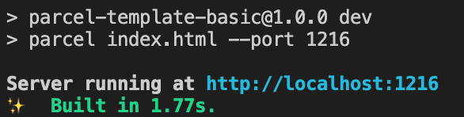

## CLI

단어로 명령을 입력하는 것

- ex) npm run dev
- [parcel.org](https://ko.parceljs.org/)

### 명령어

#### Serve

- 개발용 서버를 시작
- 앱이 수정되면 자동으로 다시 빌드하고, 빠른 개발을 위해 빠른 모듈 교체를 지원

```json
parcel index.html
```

#### Build

- 애셋을 한 번 빌드
- 이 과정에서 코드 최소화(미니파이케이션)가 활성화되고 환경변수가 `NODE_ENV=production` 로 설정

```json
parcel build index.html
```

### 옵션

#### 결과물 디렉토리

- 기본값: dist
- 폴더 이름 바꾸고 싶은 경우 아래와 같이 입력

```json
parcel build entry.js --out-dir build/output
# 혹은
parcel build entry.js -d build/output
```

#### 포트 번호

- 기본값: 1234
- 포트 번호 변경하려는 경우 아래와 같이 입력

```json
parcel serve entry.js --port 1111
```

#### 브라우저에서 열기

- 기본값: 비활성
- 활성화하고 싶은 경우 아래와 같이 입력

```json
parcel entry.js --open
```

#### 빠른 모듈 교체 비활성화

- 기본값: HMR 활성
    - 빠른 모듈 교체(HMR): 런타임에 페이지 새로고침 없이 수정된 내용을 자동으로 갱신하는 방식
- 비활성화하려는 경우 아래와 같이 입력

```json
parcel entry.js --no-hmr
```

#### 파일 시스템 캐시 비활성화

- 기본값: 캐시 활성
    - 캐시 사용 시 빠르게 로딩 가능
- 비활성화하려는 경우 아래와 같이 입력
    - 속도는 느릴 수 있으나 매번 새로운 내용 출력 가능

```json
parcel build entry.js --no-cache
```

<br/>

예제
- 포트 번호 변경하기

```json
"scripts": {
    "dev": "parcel index.html --port 1216",
    "build": "parcel build index.html"
  }
```



`parcel-bundler`를 최대한 개발자가 따로 구성 옵션을 제공하지 않고 자동화하여 동작시키는 것이 핵심이므로 꼭 필요에 따라서만 옵션 제공할 것을 권장