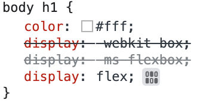

## autoprefixer

각 브라우저의 밴더사(Microsoft Edge의 MS, Chrome의 Google etc)가 자신의 브라우저에에 동작할 수 있는 구조를 만들어 놓게 됨

그러나 표준 기술은 아니기 때문에 `webkit`이나 `ms`라는 접두사를 붙여 사용

- 구형 브라우저를 사용하는 경우 `display: flex;` 같은 일반적인 기능이 작동하지 않음
- 특정 브라우저에서 동작 가능한 경우 다른 접두사를 가지는 브라우저는 동작하지 않게 됨
- 구형 브라우저에서도 최신의 css 기술이 동작할 수 있도록 공급 업체 접두사(Vender Prefix)를 붙여 줌
    - 이를 자동으로 수행해 주는 패키지가 `autoprefixer`

<br/>

패키지 설치

```bash
npm i -D postcss autoprefixer
```

package.json 코드 입력

- 전 세계 점유율이 1% 이상인 모든 브라우저의 마지막 두 버전까지는 지원하겠다는 뜻

```bash
"browserslist": [
    "> 1%",
    "last 2 versions"
  ]
```

`.postcssrc.js` 파일 생성

- .로 시작하는 파일은 구성 옵션이나 숨김 파일을 의미
- rc(Runtime Configuration)가 붙은 파일은 구성 파일

```jsx
// import autofrefixer from 'autoprefixer'
const autoprefixer = require('autoprefixer')

// export {
//   plugins: [
//     autoprefixer
//   ]
// }
module.exports = {
  plugins: [
    autoprefixer
  ]
}
```

→ `bundler`를 통해 변환하여 사용하기 때문에 브라우저에서 동작하는 것이 아닌 `node.js`에서 CommonJS 형식으로 동작

→ `import` 대신 `require`, `export` 대신 `module.exports` 사용

<br/>

간략하게 정리한 코드

```jsx
module.exports = {
  plugins: [
    require('autoprefixer')
  ]
}
```

<br/>

npm 서버 열면 `autoprefixer`와 `postcss`의 버전이 충돌하므로 `autoprefixer`를 다운그레이드

```bash
npm i -D autoprefixer@9
```

다운그레이드 후 `h1` 태그의 속성 다음과 같이 수정하여 개발자 도구 확인

```scss
body {
  background-color: $color--black;
  h1 {
    color: $color--white;
    display: flex;
  }
}
```

