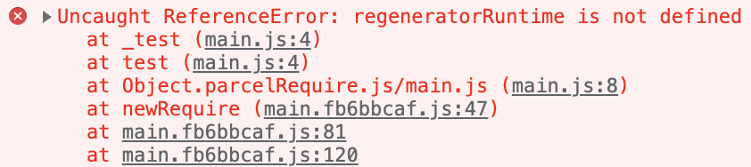
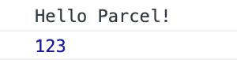

## Babel

ECMAScript 2015+ 코드를 이전 JavaScript 엔진에서 실행할 수 있는 이전 버전과 호환되는 JavaScript 버전으로 변환하는 데 주로 사용되는 무료 오픈 소스 JavaScript 트랜스컴파일러

최신 JS 문법은 ES6, ES7, ES8이기 때문에 구형 브라우저에서 작동하는 예전 문법인 ES5 버전으로 변환하는 컴파일 과정을 거쳐야 함

- 이 과정에서 사용되는 `Babel`이 컴파일러가 됨
- [Babeljs.io](https://babeljs.io/)

<br/>

패키지 설치

```bash
npm i -D @babel/core @babel/preset-env
```

.babelrc.js 생성

- 해당 코드 입력으로 구 버전 문법으로 변환 기능 추가

```jsx
module.exports = {
  presets: ['@babel/preset-env']
}
```

main.js에 코드 추가

```jsx
console.log('Hello Parcel!')

// 비동기함수
async function test() {
  const promise = Promise.resolve(123)
  console.log(await promise)
}
test()
```



→ 패키지 적용을 하긴 했으나 `async`는 기본적으로 제공하고 있지 않아 `ReferenceError` 출력

<br/>

해결하기 위한 패키지 설치

```bash
npm i -D @babel/plugin-transform-runtime
```

.babelrc.js에 코드 추가

```jsx
module.exports = {
  presets: ['@babel/preset-env'],
  plugins: [
    ['@babel/plugin-transform-runtime']
  ]
}
```

