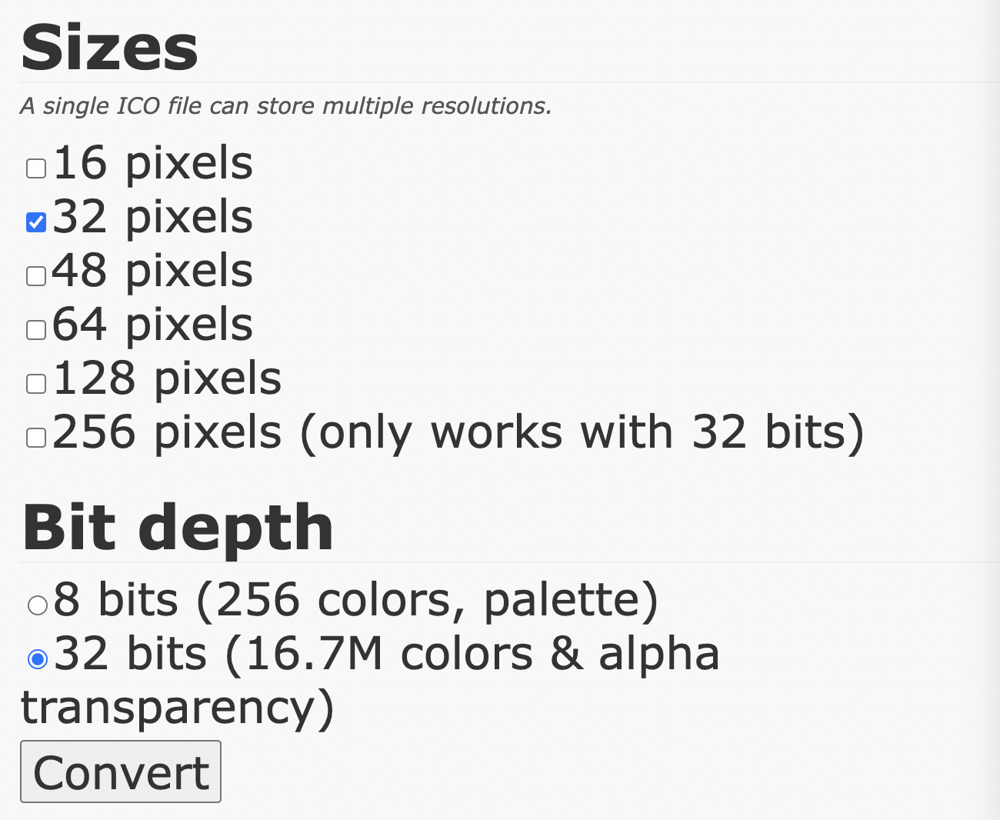

## 정적 파일 연결

[ico converter](https://www.icoconverter.com/) 사용하여 파비콘 생성



<br/>

원본 `logo.png` 파일과 `pavicon.ico`를 프로젝트 폴더에 넣게 되면 `pavicon`이 개발 서버에 뜨지 않음

- dist 폴더 안의 내용들이 웹 서버가 사용하는 파일인데 해당 폴더 안에 `pavicon.ico` 파일이 없기 때문에 뜨지 않음


- 해당 문제를 해결해 줄 플러그인 설치

```bash
npm i -D parcel-plugin-static-files-copy
```

- package.json 파일에 코드 추가

```json
"staticFiles": {
    "staticPath": "static",
  }
```

개발 서버 재실행 시 `dist` 폴더 안에 `favicon이` 해쉬 파일로 생성되는 것과 개발 서버 상단에 표시되는 것을 확인 가능