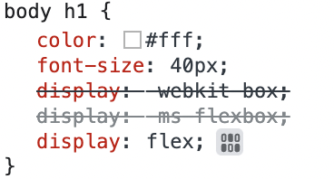
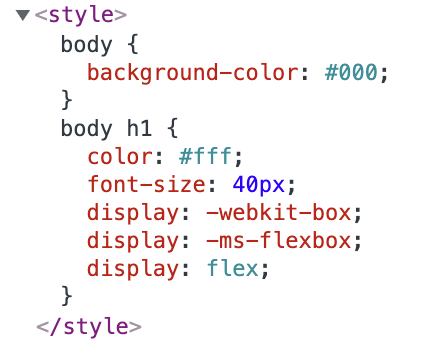

## Autoprefixer(PostCSS)

`main.scss` 수정

```scss
$color--black: #000;
$color--white: #fff;

body {
  background-color: $color--black;
  h1 {
    color: $color--white;
    font-size: 40px;
    display: flex;
  }
}
```

공급 업체 접두사를 자동으로 추가해 주는 패키지 설치

- `postcss`: 스타일의 후처리를 도움
- `autoprefixer`: 공급업체 접두사 자동으로 추가
- `postcss-loader`: postcss를 동작시키는 로더

```bash
npm i -D postcss autoprefixer postcss-loader
```

<br/>

`webpack.config.js` 수정

- `css-loader` 다음 순서로 작성해야 함
1. `sass-loader`를 통해 스타일 해석
2. `postcss-loader`로 공급 업체 접두사 사용 후 css 플러그인들을 사용 가능하게 함
3. `css-loader`로 css 읽음
4. `style-loader` 통해서 `index.html`에 삽입

```jsx
module: {
    rules: [
      {
        test: /\.s?css$/,
        use: [
          'style-loader',
          'css-loader',
          'postcss-loader',
          'sass-loader'
        ]
      }
    ]
  },
```

<br/>

`package.json` 파일에 브라우저 리스트 추가

- 프로젝트가 어떠한 브라우저를 대상으로 하고 있는지 명시
- 전 세계 1퍼센트 이상의 브라우저의 마지막 두 개 버전 지원

```json
"browserslist": [
    ">1%",
    "last 2 versions"
  ]
```

<br/>

`.postcssrc.js` 파일 추가

- postcss 플러그인으로 사용한 autoprefixer라는 패키지를 require를 통해 가지고 와 module.expots를 통해 dist로 내보냄

```jsx
module.exports = {
  plugins: [
    require('autoprefixer')
  ]
}
```

<br/>

개발 서버 오픈

- webkit이 뜨는 것을 보아 잘 작동함을 확인 가능




