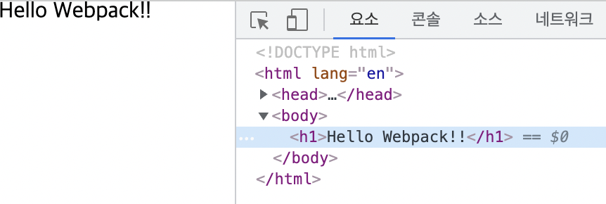

## plugins

```jsx
// import
const path = require('path')
const HtmlPlugin = require('html-webpack-plugin')

// export
module.exports = {
  // 파일을 읽어들이기 시작하는 진입점 설정
  entry: './js/main.js',

  // 결과물(번들)을 변환하는 설정
  output: {
    // path: path.resolve(__dirname, 'dist'), 
    // filename: 'main.js',
    clean: true
  },

	// 번들링 후 결과물의 처리 방식 등 다양한 플러그인들을 설정
  plugins: [
    new HtmlPlugin({
      template: './index.html'
       // 반환된 결과가 첫 번째 배열 데이터로 삽입
    })
  ]
}
```

1. entry로 시작해 js 폴더 안의 `main.js`를 읽어 ouput의 옵션으로 만듦
2. 그 과정에서 `plugins`에서 명시된 내용을 실행하여 반환
3. webpack의 `HtmlPlugin` 안의 template으로 `index.html` 지정
4. `index.html`과 `main.js`가 병합된 합본을 `dist` 안으로 보내게 됨

<br/>

개발 서버 열기

```bash
npm run dev
```

→ 확인하면 개발 서버 주소가 완벽하게 뜨지 않음

<br/>

`webpack.config.js` 파일에 코드 추가

```jsx
	plugins: [
    new HtmlPlugin({
      template: './index.html'
      // 반환된 결과가 첫 번째 배열 데이터로 삽입
    })
  ],

	// 추가
  devServer: {
    host: 'localhost'
  }
```



`Error: Cannot find module 'html-webpack-plugin'` 오류 발생 시 `html-webpack-plugin` 수동 설치

```bash
npm install html-webpack-plugin --save-dev
```