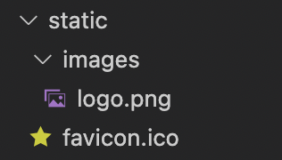
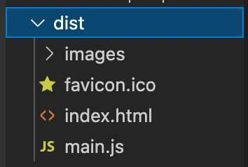

## 정적 파일 연결

images.png와 favicon.ico 준비



```jsx
<body>
  <h1>Hello Webpack!!</h1>
  
</body>
```

- `index.html` 파일 근처에서 images 폴더로 찾을 수 없으나 번들로 최종 변환 시 dist에서 images는 근처에서 찾을 수 있는 구조로 됨
- 해당 기능을 제공해 주는 패키지 설치

```bash
npm i -D copy-webpack-plugin
```

<br/>

`webpack.config.js` 수정

- `CopyPlugin` 추가

```jsx
// import
const path = require('path')
const HtmlPlugin = require('html-webpack-plugin')
const CopyPlugin = require('copy-webpack-plugin')

// export
module.exports = {
  // 파일을 읽어들이기 시작하는 진입점 설정
  entry: './js/main.js',

  // 결과물(번들)을 변환하는 설정
  output: {
    // path: path.resolve(__dirname, 'dist'), 
    // filename: 'main.js',
    clean: true
  },

	// 번들링 후 결과물의 처리 방식 등 다양한 플러그인들을 설정
  plugins: [
    new HtmlPlugin({
      template: './index.html'
      // 반환된 결과가 첫 번째 배열 데이터로 삽입
    }),
    new CopyPlugin ({
      patterns: [
        { from: 'static' }
        // 이미지와 파비콘이 포함된 static 폴더 지칭
      ]
    })
  ],

  devServer: {
    host: 'localhost'
  }
}
```

<br/>

개발 서버 열기 후 결과


<br/>

빌드 후 결과

- images가 주변에서 바로 찾아질 수 있는 형태로 변환됨

