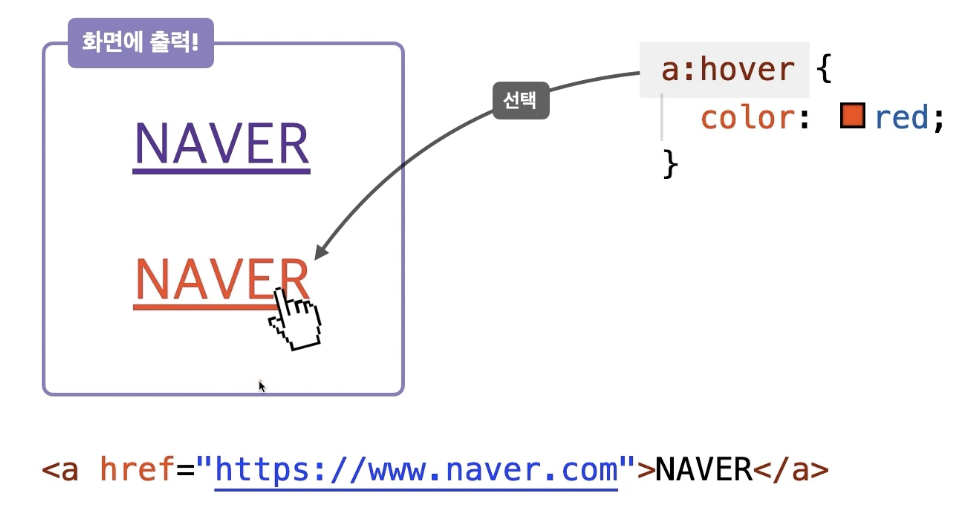
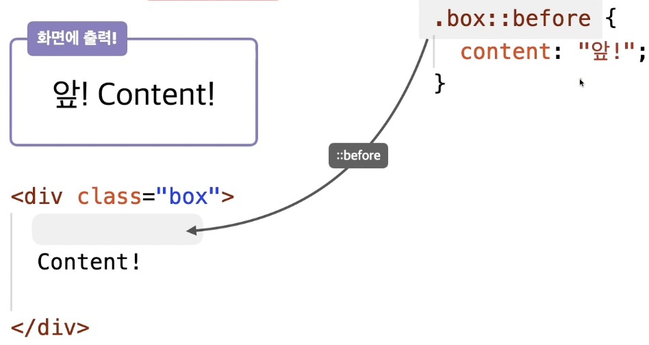

## 기본 문법  

`선택자 { 속성: 값; }`

```css
div { color: blue; }
div { color: red; margin: 20px; }
```


## 선언 방식

### 1️⃣ 내장 방식
- `<style></style>`의 내용으로 스타일을 작성하는 방식

```html
<style>
div {
color: red;
margin: 20px;
}
</style>
```

### 2️⃣ 인라인 방식
- 요소의 스타일 속성에 직접 스타일을 작성하는 방식(선택자 없음)
- 병렬식

```html
<link rel="stylesheet" href="./css/main.css">
```

### 3️⃣ `@import` 방식
- CSS의 `@import` 규칙으로 CSS 문서 안에서 또 다른 CSS 문서를 가져와 연결하는 방식
- 직렬식

```css
/* main.css */
@improt url("./box.css");

/* box.css */
.box {
background-color: red;
padding: 20px;
}
```

### 4️⃣ 링크 방식
`<link />`로 외부 CSS 문서를 가져와서 연결하는 방식

```html
<div style="color: red; margin: 20px;"></div>
```


직렬로 연결되어 있기 때문에 중간에 하나가 끊기면 끝까지 이어지지 못함  
ex) `main.css`에서 import문 삭제하는 경우 `box.css` 사용 불가능


## 기본 선택자

### 1️⃣ *
- 전체 선택자
- 모든 요소 선택  
```css 
* { color : red; }
```

### 2️⃣ ABC
- 태그 선택자
- 태그 이름이 ABC인 요소 선택  
```css
li { color: red; }
```

### 3️⃣ .ABC
- 클래스 선택자
- HTML class 속성 값이 ABC인 요소 선택
```css
.orange { color: red; }
```

### 4️⃣ #ABC
- 아이디 선택자
- HTML id 속성의 값이 ABC인 요소 선택
```css
#orange { color: red; }
```


## 복합 선택자

### 1️⃣ ABCXYZ
- 일치 선택자(Basic Combinator)
- 선택자 ABC와 XYZ를 동시에 만족하는 요소 선택

```css
[span.orange](http://span.orange) { color: red; }
```

```html
<span class="orange">오렌지</span>
```

### 2️⃣ ABC > XYZ
- 자식 선택자(Child Combinator)
- 선택자 ABC의 자식 요소 XYZ 선택

```css
ul > .orange { color: red; }
```

```html
<ul>
	<li>사과</li>
	<li>딸기</li>
	<li class="orange">오렌지</li> <!-- 여기에 css 적용 -->
</ul>
```

### 3️⃣ ABC XYZ
- 하위(후손) 선택자 (Descendant Combinator)
- 선택자 ABC 하위 요소 XYZ 선택
- 띄어쓰기가 선택자의 기호

```css
div .orange { color: red; }
```

```html
<div>
	<ul>
		<li>사과</li>
		<li>딸기</li>
		<li class="orange">오렌지</li>  <!-- css 적용 -->
	</ul>
	<div>당근</div>
	<p>토마토</p>
	<span class="orange">오렌지</span>  <!-- css 적용 -->
</div>
<span class="orange">오렌지</div>  <!-- css 적용 X -->
```

### 4️⃣ ABC + XYZ
- 인접 형제 선택자 (Adjacent Sibling Combinator)
- 선택자 ABC의 다음 형제 요소 XYZ 하나를 선택

```css
.orange + li { color: red; }
```

```html
<ul>
	<li>딸기</li>
	<li>수박</li>
	<li class="orange">오렌지</li>
	<li>망고</li> <!-- css 적용 -->
	<li>사과</li>
</ul>
```

### 5️⃣ ABC ~ XYZ
- 일반 형제 선택자 (General Sibling Combinator)
- 선택자 ABC의 다음 형제 요소 XYZ 모두를 선택

```css
.orange ~ li { color: red; }
```

```html
<ul>
	<li>딸기</li>
	<li>수박</li>
	<li class="orange">오렌지</li>
	<li>망고</li>  <!-- css 적용 -->
	<li>사과</li>  <!-- css 적용 -->
</ul>
```


## 가상 클래스 선택자

### 1️⃣ ABC:hover
- 선택자 ABC 요소에 마우스 커서가 올라가 있는 동안 선택

```css
a:hover { color: red; }
```



### 2️⃣ ABC:**active**
- 선택자 ABC 요소에 마우스를 클릭하고 있는 동안 선택

```css
a:active { color: red; }
```

### 3️⃣ ABC:focus
- 선택자 ABC 요소가 포커스되면 선택
- focus가 될 수 있는 요소: HTML 대화형 콘텐츠  
   ex) `input`, `a`, `button`, `label`, `select`, `etc`, `tabindex는` 대화형 콘텐츠 요소는 아니지만 해당

```css
input:focus { background-color: orange; }
```


### 4️⃣ ABC:first-child
- 선택자 ABC가 형제 요소 중 첫째라면 선택


fruits 클래스 안의 span 태그 첫 번째 요소 선택

### 5️⃣ ABC:last-child
- 선택자 ABC가 형제 요소 중 막내라면 선택


fruits 클래스 안의 h3 태그 마지막 요소 선택

### 6️⃣ ABC: nth-child(n)
- 선택자 ABC가 형제 요소 중 (n)째라면 선택


fruits 클래스 안의 모든 요소 중 두 번째 요소


`2*n`번째에 해당하는 요소만 선택, 홀수는 `2n+1`로 작성


`n+2` 계산 시 2번째 이후부터 쭉 선택, `n+3` → 3번째부터 끝까지

### 7️⃣ ABC:not(XYZ)
- 선택자 XYZ가 아닌 ABC 요소 선택

 

fruits 클래스 안의 전체 요소 중 `span`이 아닌 요소


## 가장 요소 선택자

### 1️⃣ ABC::before
- 선택자 ABC 요소의 내부 앞에 내용(Content) 삽입



### 2️⃣ ABC::after
- 선택자 ABC 요소의 내부 뒤에 내용(Content)을 삽입


## 속성 선택자

### 1️⃣ [ABC]
- 속성 ABC를 포함한 요소 선택


비활성화(disabled)된 속성만 선택하겠다는 뜻


type 속성 모두 선택됨, 일반적인 속성 이름으로는 하나만 선택하기 힘듦 특정한 이름 선택

### 2️⃣ [ABC="XYZ"]
- 속성 ABC를 포함하고 값이 XYZ인 요소 선택


`type`을 속성을 가지고 있는 요소들 중에서도 값이 `password`인 요소 선택


## 스타일 상속

### 상속되는 CSS 속성  
: 모두 글자/문자 관련 속성 (모든 글자/문자 속성 X)
- `font-style`: 글자 기울기
- `font-weight`: 글자 두께
- `font-size`: 글자 크기
- `line-height`: 줄 높이
- `font-family`: 폰트(서체)
- `color`: 글자 색상
- `text-align`: 정렬


### 강제 상속
- 자동 상속이 되지 않는 것들에 대해 `inherit` 값을 부여하여 강제로 상속되게 만드는 것

```html
<body>
  <div class="parent">
    <div class="child"></div>
  </div>
</body>
```

```css
.parent {
  width: 300px;
  height: 400px;
  background-color: red;
}

.child {
  width: 100px;
  height: inherit;    /* 부모로부터 상속 */
  background-color: orange;
}
```
결과  


```css
.parent {
  width: 300px;
  height: 400px;
  background-color: red;
}

.child {
  width: 100px;
  height: inherit;    /* 부모로부터 상속 */
  background-color: orange;
  position: fixed;
  top: 100px;
  right: 10px;
}
```
결과


```css
.parent {
  width: 300px;
  height: 400px;
  background-color: red;
}

.child {
  width: 100px;
  height: inherit; /* 부모로부터 상속 */
  background-color: inherit; /* 부모로부터 상속 */
  position: fixed;
  top: 100px;
  right: 10px;
}
```
결과


## 선택자 우선순위

### 우선순위  
- 같은 요소가 여러 선언의 대상이 된 경우 어떤 선언의 CSS 속성을 우선 적용할지 결정하는 방법
- 점수가 높은 선언이 우선
- 점수가 같은 경우 가장 마지막에 해석된 선언이 우선

```html
<div
	id="color_yellow"
	class="color_green"
	style="color: orange; ">  <!-- 인라인 선언: 1000점 -->
Hello World!
</div>
```

```css
div { color: red !important; }  /* !important: 무한대 */
#color_yellow { color: yellow; }  /* id 선택자: 100점 */
.color_green { color: green; }  /* class 선택자: 10점 */
div { color: blue; }  /* 태그 선택자: 1점 */
* { color: darkblue; }  /* 전체 선택자: 0점 */
body { color: violet; }  /* 상속: X */
```


ex1)

```css
.list li.item { color: red; }

.list li:hover { color: red; }

.box::before { content: "Good "; color: red; }

#submit span { color: red; }

header .menu li:nth-child(2) { color: red; }

h1 { color: red; }

:not(.box) { color: red; }
```

ex2)

```html
<div id="hello" class="hello">Hello World!</div>
```

```css
div {  /* 태그 선택자: 1점 */
  font-size: 70px;
}
.hello {  /* 클래스 선택자: 10점 */
  color: red;
}
#hello {  /* 아이디 선택자: 100점 */
  color: blue;
}
```


```css
div {
  font-size: 70px;
}
.hello {
  color: red;
}
.hello {
  color: green;
}
```


```css
div {  /* 태그(div) = 1점 */
  font-size: 70px;
}
div.hello {  /* 태그(div)+클래스(hello) = 11점 */
  color: green;
}
.hello {  /* 클래스(hello) = 10점 */
  color: red;
}
```


```html
<div id="hello" class="hello" style="color: orange;">
	Hello World!</div>
<!-- 인라인 선언 1000점 -->
```
