## 너비

### 1️⃣ width, height
- 요소의 가로/세로 너비
- 기본값: `auto`
- `auto`: 브라우저가 너비를 계산
- 단위: `px`, `em`, `vw` 등 단위로 지정

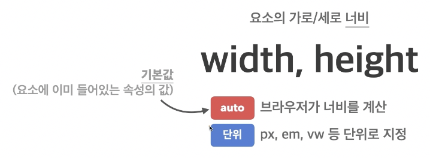

```html
<span>Hello</span>
<span>World</span>
```

- 대표적인 인라인 요소
- 본질적으로 아무것도 나타내지 않는 콘텐츠 영역 설정하는 용도

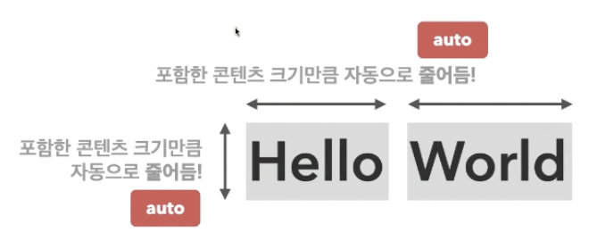


```html
<div>Hello</div>
<div>World</div>
```

- 대표적인 블록 요소
- 본질적으로 아무것도 나타내지 않는 콘텐츠 영역 설정하는 용도

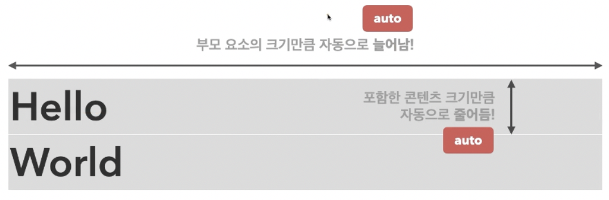

### 2️⃣ max-width, max-height
- 요소가 커질 수 있는 최대 

#### 가로/세로 너비
- 기본값: `none`
- `none`: 최대 너비 제한 없음
- 단위: `px`, `em`, `vw` 등 단위로 지정

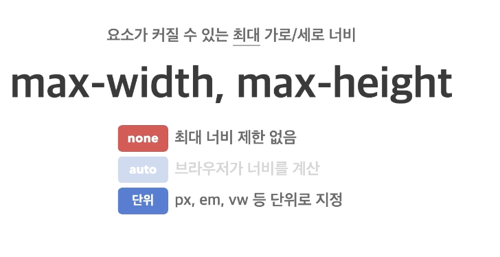

### 3️⃣ min-width, min-height
- 요소가 작아질 수 있는 최소 가로/세로 너비
- 기본값: 0
- 0: 최소 너비 제한 없음
- 단위: `px`, `em`, `vw` 등 단위로 지정

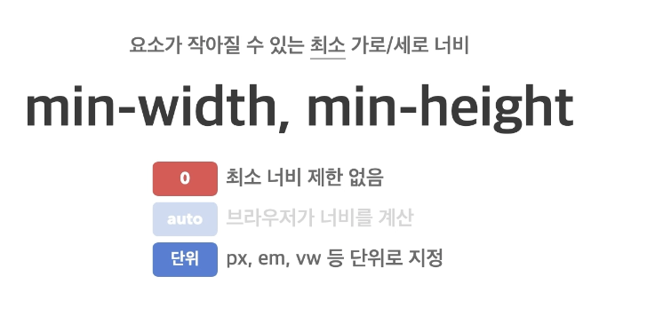

---

## CSS 단위

#### 표현 단위
- `px`: 픽셀
- `%:` 상대적 백분율
- `em`: 요소의 글꼴 크기
- `rem`: 루트 요소(html)의 글꼴 크기
- `vw`: 뷰 포트 가로 너비의 백분율
- `vh`: 뷰 포트 세로 너비의 백분율

ex)

```html
<div class="parent">
  <div class="child"></div>
</div>
```

```css
html {
  /* font-size: 16px; */
}
.parent {
  width: 300px;
  height: 200px;
  background-color: royalblue;
  font-size: 10px;
}
.child {
  width: 50%;
  height: 50%;
  background-color: orange;
}
```


```css
html {
/*   font-size: 16px; */
}
.parent {
  width: 300px;
  height: 200px;
  background-color: royalblue;
  font-size: 10px;
}
.child {
  width: 20em;
  height: 50%;
  background-color: orange;
}
```


```css
html {
/*   font-size: 16px; */
}
.parent {
  width: 300px;
  height: 200px;
  background-color: royalblue;
  font-size: 10px;
}
.child {
  width: 20em;
  height: 50%;
  background-color: orange;
}
```
parent의 font-size가 child에게도 영향 미쳐서 총 200px 차지  


```css
html {
  font-size: 16px;
}
.parent {
  width: 300px;
  height: 200px;
  background-color: royalblue;
  font-size: 10px;
}
.child {
  width: 20rem;
  height: 50%;
  background-color: orange;
}
```
rem의 장점  
html의 크기에 맞춰서 사용되기 때문에 주변 상황에 영향을 안 받는다  


```css
html {
  font-size: 16px;
}
.parent {
  width: 300px;
  height: 200px;
  background-color: royalblue;
  font-size: 10px;
}
.child {
  width: 50vw;
  height: 50%;
  background-color: orange;
}
```
parent의 font-size가 child에게도 영향 미쳐서 총 200px 차지


```css
html {
  font-size: 16px;
}
.parent {
  width: 300px;
  height: 200px;
  background-color: royalblue;
  font-size: 10px;
}
.child {
  width: 50vw;
  height: 50vh;
  background-color: orange;
}
```
parent의 font-size가  child에게도 영향 미쳐서 총 200px 차지


---

## 외부 여백 (margin)

### margin
- 요소의 외부 여백(공간)을 지정하는 단축 속성
- `0`: 외부 여백 없음
- 음수 사용 가능(ex -10px)
- `auto`: 브라우저가 여백을 계산(가로/세로 너비가 있는 요소의 가운데 정렬에 활용)
- 단위: `px`, `em`, `vw` 등 단위로 지정
- `%`: 부모 요소의 가로 너비에 대한 비율로 지정

#### ✔️ margin-방향
- `margin-top`
- `margin-bottom`
- `margin-left`
- `margin-right`

ex)

```html
<div class="container">
  <div class="item"></div>
  <div class="item"></div>
  <div class="item"></div>
</div>
```

```css
.container {
  
}
.container .item {
  width: 100px;
  height: 100px;
  background-color: orange;
  margin: 10px;
}
```


```css
.container {

}
.container .item {
  width: 100px;
  height: 100px;
  background-color: orange;
  margin-bottom: 20px;
}
```


<br/><br/>

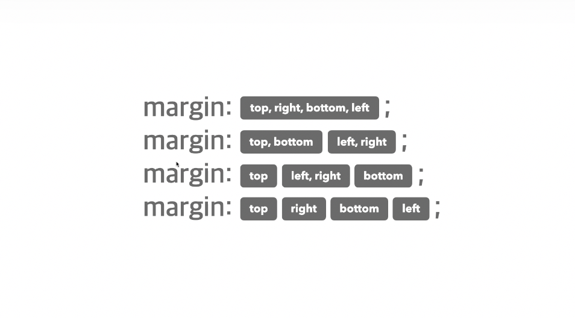
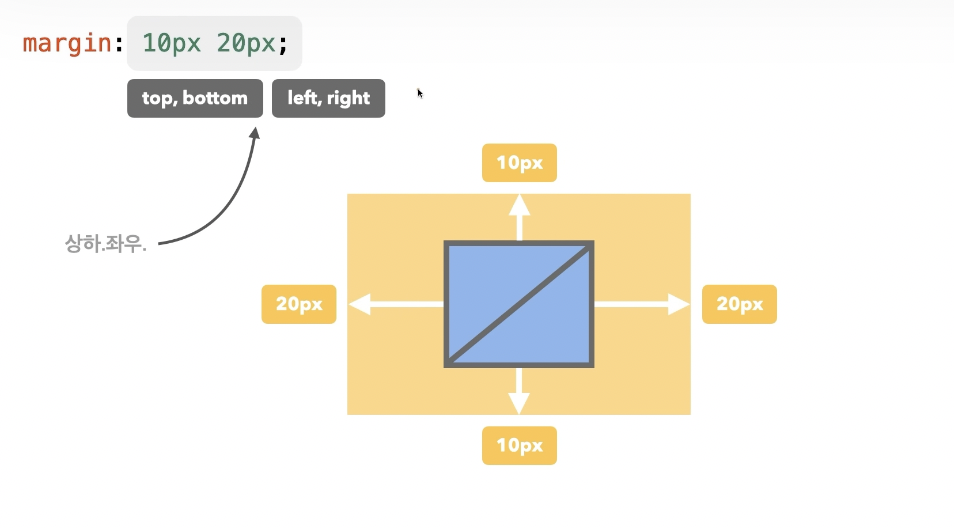


- `margin`은 단축 속성이기 때문에 margin 단독으로 사용할 경우 상하좌우 전체 적용  

ex) 
```css
margin: 10px;
```
- `margin: 10px 20px;` 차례대로 상하 / 좌우 적용
- `margin: 10px 20px 30px;` 차례대로 상 / 좌우 / 하 적용
- `margin: 10px 20px 30px 40px;` 차례대로 상 / 우 / 하 / 좌 적용

```css
.container {
  
}
.container .item {
  width: 100px;
  height: 100px;
  background-color: orange;
  border: 4px solid red;
  margin: 10px;
}
```
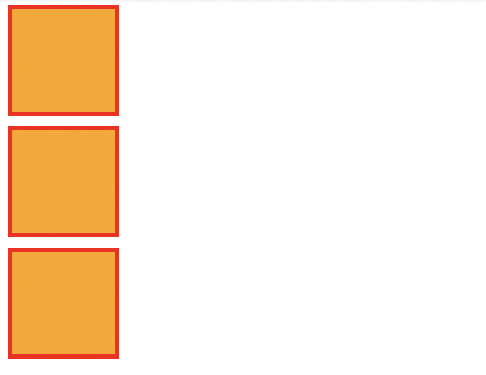


```css
.container {
  
}
.container .item {
  width: 100px;
  height: 100px;
  background-color: orange;
  border: 4px solid red;
  margin: -20px 10px;
}
```

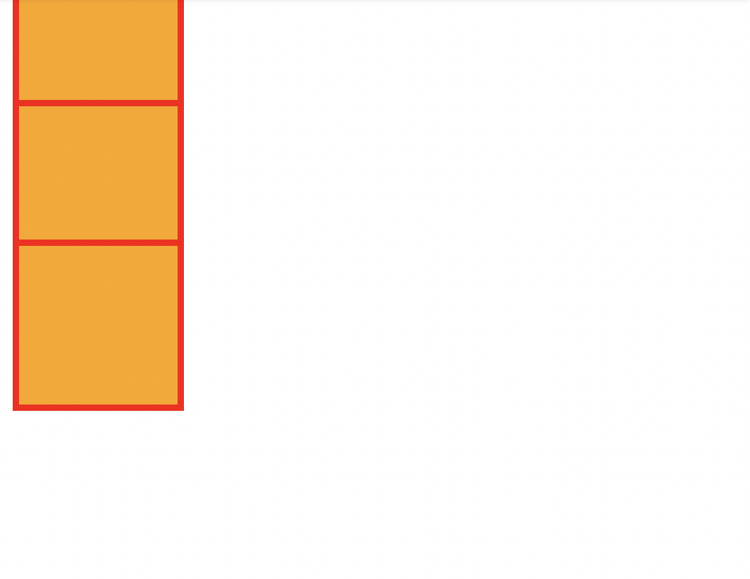


## 내부 여백

### padding
- 요소의 내부 여백(공간)을 지정하는 단축 속성
- `0`: 내부 여백 없음
- 단위: `px`, `em`, `vw` 등 단위로 지정
- `%`: 부모 요소의 가로 너비에 대한 비율로 지정

```html
<div class="container">
  <div class="item"></div>
  <div class="item"></div>
</div>
```

```css
.container .item {
  width: 100px;
  height: 100px;
  background-color: orange;
  border: 4px solid red;
}
```

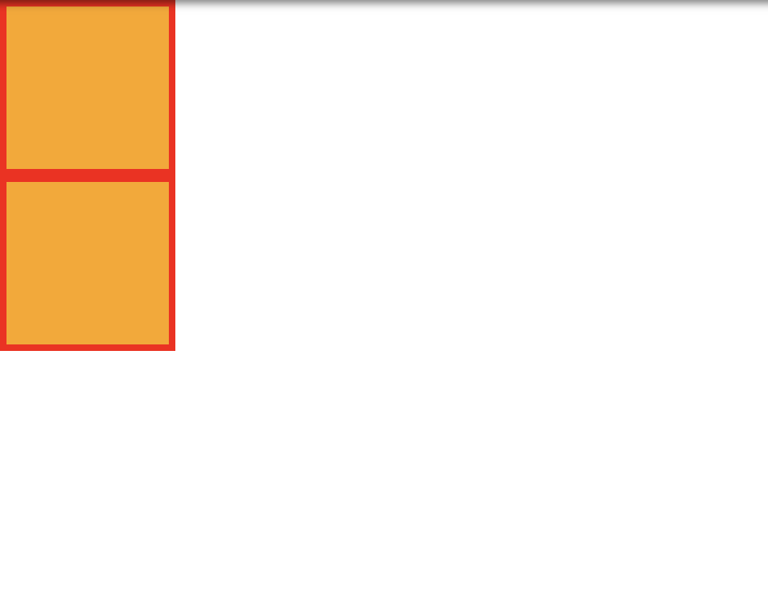


```css
.container .item {
  width: 100px;
  height: 100px;
  background-color: orange;
  border: 4px solid red;
}
.container .item:first-child {
  padding: 20px;
}
```
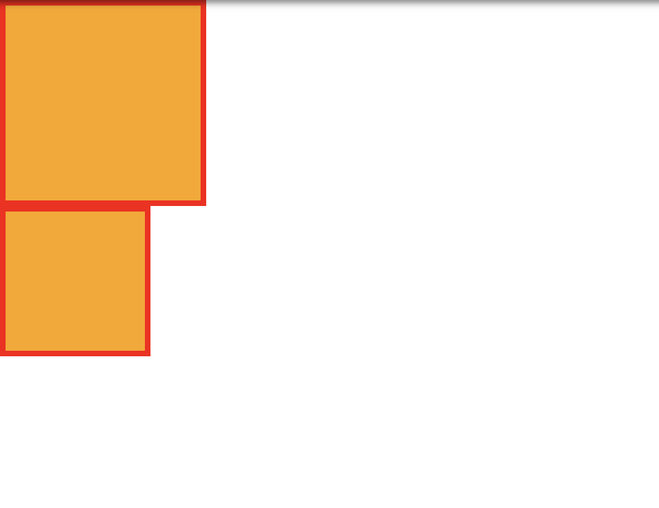

<br /><br/>


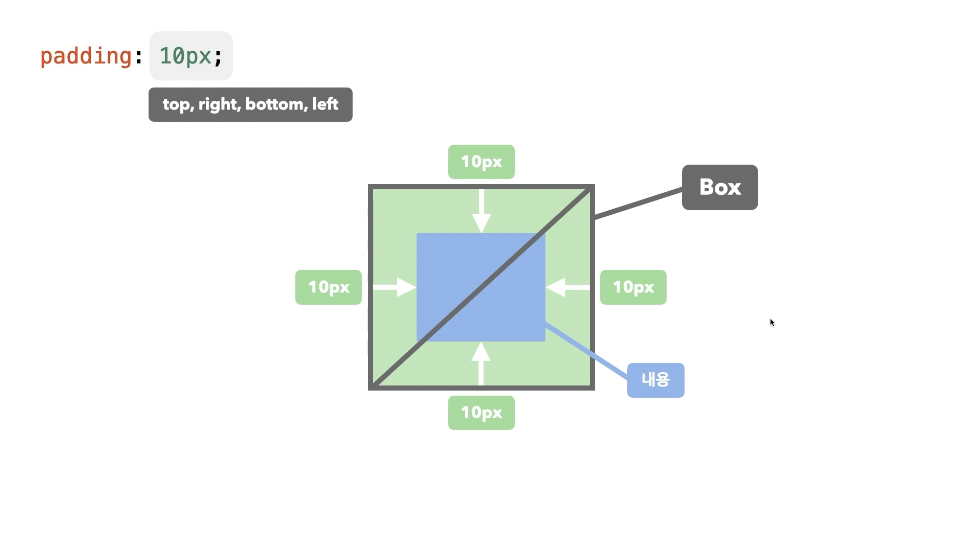
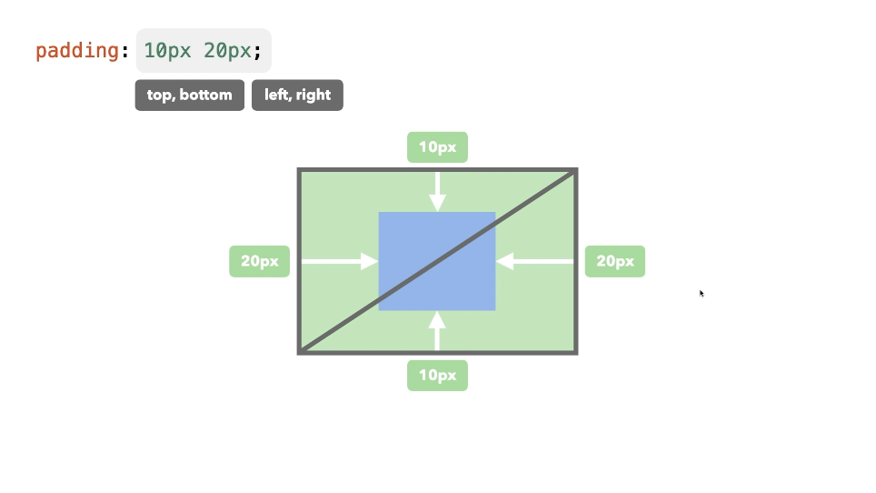
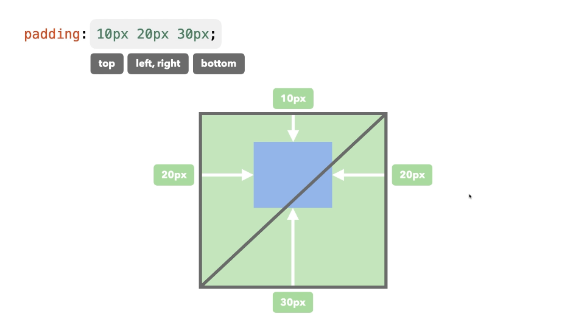
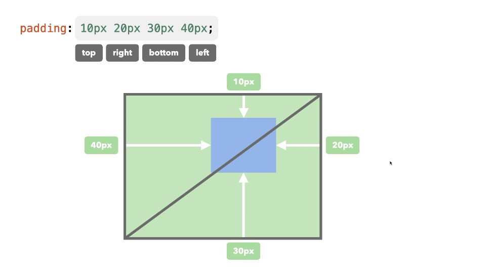

- `padding`은 단축 속성이기 때문에 `padding` 단독으로 사용할 경우 상하좌우 전체 적용  

ex)
```css
padding: 10px;
```
- `padding: 10px 20px;` 차례대로 상하 / 좌우 적용
- `padding: 10px 20px 30px;` 차례대로 상 / 좌우 / 하 적용
- `padding: 10px 20px 30px 40px;` 차례대로 상 / 우 / 하 / 좌 적용