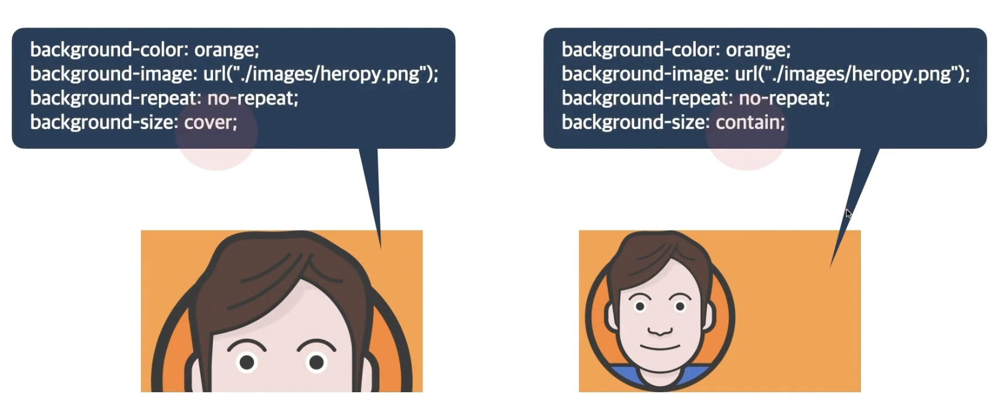
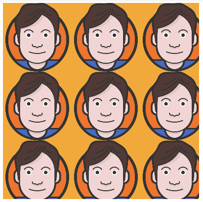
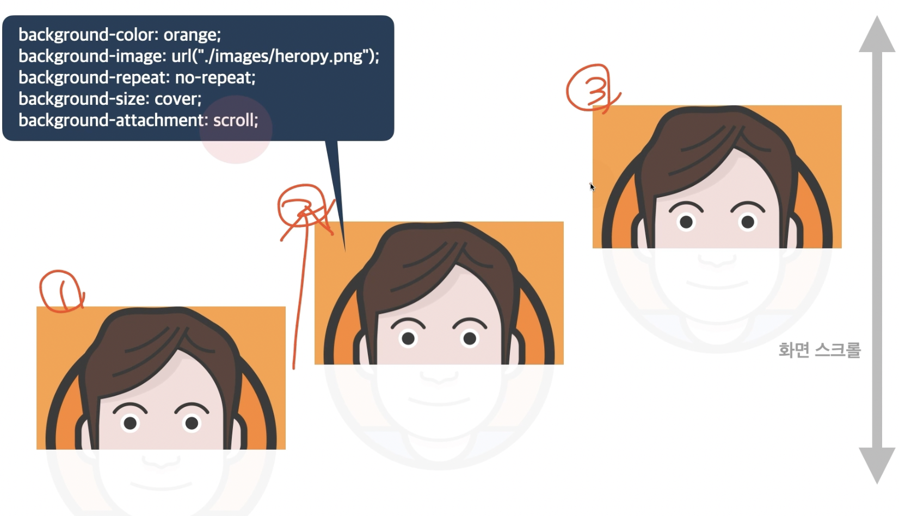
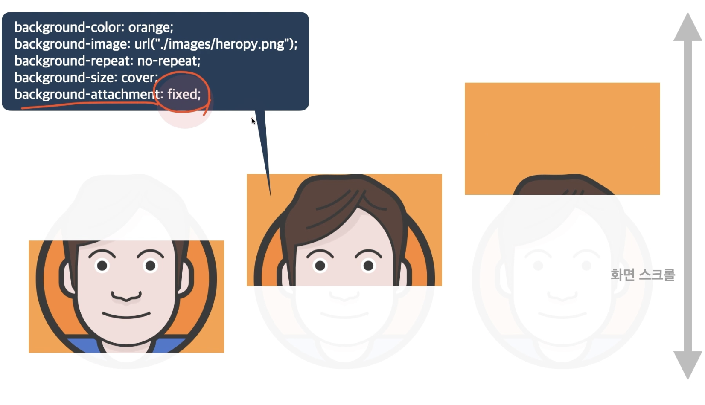

## 배경

### 1️⃣ background-color
- 요소의 배경 색상
- `transparent`: 투명함
- 색상: 지정 가능한 색상

### 2️⃣ background-image
- 요소의 배경 이미지 삽입
- `none`: 이미지 없음
- `url("경로")`: 이미지 경로

### 3️⃣ background-position
- 요소의 배경 이미지 위치
- 0% 0%: 0%~ 100% 사이의 값
- 방향: `top`, `bottom`, `left`, `right`, `center` 방향
- 단위: `px`, `em`, `rem` 등 단위로 지정

### 4️⃣ background-size
- 요소의 배경 이미지 크기
- `auto`: 이미지의 실제 크기
- 단위: `px`, `em`, `rem` 등 단위로 지정
- `cover`: 비율을 유지, 요소의 더 넓은 너비에 맞춤
- `contain`: 비율을 유지, 요소의 더 짧은 너비에 맞춤 



```css
div {
  width: 200px;
  height: 200px;
  background-color: orange;
  background-image: url("https://heropy.blog/css/images/logo.png");
  background-size: 70px;
}
```



- 바둑판식 배열

```css
div {
  width: 200px;
  height: 200px;
  background-color: orange;
  background-image: url("https://heropy.blog/css/images/logo.png");
  background-size: 70px;
  background-repeat: no-repeat;
  background-position: center;
}
```


- `background-repeat`으로 바둑판식 배열에서 이미지 하나만 나타나도록 함
- `background-position`으로 이미지 위치 지정

### 5️⃣ background-attatchment
- 요소의 배경 이미지 스크롤 특성
- `scroll`: 이미지가 요소를 따라서 같이 스크롤
- `fixed`: 이미지가 뷰 포트에 고정, 스크롤 X
- `local`: 요소 내 스크롤 시 이미지가 같이 스크롤



