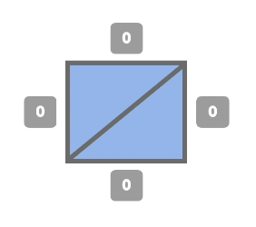
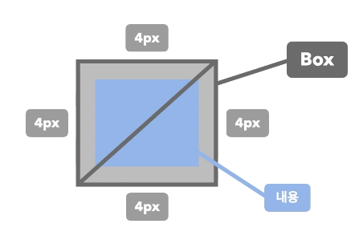
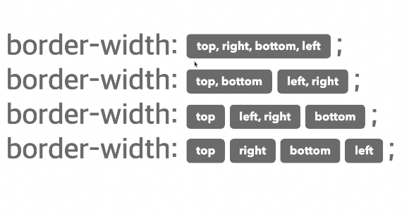
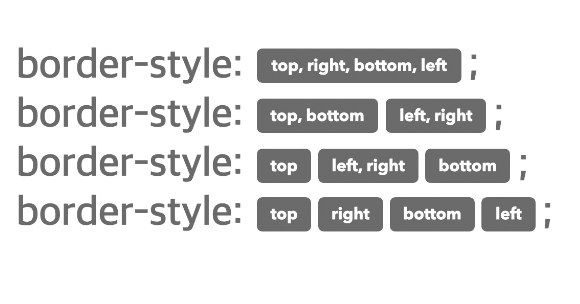
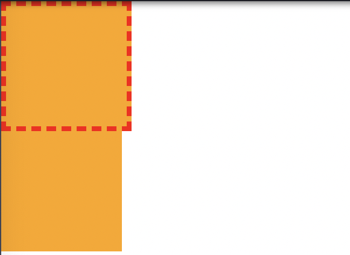
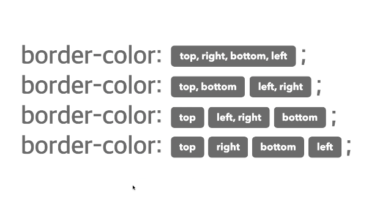
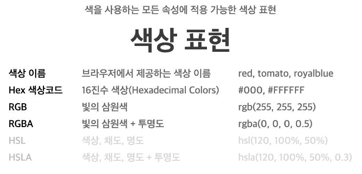
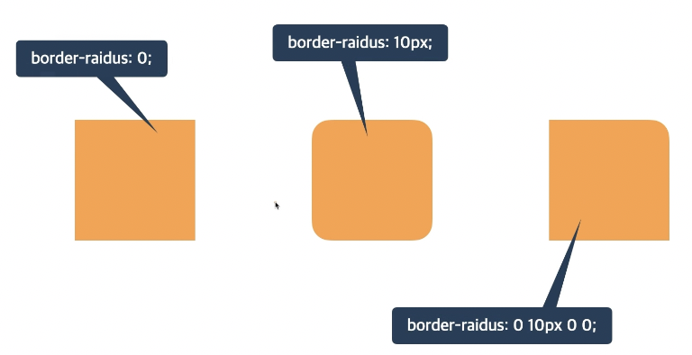

## 테두리 선과 색상

### border
- 요소의 테두리 선을 지정하는 단축 속성  
**border: 선-두께 선-종류 선-색상;**

```html
<div class="container">
  <div class="item"></div>
  <div class="item"></div>
</div>
```

```css
.container .item {
  width: 100px;
  height: 100px;
  background-color: orange;
}
.container .item:first-child {
  border: 10px solid orange;
}
```


<br/>



- `border: medium none black;`  
선의 종류가 없어 출력되지 않음

<br/>



- `border: 4px solid black;`  
4px 두께의 검정색 실선

### border-width
- 요소 테두리 선의 두께
- `medium`: 중간 두께
- `thin`: 얇은 두께
- `thick`: 두꺼운 두께  
   (위 세 가지는 사용 권장 X)
- 단위: `px`, `em`, `%` 등 단위로 지정



- `border-width`은 단축 속성이기 때문에 `border-width` 단독으로 사용할 경우 상하좌우 전체 적용
- `border-width: 10px 20px;` 차례대로 상하 / 좌우 적용
- `border-width: 10px 20px 30px;` 차례대로 상 / 좌우 / 하 적용
- `border-width: 10px 20px 30px 40px;` 차례대로 상 / 우 / 하 / 좌 적용

### border-style
- `none`: 선 없음
- `solid`: 실선
- `dashed`: 파선



```html
<div class="container">
  <div class="item"></div>
  <div class="item"></div>
</div>
```

```css
.container .item {
  width: 100px;
  height: 100px;
  background-color: orange;
}
.container .item:first-child {
  border: 4px dashed red;
}
```



### border-color
- 요소 테두리 선의 색상을 지정하는 단축 속성
- `black`: 검정색
- 색상: 선의 색상
- `transparent`: 투명






### border-방향 / border-방향-속성
- `border-방향(top/bottom/right/left)`: 두께 종류 색상;
- `border-방향-width`: 두께;
- `border-방향-style`: 종류;
- `border-방향-color`: 색상;

Q. 두께 2px, 종류 실선, 색상 빨강의 테두리선 작성  
A. border: 2px solid red;

### border-radius
- 요소의 모서리를 둥글게 깎음
- 0: 둥글게 없음
- 단위: `px`, `em`, `vw` 등 단위로 지정

```css
div {
  width: 100px;
  height: 100px;
  background-color: orange;
  margin: 20px;
  border-radius: 10px;
}
```


<br/>



css에서 0에는 `px` 단위를 붙이지 않는 것을 권장