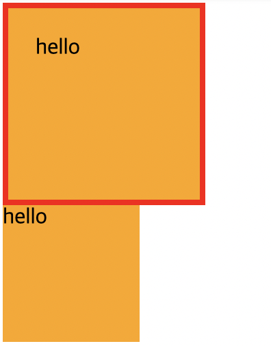
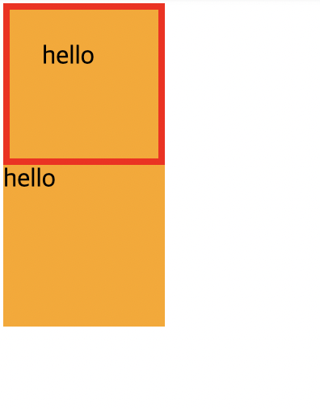
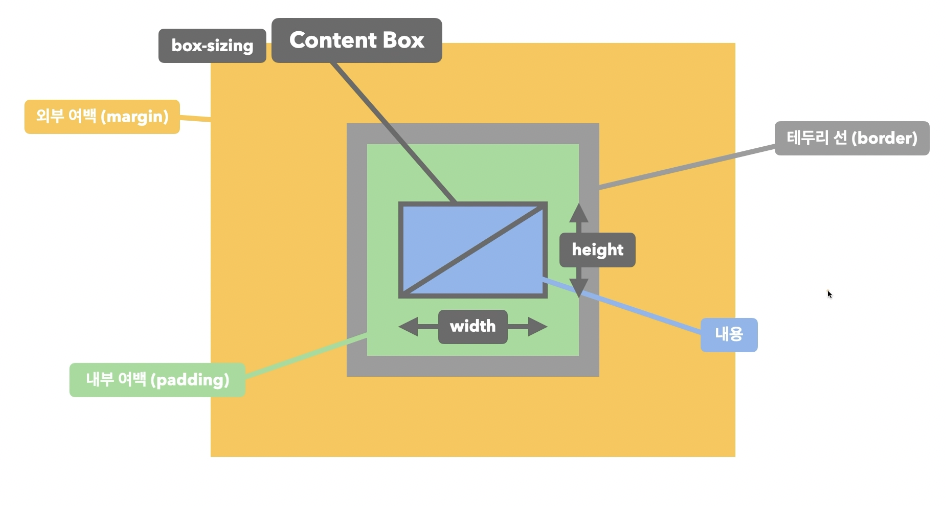

## 크기 계산

### box-sizing
- 요소의 크기 계산 기준을 지정
- `content-box`: 요소의 내용(content)으로 크기 계산
- `border-box`: 요소의 내용 + `padding`  + `border`로 크기 계산

```html
<div class="item">hello</div>
<div class="item">hello</div>
```

```css
.item {
  width: 100px;
  height: 100px;
  background-color: orange;
}
.item:first-child {
  border: 4px solid red;
  padding: 20px;
}
```



가로 넓이 = `width(100px) - ( padding 40 + border 8 )`

```css
.item {
  width: 100px;
  height: 100px;
  background-color: orange;
}
.item:first-child {
  border: 4px solid red;
  padding: 20px;
  box-sizing: border-box;
}
```



<br/>



Q. 아래 코드가 지정된 요소의 실제 가로 너비는?  

```css
width: 100px; 
padding 20px; 
border: 1px solid red;
``` 
A. 142px

Q. 아래 코드가 지정된 요소의 실제 가로 너비는?  

```css
width: 100px; 
padding 20px; 
border: 1px solid red; 
box-sizing: border-box;  
```

A. 100px