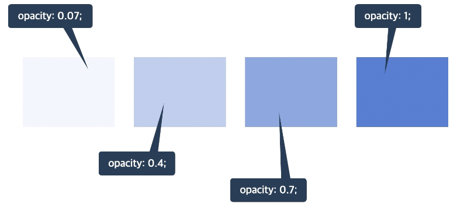
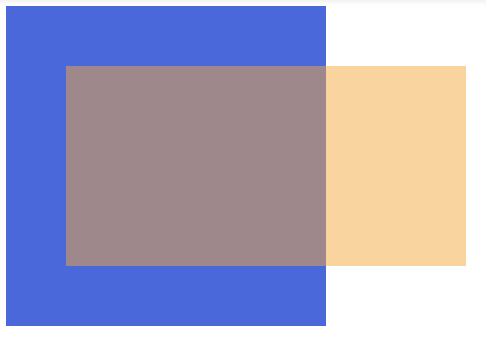

## display
요소의 화면 출력(보여짐 특성)
- 각 요소에 이미 지정되어 있는 값
  - `block`: 상자(레이아웃) 요소
  - `inline`: 글자 요소
  - `inline-block`: 글자+상자 요소
- 따로 지정해서 사용하는 값
  - `flex`: 플렉스 박스 (1차원 레이아웃)
  - `grid`: 그리드 (2차원 레이아웃)
  - `none`: 보여짐 특성 없음, 화면에서 사라짐
- 기타: `table`, `table-row`, `table-cell`등

```html
<span>Hello World!</span>
```

```css
span {
  display: block;
  width: 120px;
  height: 30px;
  background-color: royalblue;
  color: white;
}
```
> `display: block;` 입력 시  
`display: none;` 사용하면 사라짐 


---

## opacity
- 요소 투명도
- 1: 불투명
- 0-1: 0부터 1 사이의 소수점 숫자



- 백분율로 계산  
ex) 0.07 = 7%, 0.4 = 40%, 0.7 = 70% 1 = 100%

<br/>

ex)
```html
<div class="parent">
  <div class="child"></div>
</div>
```

```css
.parent {
  width: 100px;
  height: 100px;
  padding: 30px;
  background-color: royalblue;
}
.child {
  width: 200px;
  height: 100px;
  background-color: orange;
  opacity: 0.5;
}
```
> `opacity: 0.5; = 50%` 입력 시  
`opacity: .5`로 입력해도 동일

