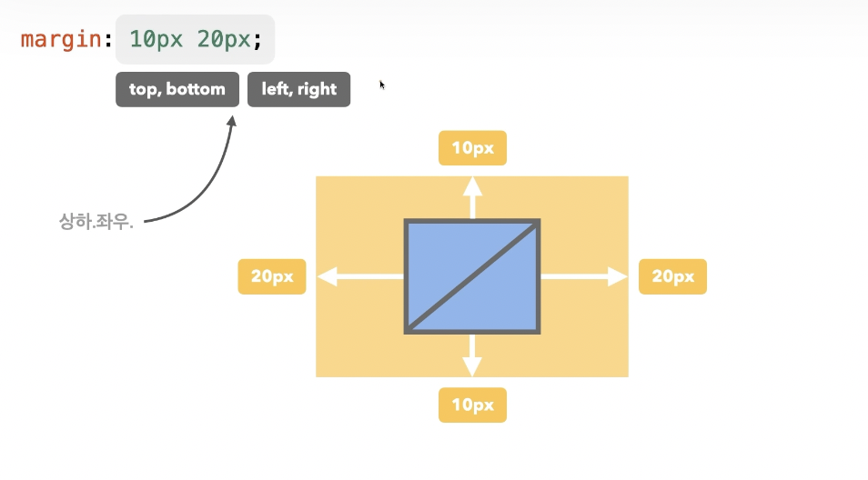
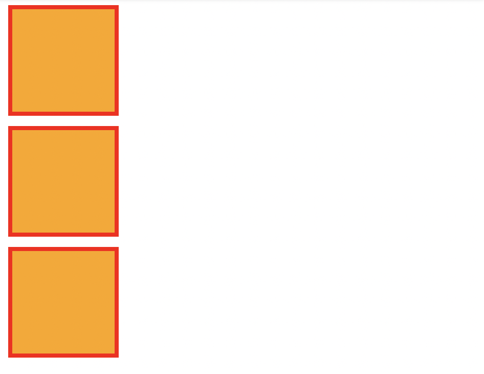
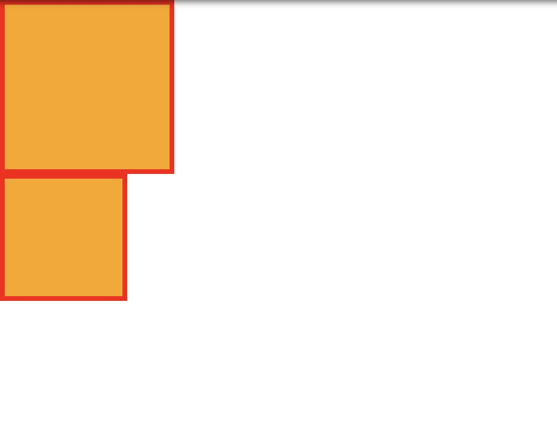

## 외부 여백 (margin)

### margin
- 요소의 외부 여백(공간)을 지정하는 단축 속성
- `0`: 외부 여백 없음
- 음수 사용 가능(ex -10px)
- `auto`: 브라우저가 여백을 계산(가로/세로 너비가 있는 요소의 가운데 정렬에 활용)
- 단위: `px`, `em`, `vw` 등 단위로 지정
- `%`: 부모 요소의 가로 너비에 대한 비율로 지정

#### ✔️ margin-방향
- `margin-top`
- `margin-bottom`
- `margin-left`
- `margin-right`

ex)

```html
<div class="container">
  <div class="item"></div>
  <div class="item"></div>
  <div class="item"></div>
</div>
```

```css
.container {
  
}
.container .item {
  width: 100px;
  height: 100px;
  background-color: orange;
  margin: 10px;
}
```


```css
.container {

}
.container .item {
  width: 100px;
  height: 100px;
  background-color: orange;
  margin-bottom: 20px;
}
```


<br/><br/>





- `margin`은 단축 속성이기 때문에 margin 단독으로 사용할 경우 상하좌우 전체 적용  

ex) 
```css
margin: 10px;
```
- `margin: 10px 20px;` 차례대로 상하 / 좌우 적용
- `margin: 10px 20px 30px;` 차례대로 상 / 좌우 / 하 적용
- `margin: 10px 20px 30px 40px;` 차례대로 상 / 우 / 하 / 좌 적용

```css
.container {
  
}
.container .item {
  width: 100px;
  height: 100px;
  background-color: orange;
  border: 4px solid red;
  margin: 10px;
}
```



```css
.container {
  
}
.container .item {
  width: 100px;
  height: 100px;
  background-color: orange;
  border: 4px solid red;
  margin: -20px 10px;
}
```


## 내부 여백

### padding
- 요소의 내부 여백(공간)을 지정하는 단축 속성
- `0`: 내부 여백 없음
- 단위: `px`, `em`, `vw` 등 단위로 지정
- `%`: 부모 요소의 가로 너비에 대한 비율로 지정

```html
<div class="container">
  <div class="item"></div>
  <div class="item"></div>
</div>
```

```css
.container .item {
  width: 100px;
  height: 100px;
  background-color: orange;
  border: 4px solid red;
}
```


```css
.container .item {
  width: 100px;
  height: 100px;
  background-color: orange;
  border: 4px solid red;
}
.container .item:first-child {
  padding: 20px;
}
```


<br /><br/>


- `padding`은 단축 속성이기 때문에 `padding` 단독으로 사용할 경우 상하좌우 전체 적용  

ex)
```css
padding: 10px;
```
- `padding: 10px 20px;` 차례대로 상하 / 좌우 적용
- `padding: 10px 20px 30px;` 차례대로 상 / 좌우 / 하 적용
- `padding: 10px 20px 30px 40px;` 차례대로 상 / 우 / 하 / 좌 적용