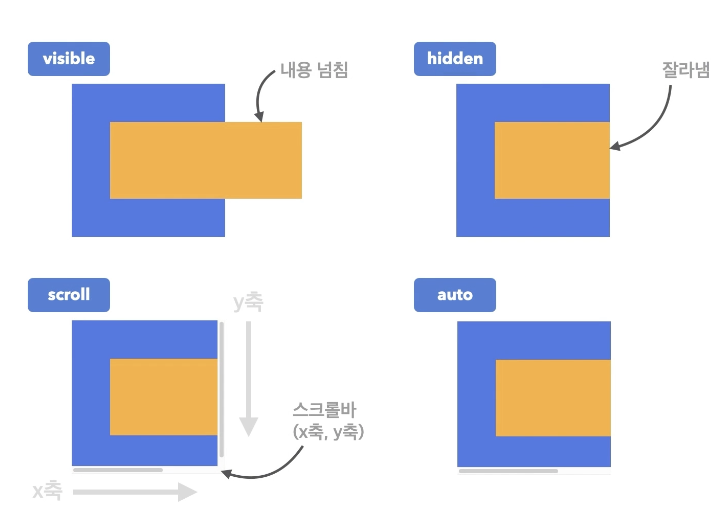

## 넘침 제어
### overflow
- 요소의 크기 이상으로 내용이 넘쳤을 때, 보여짐을 제어하는 단축 속성
- `visible`: 넘친 내용을 그대로 보여 줌
- `hidden`: 넘친 내용을 잘라냄
- `scroll`: 넘친 내용을 잘라냄, 스크롤바 생성
- `auto`: 넘친 내용이 있는 경우에만 잘라내고 스크롤바 새성

```html
<div class="parent">
  <div class="child"></div>
</div>
```

```css
.parent {
  width: 200px;
  height: 150px;
  background-color: royalblue;
  margin: 20px;
}
.child {
  height: 100px;
  background-color: orange;
}
```


<br/>

overflow `visible` 속성일 때
```css
.parent {
  width: 200px;
  height: 150px;
  background-color: royalblue;
  margin: 20px;
  overflow: visible;
}
.child {
  width: 300px;
  height: 100px;
  background-color: orange;
}
```


<br/>

overflow `hidden` 속성일 때
```css
.parent {
  width: 200px;
  height: 150px;
  background-color: royalblue;
  margin: 20px;
  overflow: hidden;
}
.child {
  width: 300px;
  height: 100px;
  background-color: orange;
}
```


<br/>

overflow `scroll` 속성일 때
```css
.parent {
  width: 200px;
  height: 150px;
  background-color: royalblue;
  margin: 20px;
  overflow: scroll;
}
.child {
  width: 300px;
  height: 100px;
  background-color: orange;
}
```


<br/>

overflow `auto` 속성일 때  
- 브라우저가 알아서 스크롤바 생성
```css
.parent {
  width: 200px;
  height: 150px;
  background-color: royalblue;
  margin: 20px;
  overflow: auto;
}
.child {
  width: 300px;
  height: 100px;
  background-color: orange;
}
```


