## 변환

### 1️⃣ transform


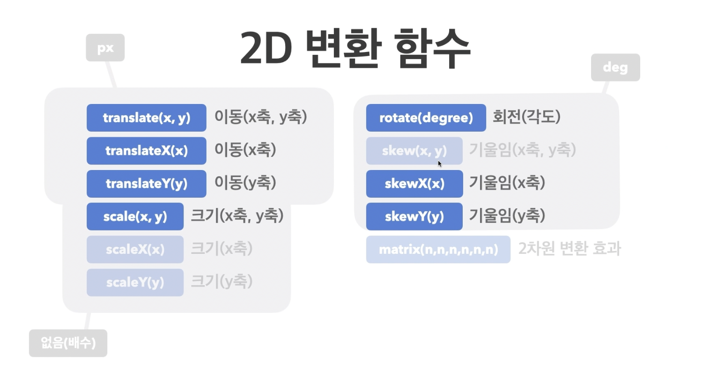

브라우저 내에서 `matrix로` 관리되나 직접적으로는 잘 쓰지 않고 명시적인 함수 이름을 주로 사용

<br/>

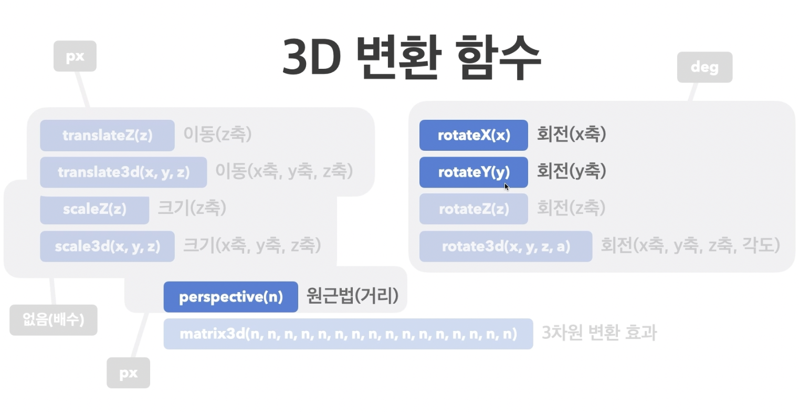
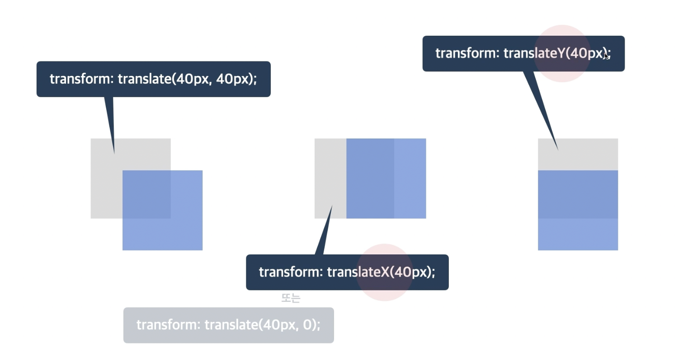
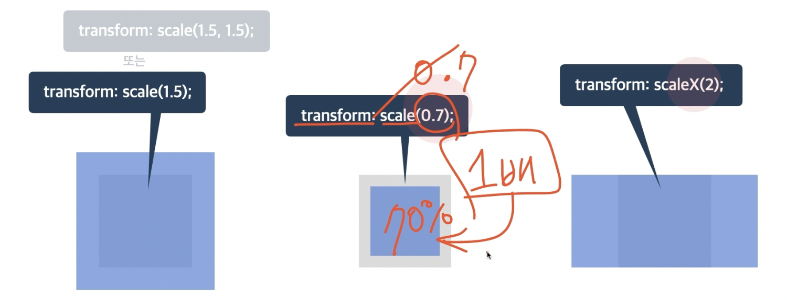

1보다 작은 값 입력 시 크기 축소 가능

<br/>

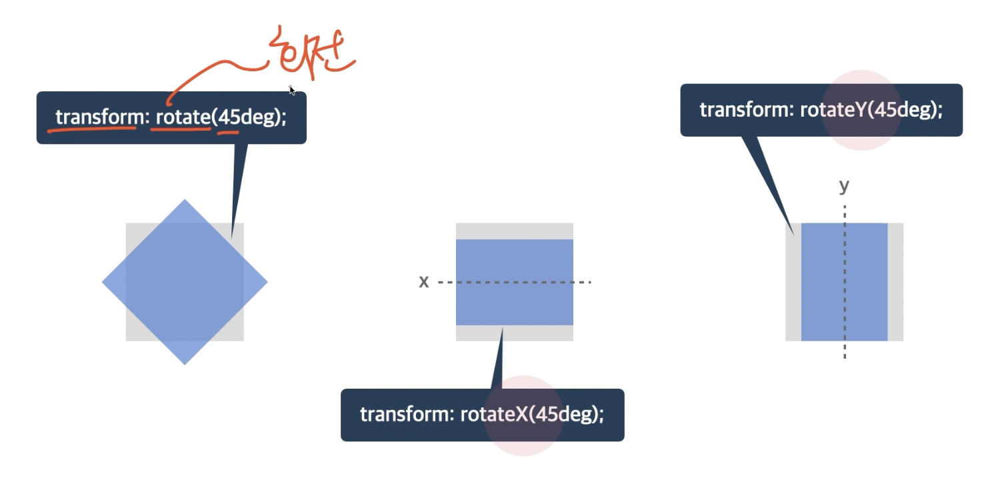
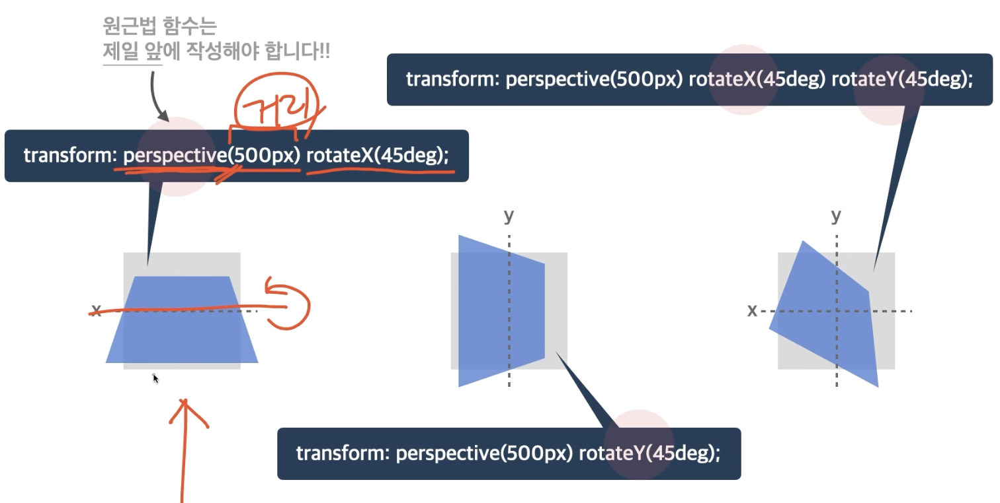

`perspective는` 3D 함수 - 원근법 함수, `transform` 사용 시 제일 먼저 작성해야 함
`persepctive(500px)` - 500의 값이 원근 거리를 뜻함

<br/>

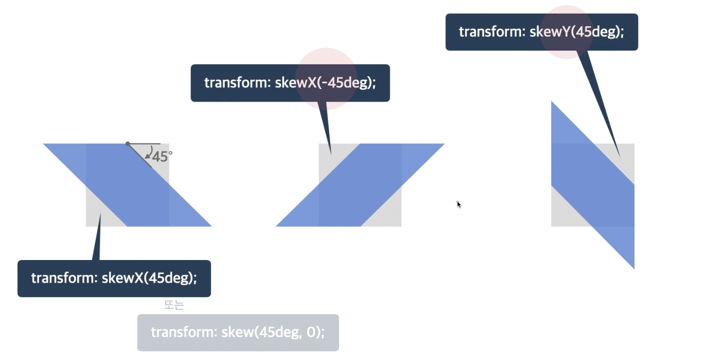


```css
body {
  padding: 100px;
}
.container {
  width: 100px;
  height: 100px;
  background-color: royalblue;
}
.container .item {
  width: 100px;
  height: 100px;
  background-color: orange;
  transform: perspective(150px) 
rotateX(45deg) translate(100px);
}
```

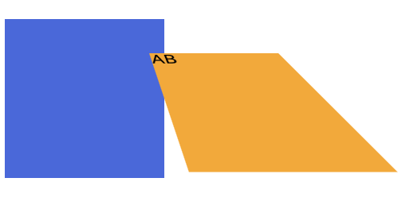


### 2️⃣ perspective
- 하위 요소를 관찰하는 원근 거리를 지정
- 단위: `px` 등 단위로 지정

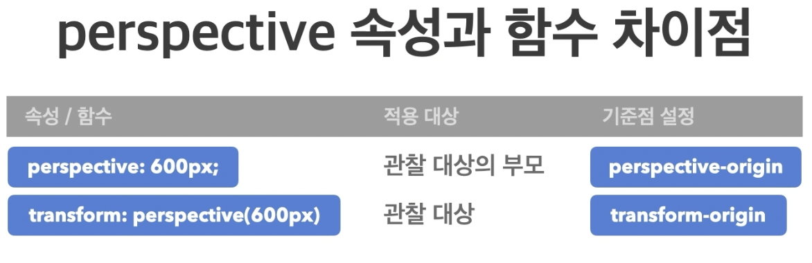
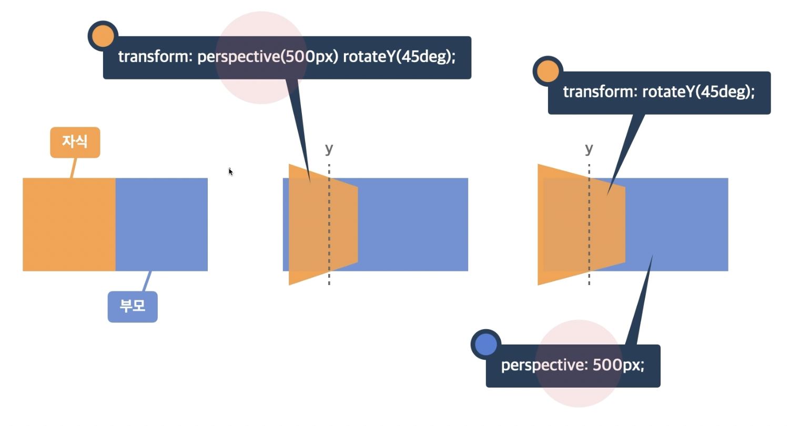

### 3️⃣ backface-visibility
- 3D 변환으로 회전된 요소의 뒷면 숨김 여부
- `visible`: 뒷면 보임
- `hidden`: 뒷면 숨김

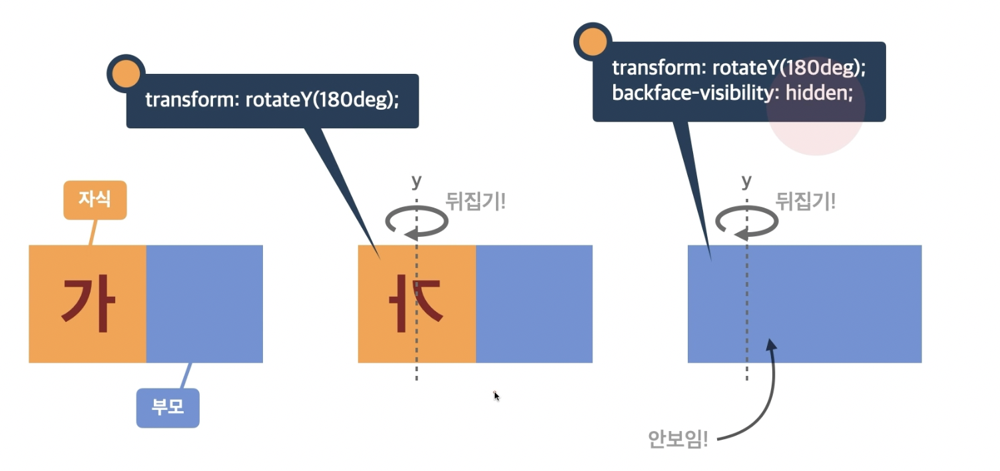

```css
body {
  padding: 100px;
}
.container {
  width: 100px;
  height: 100px;
  background-color: royalblue;
  perspective: 250px;
}
.container .item {
  width: 100px;
  height: 100px;
  background-color: orange;
  font-size: 60px;
  display: flex;
  justify-content: center;
  align-items: center;
  transform: rotateX(180deg);
  backface-visibility: visible;
}
```

