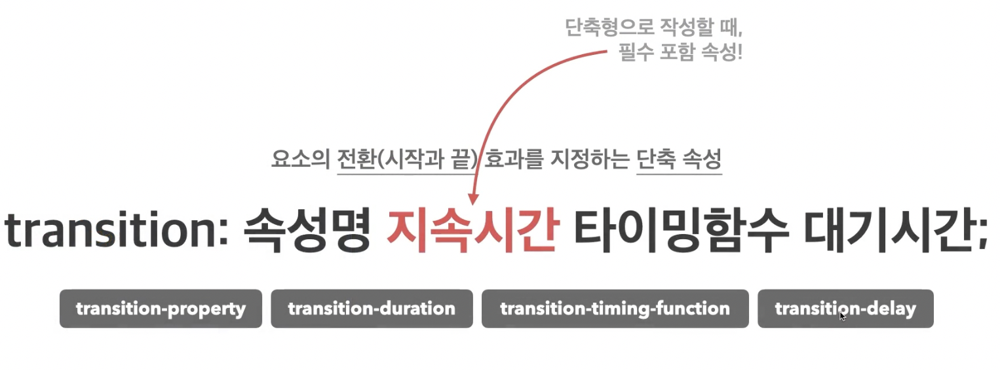
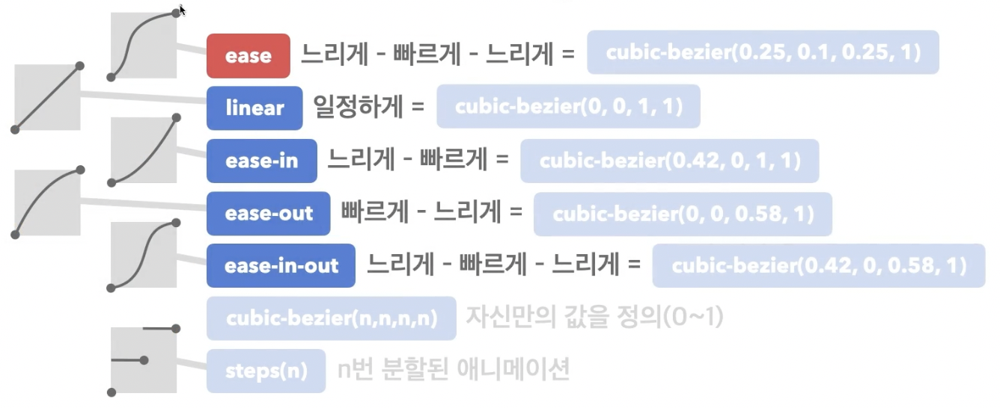

## 전환
### 1️⃣ transition
- 요소의 전환(시작과 끝) 효과를 지정하는 단축 속성



### 2️⃣ transition-property
- 전환 효과를 사용할 속성 이름을 지정
- `all`: 모든 속성에 적용
- 속성 이름: 전환 효과를 사용할 속성 이름 명시

### 3️⃣ transition-duration
- 전환 효과의 지속 시간을 지정
- 0s: 전환 효과 없음
- 시간: 지속 시간(s) 지정

```css
div {
  width: 100px;
  height: 100px;
  background-color: orange;
  transition: 
    width .5s, 
    background-color 2s;
}
div:hover {
  width: 300px;
  background-color: royalblue;

```


커서 올릴 때만 작동

### 4️⃣ transition-timing-function
- 전환 효과의 타이밍(Easing) 함수를 지정



### 5️⃣ transition-delay
- 전환 효과가 몇 초 뒤에 시작할지 대기 시간을 지정
- 0s: 대기 시간 없음
- 시간: 대기 시간(s) 지정