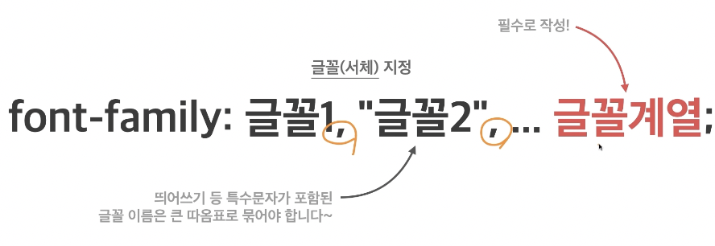
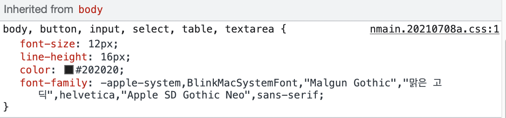
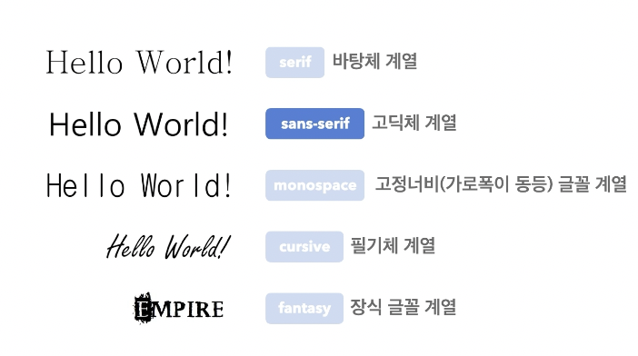
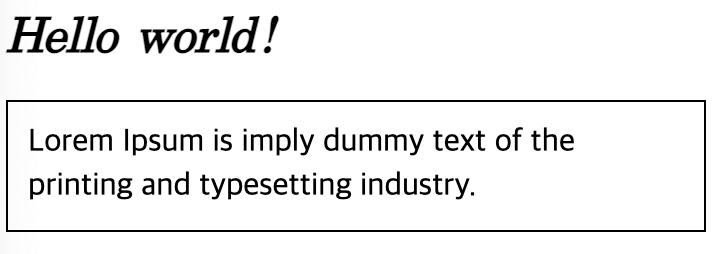
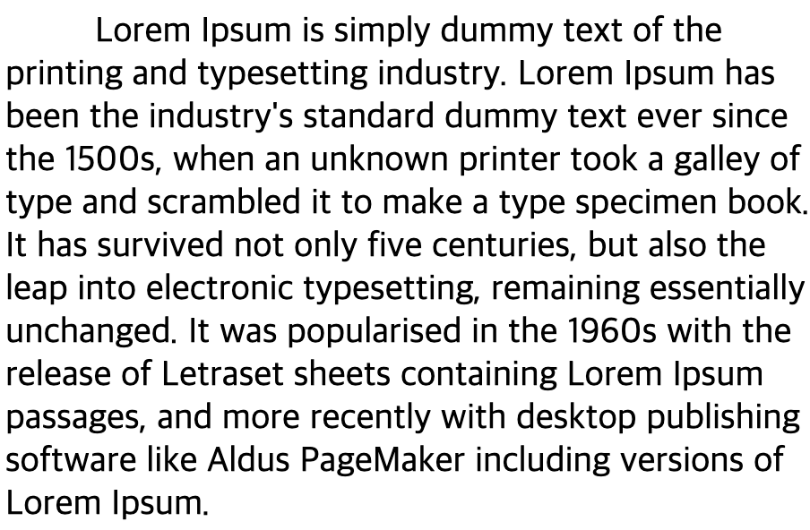

## 글꼴

### 1️⃣ font-style
- 글자의 기울기
- `normal`: 기울기 없음
- `italic`: 이텔릭체
- `oblique`: 기울어진 글자  
  (`italic`으로 기울임 표현 가능하므로 잘 사용하지 않음)

### 2️⃣ font-weight
- 글자의 두께(가중치)
- `normal`, `400`: 기본 두께
- `bold`, `700`: 두껍게
- `bolder`: 상위(부모) 요소보다 더 두껍게
- `lighter`: 상위(부모) 요소보다 더 얇게
- 100~900: 100단위의 숫자 9개, `normal과` `bold` 이외 두께

### 3️⃣ font-size
- 글꼴 크기
- `16px`: 기본 크기
- 단위: `px`, `em`, `rem` 등 단위로 지정



글꼴1부터 시도하여 가능한 경우 글꼴 1 사용, 
사용할 수 없을 경우 글꼴 2 사용



ex) 네이버의 css - apple-system부터 시작하여 적용 가능 폰트 찾기 위해 순차적으로 시도



### 4️⃣ line-height
- 한 줄의 높이 행간과 유사
- `normal`: 브라우저의 기본 정의 사용
- 숫자: 요소의 글꼴 크기의 배수로 지정
- 단위: `px`, `em`, `rem` 등의 단위로 지정

```css
h1 {
  font-size: 24px;
  font-weight: 700;
  font-style: italic;
  font-family: serif; /* 바탕체 */
}
p {
  font-size: 16px;
  width: 350px;
  padding: 10px;
  border: 1px solid;
  box-sizing: border-box;
  line-height: 1.4; /* 줄간격 */
}
```



## 문자

### 1️⃣ color
- 글자의 색상
- `rgb(0,0,0)`: 검정색
- 색상: 기타 지정 가능한 색상

### 2️⃣ text-align
- 문자의 정렬 방식
- `left`: 왼쪽 정렬
- `right`: 오른쪽 정렬
- `center`: 가운데 정렬
- `justify`: 양쪽 정렬

### 3️⃣ text-decoration
- 문자의 장식(선)
- `none`: 장식 없음
- `underline`: 밑줄  
<u>(동해물과 백두산이 마르고 닳도록)</u>
- `overflow`: 윗줄
- `line-through`: 중앙선  
(~~동해물과 백두산이 마르고 닳도록~~)

```html
<a href="https://google.com">
  Google
</a>
```

```css
a {
  display: block;
  width: 200px;
  height: 100px;
  background-color: orange;
  font-size: 22px;
  color: white;
  text-decoration: none;
  text-align: center;
  line-height: 100px;
}
```


### 4️⃣ text-indent
- 문자 첫 줄의 들여쓰기
- 음수 사용 가능, 반대는 내어쓰기(outdent)
- 0: 들여쓰기 없음
- 단위: `px`, `em`, `rem` 등 단위로 지정
- `%`: 요소의 가로 너비에 대한 비율

```css
p {
  font-size: 20px;
  text-indent: 50px; /* 들여쓰기 */
  
}
```

