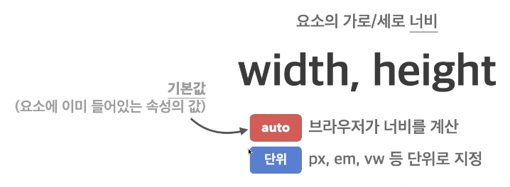
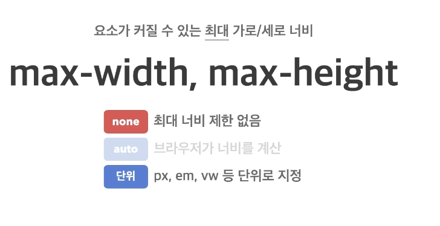

## 너비

### 1️⃣ width, height
- 요소의 가로/세로 너비
- 기본값: `auto`
- `auto`: 브라우저가 너비를 계산
- 단위: `px`, `em`, `vw` 등 단위로 지정



```html
<span>Hello</span>
<span>World</span>
```

- 대표적인 인라인 요소
- 본질적으로 아무것도 나타내지 않는 콘텐츠 영역 설정하는 용도


```html
<div>Hello</div>
<div>World</div>
```

- 대표적인 블록 요소
- 본질적으로 아무것도 나타내지 않는 콘텐츠 영역 설정하는 용도


### 2️⃣ max-width, max-height
- 요소가 커질 수 있는 최대 

#### 가로/세로 너비
- 기본값: `none`
- `none`: 최대 너비 제한 없음
- 단위: `px`, `em`, `vw` 등 단위로 지정



### 3️⃣ min-width, min-height
- 요소가 작아질 수 있는 최소 가로/세로 너비
- 기본값: 0
- 0: 최소 너비 제한 없음
- 단위: `px`, `em`, `vw` 등 단위로 지정


---

## CSS 단위

#### 표현 단위
- `px`: 픽셀
- `%:` 상대적 백분율
- `em`: 요소의 글꼴 크기
- `rem`: 루트 요소(html)의 글꼴 크기
- `vw`: 뷰 포트 가로 너비의 백분율
- `vh`: 뷰 포트 세로 너비의 백분율

ex)

```html
<div class="parent">
  <div class="child"></div>
</div>
```

```css
html {
  /* font-size: 16px; */
}
.parent {
  width: 300px;
  height: 200px;
  background-color: royalblue;
  font-size: 10px;
}
.child {
  width: 50%;
  height: 50%;
  background-color: orange;
}
```


```css
html {
/*   font-size: 16px; */
}
.parent {
  width: 300px;
  height: 200px;
  background-color: royalblue;
  font-size: 10px;
}
.child {
  width: 20em;
  height: 50%;
  background-color: orange;
}
```


```css
html {
/*   font-size: 16px; */
}
.parent {
  width: 300px;
  height: 200px;
  background-color: royalblue;
  font-size: 10px;
}
.child {
  width: 20em;
  height: 50%;
  background-color: orange;
}
```
parent의 font-size가 child에게도 영향 미쳐서 총 200px 차지  


```css
html {
  font-size: 16px;
}
.parent {
  width: 300px;
  height: 200px;
  background-color: royalblue;
  font-size: 10px;
}
.child {
  width: 20rem;
  height: 50%;
  background-color: orange;
}
```
rem의 장점  
html의 크기에 맞춰서 사용되기 때문에 주변 상황에 영향을 안 받는다  


```css
html {
  font-size: 16px;
}
.parent {
  width: 300px;
  height: 200px;
  background-color: royalblue;
  font-size: 10px;
}
.child {
  width: 50vw;
  height: 50%;
  background-color: orange;
}
```
뷰 포트의 가로 넓이 반 차지


```css
html {
  font-size: 16px;
}
.parent {
  width: 300px;
  height: 200px;
  background-color: royalblue;
  font-size: 10px;
}
.child {
  width: 50vw;
  height: 50vh;
  background-color: orange;
}
```
뷰 포트의 세로 넓이 반 차지
