## 배치

### 1️⃣ position
- 요소의 위치 지정 기준
- `static`: 기준 없음
- `relative`: 요소 자신을 기준
- `absolute`: 위치 상 부모 요소를 기준
- `fixed`: 뷰포트(브라우저)를 기준

### 2️⃣ top, bottom, left, right
- 요소의 각 방향별 거리 지점
- `auto`: 브라우저가 계산

```css
.container {
  width: 300px;
  background-color: royalblue;
  position: relative;
}
.container .item {
  border: 4px dashed red;
  background-color: orange;
}
.container .item:nth-child(1) {
  width: 100px;
  height: 100px;
}
.container .item:nth-child(2) {
  width: 140px;
  height: 70px;
  position: relative;
  /* relative 속성은 부여되었지만 화면에 나타나는 효과는 없음을 알아야 함 */
  right: 10px;
  bottom: 10px;
  top: 30px;
  left: 200px;
}
.container .item:nth-child(3) {
  width: 70px;
  height: 120px;
}
```

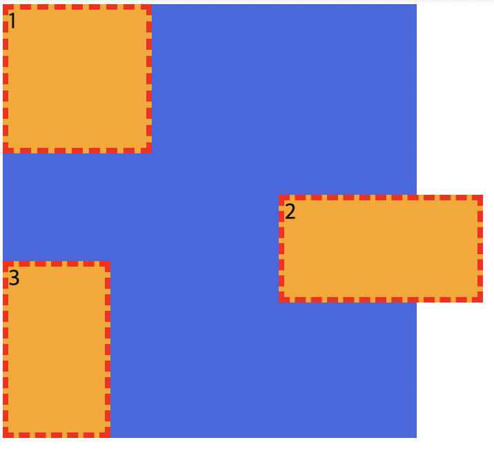
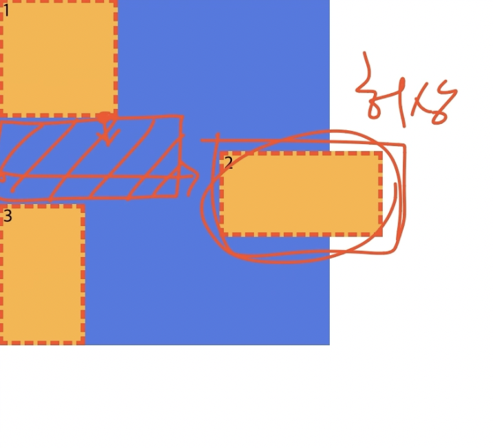

- `relative`는 자기 자신이 있던 위치를 중심으로 움직이기 때문에 1과 3 사이에 빈 공간이 생기기 됨, 그러나 저 공간이 왜 생겼는지 보는 사람은 이해할 수 없으므로 개발할 때 `relative`를 이용한 배치는 잘 사용하지 않음


### - absolute

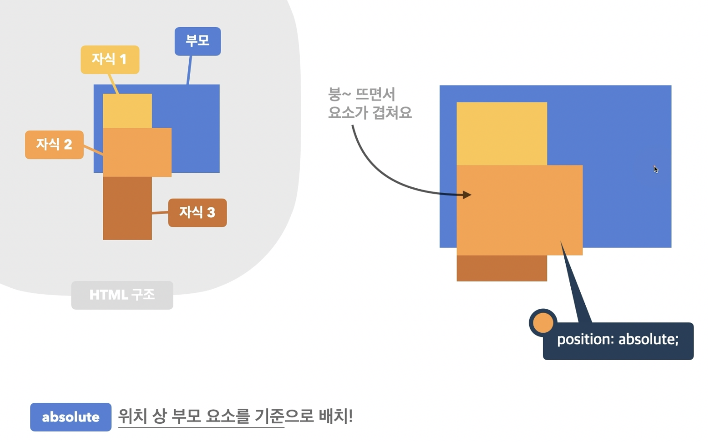

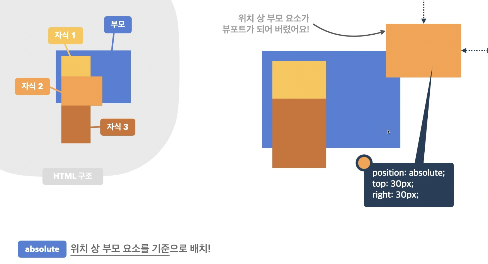

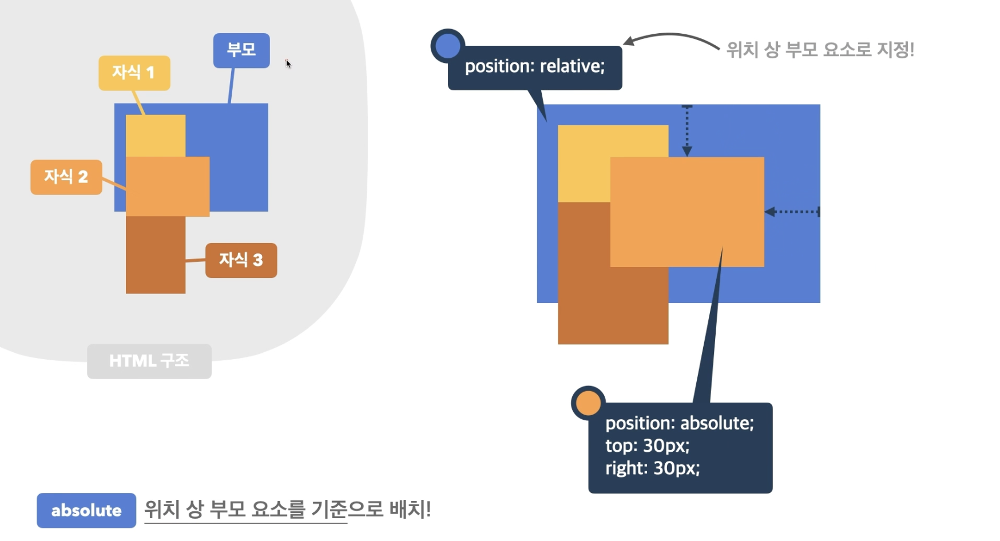

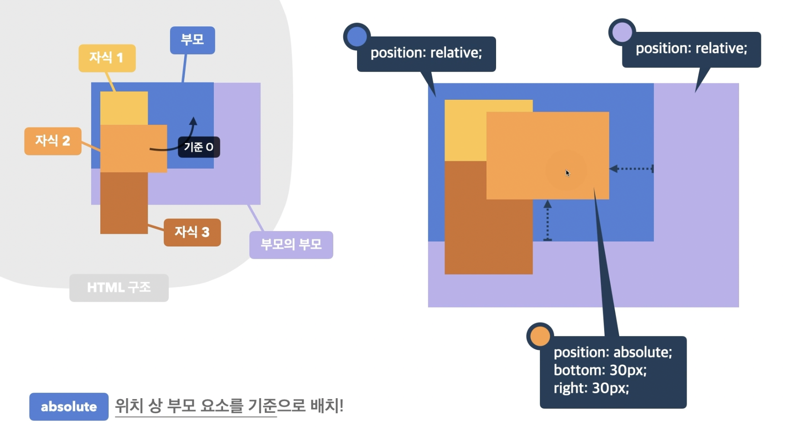

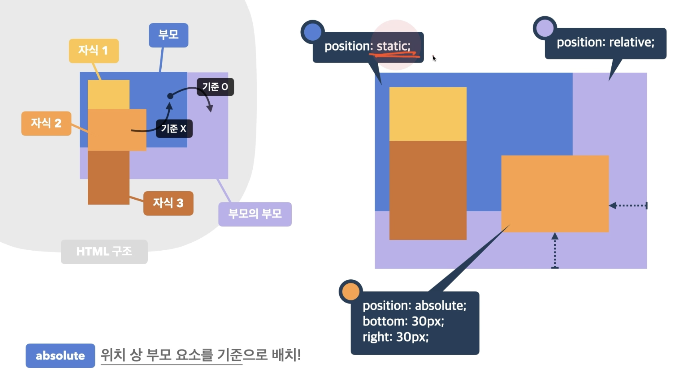

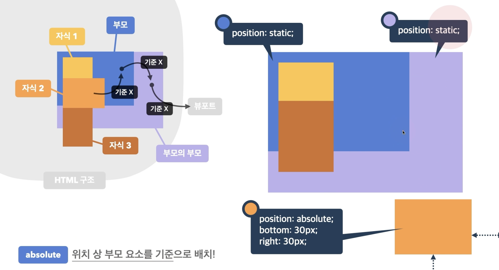

ex 1)
```css
.container {
  width: 300px;
  background-color: royalblue;
}
.container .item {
  border: 4px dashed red;
  background-color: orange;
}
.container .item:nth-child(1) {
  width: 100px;
  height: 100px;
}
.container .item:nth-child(2) {
  width: 140px;
  height: 70px;
  position: absolute;
  bottom: 30px;
  right: 60px;
}
.container .item:nth-child(3) {
  width: 70px;
  height: 120px;
}
```

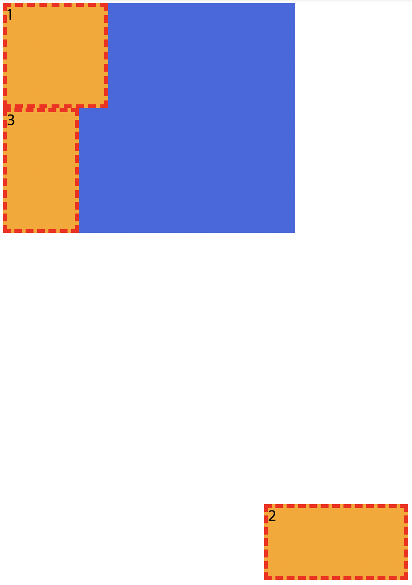

> `container`에서 `position`이 지정되지 않았기 때문에 지정된 위치가 없다고 판단하여 item 2가 뷰포트를 기준으로 삼게 됨

<br/>

ex 2)

```css
.container {
  width: 300px;
  background-color: royalblue;
  position: relative;
}
.container .item {
  border: 4px dashed red;
  background-color: orange;
}
.container .item:nth-child(1) {
  width: 100px;
  height: 100px;
}
.container .item:nth-child(2) {
  width: 140px;
  height: 70px;
  position: absolute;
  bottom: 30px;
  right: 60px;
}
.container .item:nth-child(3) {
  width: 70px;
  height: 120px;
}
```

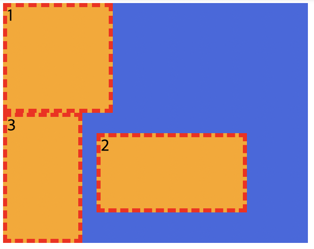

<br/>

ex 3)
```css
.wrap {
  width: 400px;
  height: 300px;
  background-color: tomato;
  position: relative;
}
.container {
  width: 300px;
  background-color: royalblue;
}
.container .item {
  border: 4px dashed red;
  background-color: orange;
}
.container .item:nth-child(1) {
  width: 100px;
  height: 100px;
}
.container .item:nth-child(2) {
  width: 140px;
  height: 70px;
  position: absolute;
  bottom: 30px;
  right: 60px;
}
.container .item:nth-child(3) {
  width: 70px;
  height: 120px;
}
```

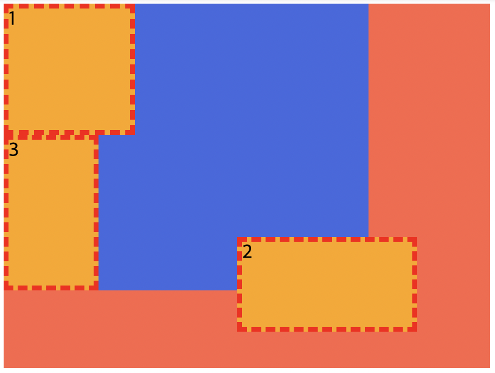

> `container`에 `position`을 지정하지 않았으므로 위치 지정이 되지 않았다고 판단하여 `container`의 상위 요소인 `relative`로 지정된 `wrap`을 기준으로 item2 배치


### - fixed

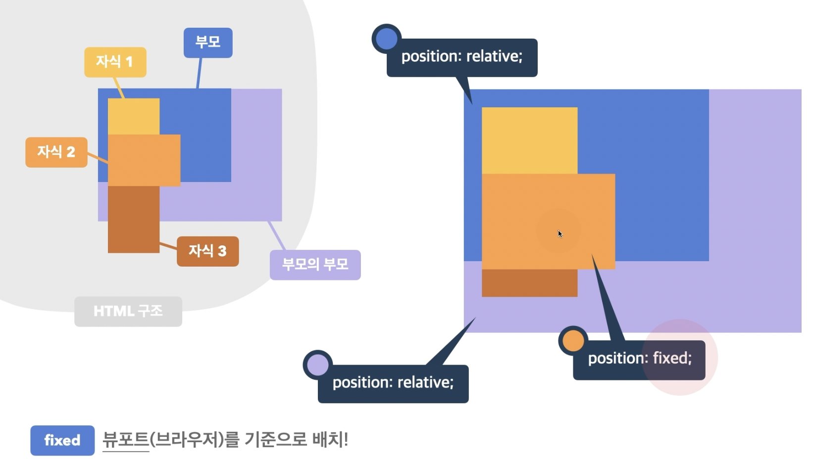

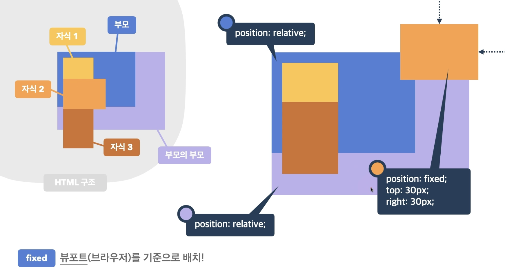


### 3️⃣ 요소 쌓임 순서(Stack Order)
- 어떤 요소가 사용자와 더 가깝게 있는지(위에 쌓이는지) 결정  
➀ 요소에 `position` 속성 값이 있는 경우 위에 쌓임(기본값 `static` 제외)  
➁ 1번 조건이 같은 경우 `z-index` 속성의 숫자 값이 높을수록 위에 쌓임  
➂ 1번과 2번 조건까지 같은 경우 HTML의 다음 구조일수록 위에 쌓임  

```css
.container {
  width: 300px;
  background-color: royalblue;
  position: relative;
}
.container .item {
  width: 100px;
  height: 100px;
  border: 4px dashed red;
  background-color: orange;
}
.container .item:nth-child(1) {
  position: relative;
}
.container .item:nth-child(2) {
  position: absolute;
  top: 50px;
  left: 50px;
}
.container .item:nth-child(3) {
}
```

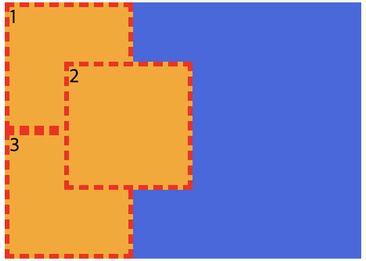

- 1번 조건: 1과 2번 모두 `positon` 값 존재
- 2번 조건: `z-index` 값 없음
- 3번 조건: 나중에 작성된 2번이 더 위에 쌓임

```css
.container {
  width: 300px;
  background-color: royalblue;
  position: relative;
}
.container .item {
  width: 100px;
  height: 100px;
  border: 4px dashed red;
  background-color: orange;
}
.container .item:nth-child(1) {
  position: relative;
  z-index: 1;
}
.container .item:nth-child(2) {
  position: absolute;
  top: 50px;
  left: 50px;
}
.container .item:nth-child(3) {
  z-index: 2;
}
```

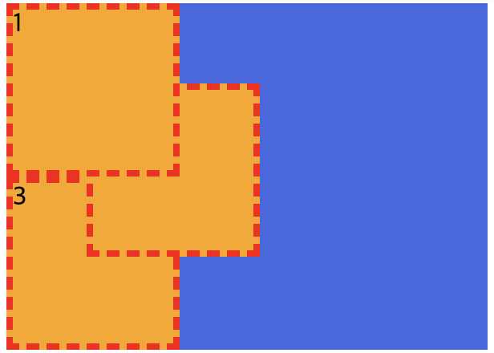

- 1번 조건: 1과 2번 모두 `positon` 값 존재
- 2번 조건: 1번은 있지만 2번은 없으므로 1번이 위에 쌓임, 3번은 `z-index` 값이 존재하긴 하나 `position이` 지정되지 않았으므로 비교 대상이 되지 않음

### 4️⃣ z-index
- 요소의 쌓임 정도를 지정
- `auto`: 부모 요소와 동일한 쌓임 정도
- 숫자: 숫자가 높을수록 위에 쌓임

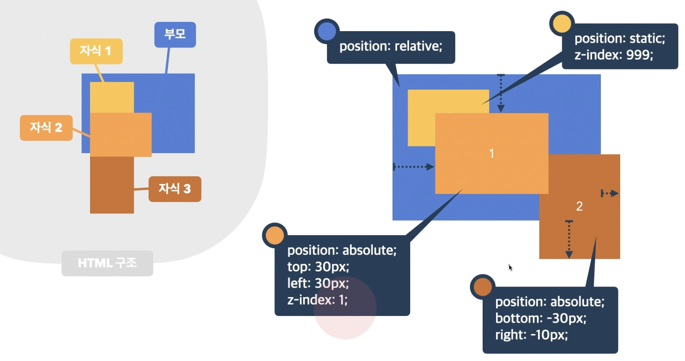

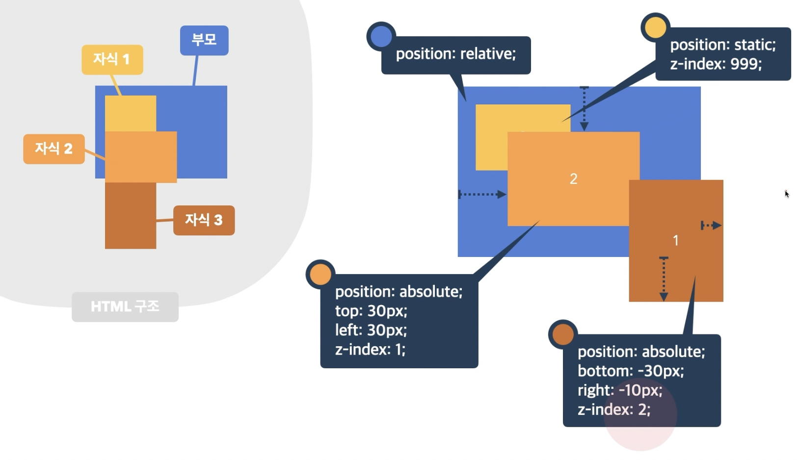

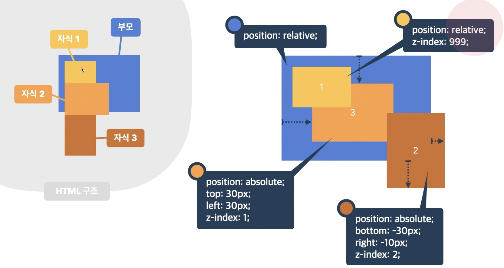

<br/>

`position` 속성의 값으로 `absolute`, `fixed`가 지정된 요소는 `display` 속성이 `block`으로 변경됨

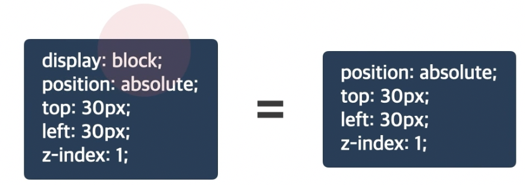