## 플렉스 Container

```html
<div class="container">
  <div class="item">1</div>
  <div class="item">2</div>
  <div class="item">3</div>
</div>
```

```css
.container {
  background-color: royalblue;
  display: flex;
}
.container .item {
  width: 100px;
  height: 100px;
  border: 3px dashed red;
  background-color: orange;
}
```

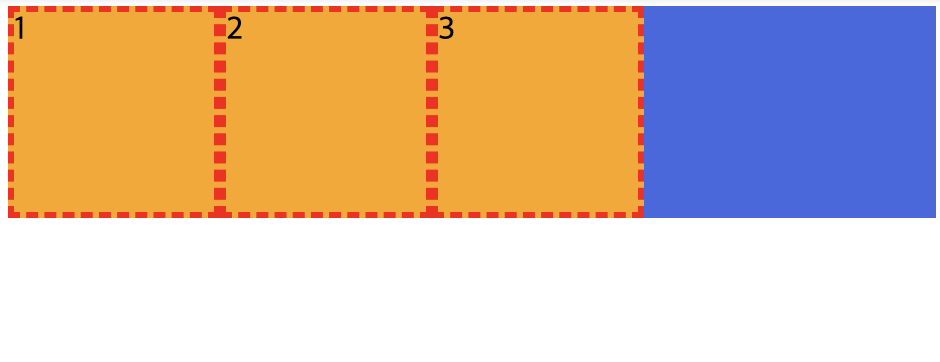

<br/>

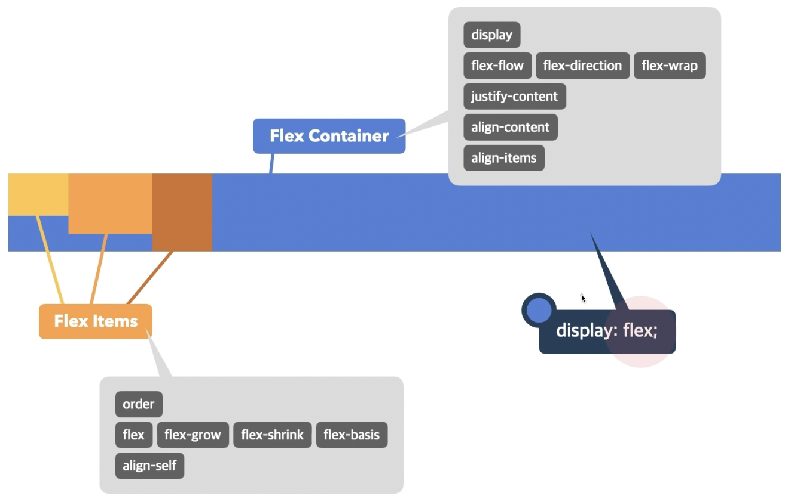

Container와 Item 각각에 부여할 수 있는 속성이 다름

### 1️⃣ display
- Flex Container의 화면 출력(보여짐)의 특성
- `flex`: 블록 요소와 같이 Flex Container 정의
- `inline-flex`: 인라인 요소와 같이 Flex Container 정의

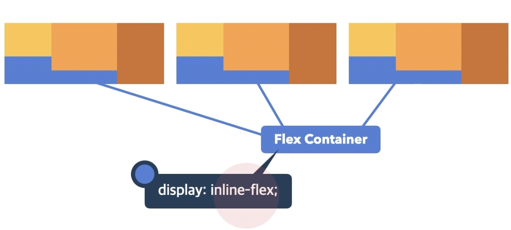

### 2️⃣ flex-direct
- 주 축을 설정(수평 정렬 / 수직 정렬 선택)
- `row`: 행 축(좌→우)
- `row-reverse`: 행 축(우→좌)
- `column`: 열 축(위→아래)
- `column-reverse`: 열 축(아래→위)

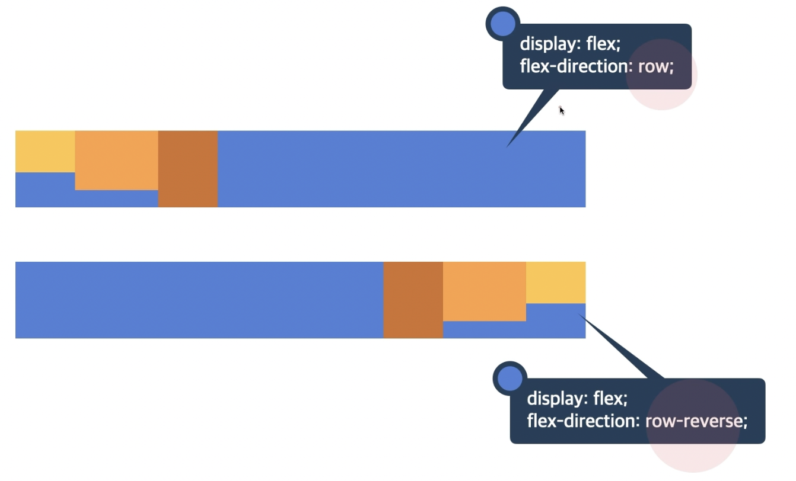

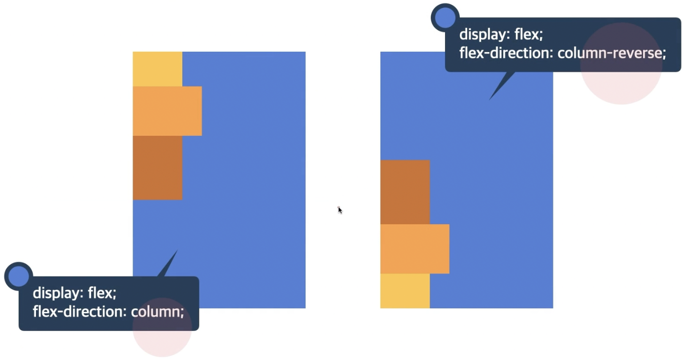


### 3️⃣ flex-wrap
- Flex Items 묶음(줄 바꿈) 여부
- `nowrap`: 묶음(줄 바꿈) 없음
- `wrap`: 여러 줄로 묶음
- `wrap-reverse`: `wrap의` 반대 방향으로 묶음

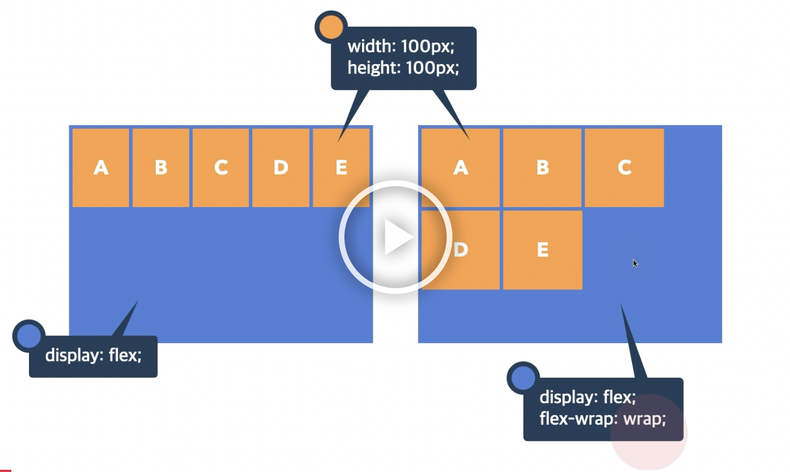

```css
.container {
  width: 250px;
  background-color: royalblue;
  display: flex;
  flex-wrap: wrap;
}
.container .item {
  width: 100px;
  height: 100px;
  border: 3px dashed red;
  background-color: orange;
}
```

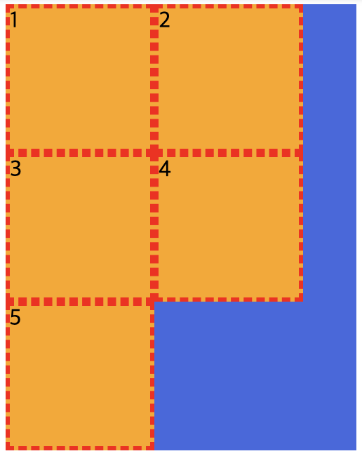

### 4️⃣ justify-content
- 주 축의 정렬 방법
- `flex-start: Flex Item`를 시작점으로 정렬
- `flex-end: Flex Items`를 끝점으로 정렬
- `center`: Flex Items를 가운데 정렬
- `space-between`: 각 Flex Item 사이를 균등하게 정렬
- `space-around`: 각 Flex Item의 외부 여백을 균등하게 정렬

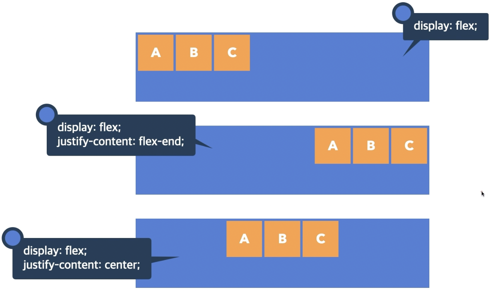

5️⃣ align-content
-  교차 축의 여러 줄 정렬 방법
- `stretch`: Flex Items를 시작점으로 정렬
- `flex-start`: Flex Items를 시작점으로 정렬
- `flex-end`: Flex Items를 끝점으로 정렬
- `center`: Flex Items를 가운데 정렬
- `space-between`: 각 Flex Item 사이를 균등하게 정렬
- `space-around`: 각 Flex Item의 외부 여백을 균등하게 정렬

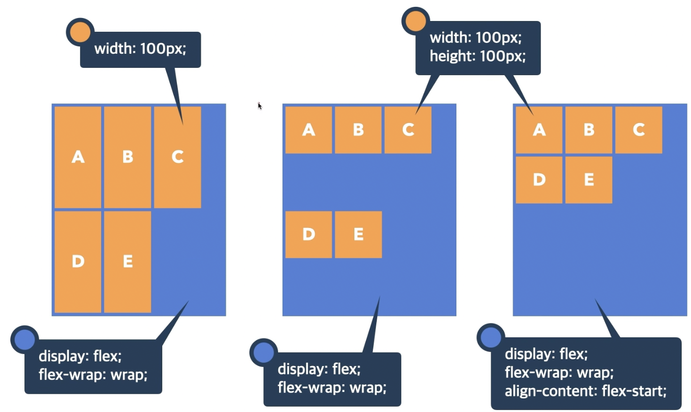
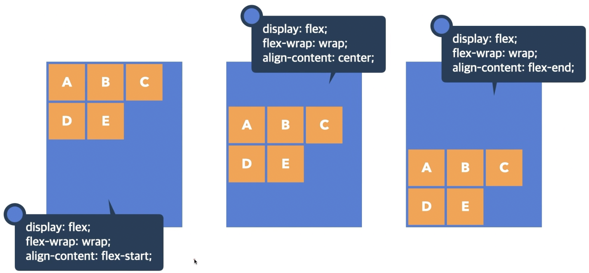

### 6️⃣ align-items
- 교차 축의 한 줄 정렬 방법
- `stretch`: Flex Items를 교차 축으로 늘림
- `flex-start`: Flex Items를 각 줄의 시작점으로 정렬
- `flex-end`: Flex Items를 각 줄의 끝점으로 정렬
- `center`: Flex Items를 각 줄의 가운데 정렬
- `baseline`: Flex Items를 각 줄의 문자 기준선에 정렬


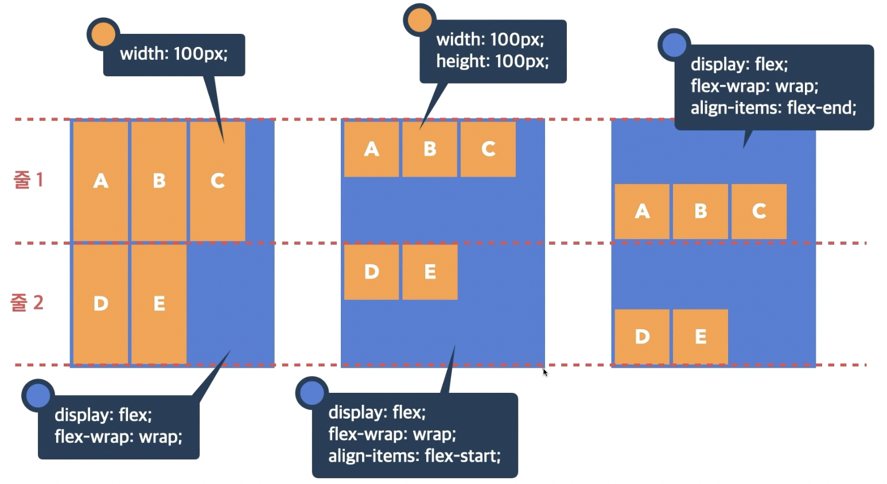
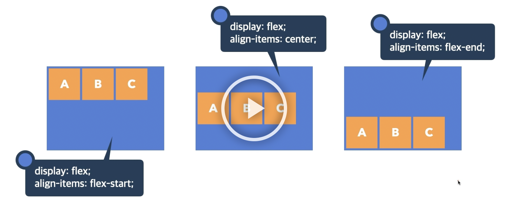

```css
.container {
  width: 500px;
  height: 300px;
  background-color: royalblue;
  display: flex;
  justify-content: center; 
  /* 수평 정렬 */
  align-items: center; 
  /* 수직 정렬 */
}
.container .item {
  width: 100px;
  height: 100px;
  border: 3px dashed red;
  background-color: orange;
}
```

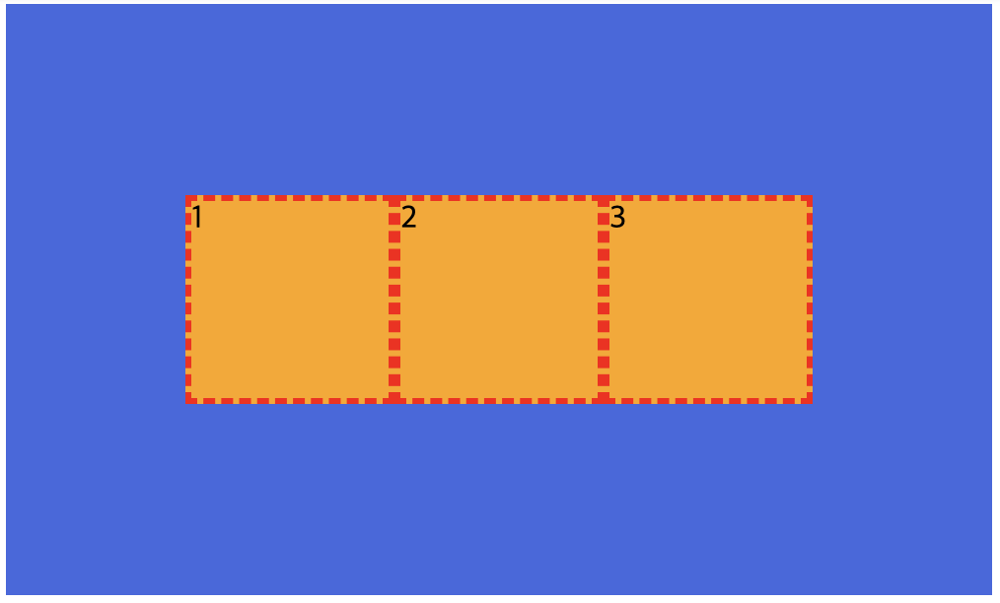