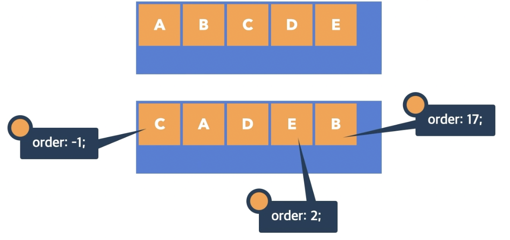

## 플렉스 Items

```css
.container {
  width: 500px;
  height: 300px;
  background-color: royalblue;
  display: flex;
  justify-content: center;
  align-items: center;
}
.container .item {
  width: 100px;
  height: 100px;
  border: 3px dashed red;
  background-color: orange;
  flex-grow: 1;
  flex-basis: 0;
}
.container .item:nth-child(3) {
  flex-grow: 2;
}
```


> 1, 2, 3번 박스에 1:1:1의 비율을 설정하였으나,  
`item:nth-child(3)`에서 비율을 2로 설정하였으므로 3번 박스가 2, 나머지 박스가 1:1의 비율을 가지게 됨

### 1️⃣ order
- Flex Item의 순서
- 0: 순서 없음
- 숫자: 숫자가 작을수록 먼저



### 2️⃣ flex-grow
- Flex Item의 증가 너비 비율
- 0: 증가 비율 없음
- 숫자: 증가 비율


### 3️⃣ flex-shrink
- Flex Items의 감소 너비 비율
- 1: Flex Container 너비에 따라 감소 비율 적용
- 숫자: 감소 비율


기본값이 `flex-shrink: 1;`이기 때문에 두 번째 그림처럼 상자 너비가 축소됨

### 4️⃣ flex-basis
- Flex Item의 공간 배분 전 기본 너비
- `auto`: 요소의 Content 너비
- 단위: `px`, `em`, `rem` 등 단위로 지정


글자가 차지하고 있는 기본 너비가 있으므로 flex-grow로 비율 배분 정확히 불가능

<br/>


`flex-basis: 0;`으로 기본 너비를 지정하지 않아 1:1:2로 비율 배분 가능

<br/>


기본 너비 100px를 제외한 너비에서 1:1:2의 비율 배분