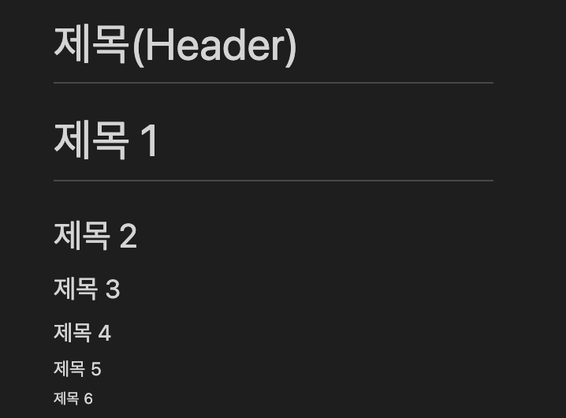
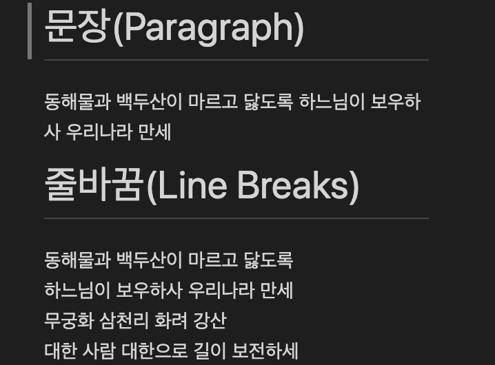
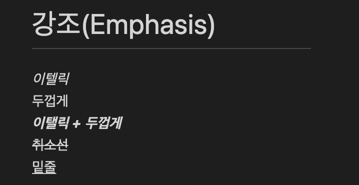
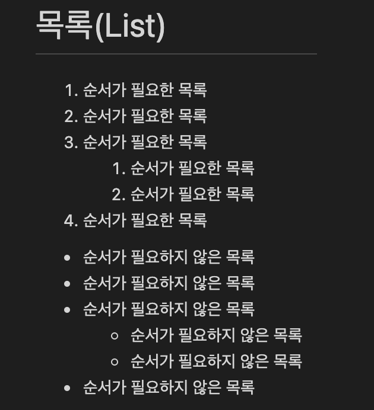
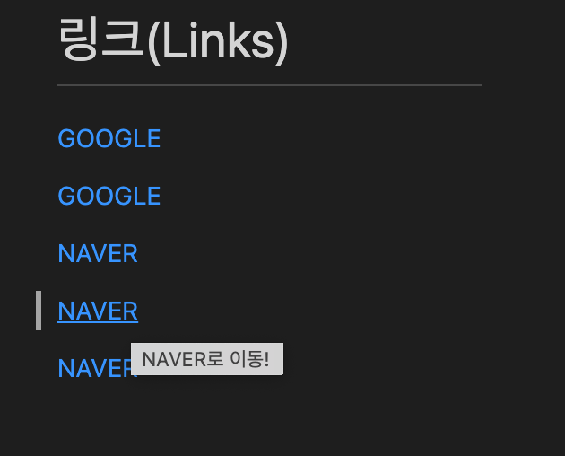
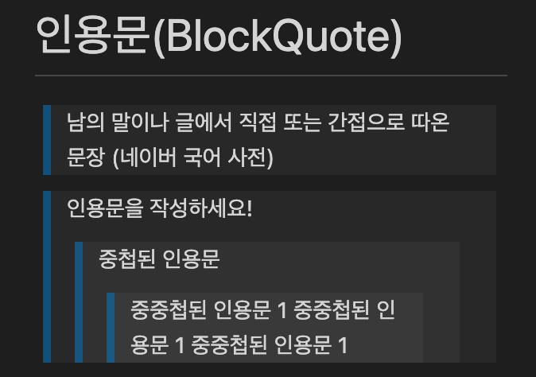
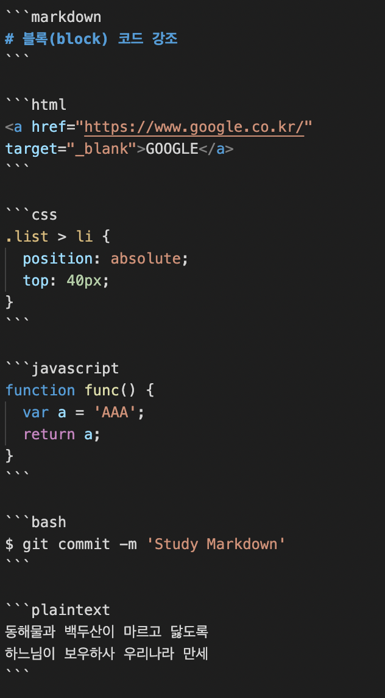
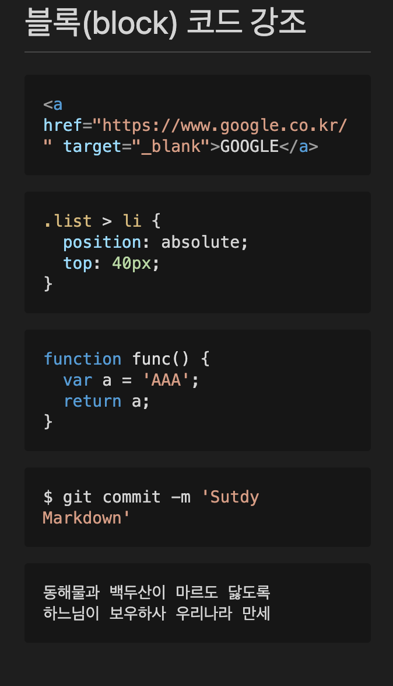
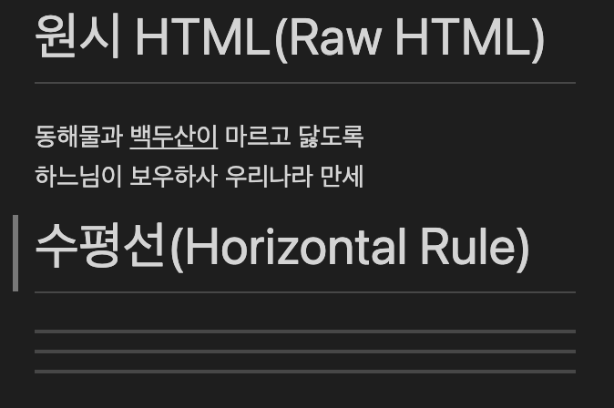

## 마크다운

- 장점
  - 문법이 쉽고 간결하다
  - 관리가 쉽다
  - 지원 가능한 플랫폼과 프로그램이 다양하다
- 단점
  - 표준이 없다
  - 모든 HTML 마크업을 대신하지 못한다

---

## 제목, 문장, 줄바꿈

### 1. 제목  
#~######로 제목 크기 및 중요도 조절 가능

```markdown
# 제목(Header)

# 제목 1
## 제목 2
### 제목 3
#### 제목 4
##### 제목 5
###### 제목 6
```



### 2. 문장, 줄바꿈  
엔터가 아닌 띄어쓰기 두 번 또는 `<br />`으로 줄 바꿈

```markdown
# 문장(Paragraph)
동해물과 백두산이 마르고 닳도록
하느님이 보우하사 우리나라 만세

# 줄바꿈(Line Breaks)

동해물과 백두산이 마르고 닳도록  
하느님이 보우하사 우리나라 만세  
무궁화 삼천리 화려 강산  
대한 사람 대한으로 길이 보전하세
```



---

## 강조, 목록

### 1. 강조  
밑줄 태그는 권장하지 않음

```markdown
# 강조(Emphasis)
_이텔릭_  
두껍게  
**_이텔릭 + 두껍게_**  
~~취소선~~  
<u>밑줄</u>
```



### 2. 목록  
`<ol>`태그와 비슷한 기능

```markdown
# 목록(List)

1. 순서가 필요한 목록
1. 순서가 필요한 목록
1. 순서가 필요한 목록
    <!-- 들여쓰기 두 번으로 하위 목록 생성 -->
    1. 순서가 필요한 목록
    1. 순서가 필요한 목록
1. 순서가 필요한 목록

- 순서가 필요하지 않은 목록
- 순서가 필요하지 않은 목록
- 순서가 필요하지 않은 목록
    <!-- 들여쓰기 두 번으로 하위 목록 생성 -->
    - 순서가 필요하지 않은 목록
    - 순서가 필요하지 않은 목록
- 순서가 필요하지 않은 목록
```



## 링크, 이미지

### 1. 링크

```markdown
# 링크(Links)

<a href="https://google.com">GOOGLE</a>

[GOOGLE](https://google.com)

<a href="https://naver.com" title="NAVER로 이동!">NAVER</a>
<!-- title에 내용 입력하면 커서 올렸을 때 해당 내용 표시-->

[NAVER](https://naver.com "NAVER로 이동!")

<a href="https://naver.com" title="NAVER로 이동!" target="_blank">NAVER</a>  
<!-- _blank 새 탭에 화면 띄우기, 마크다운에서 target을 제공하고 있지는 않음 -->
```



### 2. 이미지

```markdown
# 이미지(Images)

<!-- 이미지 주소 복사해 이미지만 출력 -->


<!-- 이미지 클릭 시 특정 링크로 이동될 수 있도록 -->
[](https://heropy.blog)이미지만 출력
```

이미지만 출력


클릭 시 특정 링크로 이동

<a href="https://heropy.blog"></a>


## 인용문, 코드 강조

### 1. 인용문

```markdown
# 인라인(inline) 코드 강조

CSS에서 `background` 혹은 `background-image` 속성으로 요소에 배경 이미지를 삽입할 수 있습니다.
```



#### 2. 코드 강조

```markdown
# 블록(block) 코드 강조
```

```html
<a href="https://www.google.co.kr/" target="_blank">GOOGLE</a>
```

```css
.list > li {
  position: absolute;
  top: 40px;
}
```

```javascript
function func() {
  var a = 'AAA';
  return a;
}
```

```bash
$ git commit -m 'Study Markdown'
```

```plaintext
동해물과 백두산이 마르고 닳도록  
하느님이 보우하사 우리나라 만세
```





## 표

- 기본적으로 왼쪽 정렬
- 가운데정렬(:—:) 가운데정렬(—:) 콜론 위치로 설정 가능

```markdown
# 표(Table)

position 속성

값 | 의미 | 기본값
--|:--:|--:
static | 기준 없음 | O
relative | 요소 자신 | X
absolute | 위치 상 부모 요소 | X
fixed | 뷰포트 | X
```


## 원시 HTML, 수평선

#### 1. 원시 HTML  
`<u></u>` 태그보다 `<span style="text-decoration: underline;>`을 더 권장

```markdown
# 원시 HTML(Raw HTML)

동해물과 <span style="text-decoration: underline;">백두산이</span> 마르고 닳도록<br />
하느님이 보우하사 우리나라 만세
```

#### 2. 수평선

```markdown
# 수평선(Horizontal Rule)

---

***

___
```

