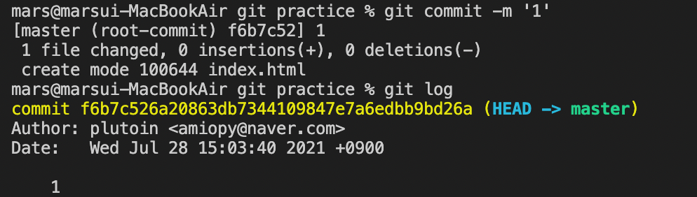
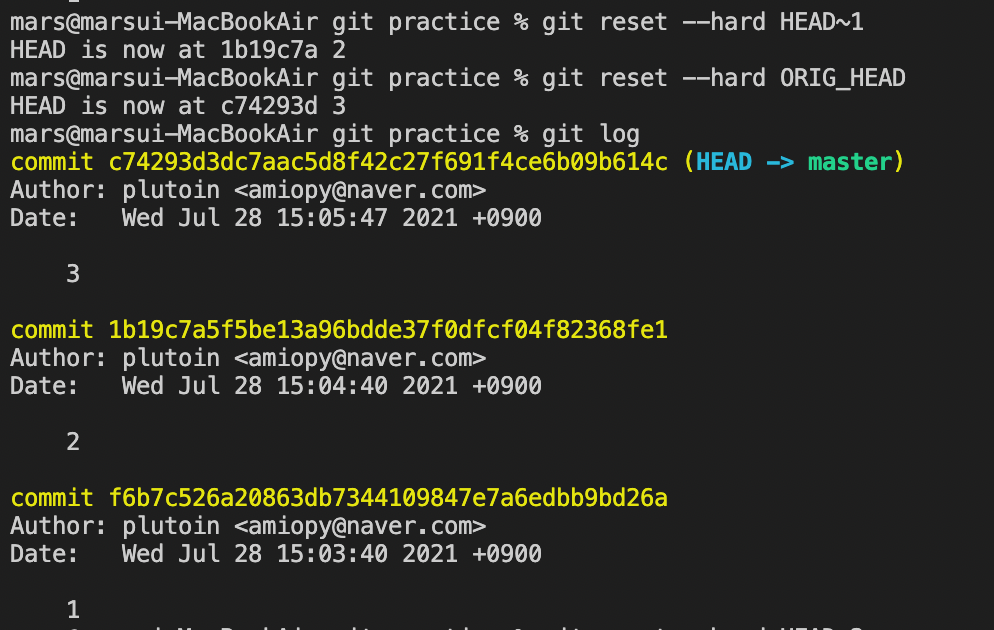
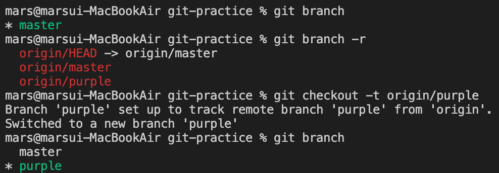
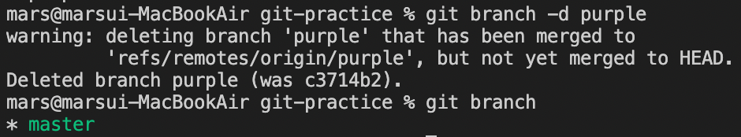
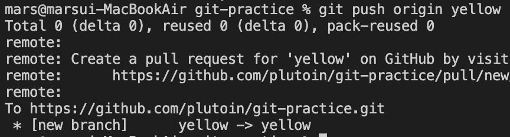
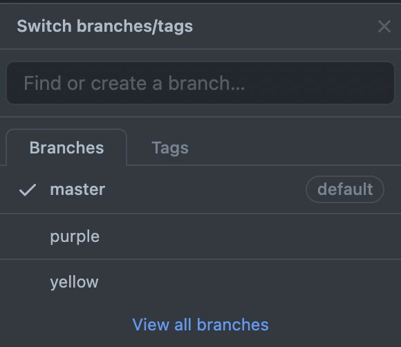

## 버전 생성 및 업로드

```bash
git init
# 리포지토리 초기화, .git 폴더 생성
git status
# 리포지토리 상태
git add .
# 파일 추적할 수 있게 함
git commit -m '커밋 메시지'
# 버전 관리 위한 커밋 메시지 입력
git log
# 로그 표시
git remote add origin 리포지토리 주소
# 원격 저장소와의 연결
git push origin master
# 원격 저장소에 업로드
```

---

## 지속적인 배포

- Netlify를 이용하여 지속적인 배포 가능
- 버전 관리 가능
- [Netlify: Develop & deploy the best web experiences in record time](https://www.netlify.com/)

---

## 로그인 브랜치

현재 사용하고 있는 브랜치 확인

```shell
git branch
```

로그인 브랜치 생성

```shell
git branch signin
```

master 브랜치에서 signin 브랜치로 변경

```shell
git checkout signin
```

- 병합하기 전까지 master 브랜치에 영향 주지 않으므로 실제 보여지는 페이지에 영향 역시 주지 않음
- Netlify에서도 master의 내용으로 배포하기 때문에 병합 전에는 실제로 나타나지 않음

---

## 프로젝트 복제(Clone)

- `ls` 명령어로 현재 위치에 있는 파일 목록 출력
- 원하는 저장소로 이동 시 `cd` 명령어 이용
`cd ..`로 상위 이동 가능

```bash
데스크톱으로 이동하려고 할 때
cd desktop
```

- 원하는 프로젝트  깃 주소 복사하여 클론(복제)하기

```bash
git clone https://github.com/
```

- 복제한 프로젝트 열기

```bash
cd 원하는 프로젝트 폴더 이름
code .

# 원하는 프로젝트 현재 창으로 열기
code . -r
```

---

## 버전 되돌리기(reset)

1. git으로 관리할 수 있도록 설정

```shell
git init
```

2. git의 상태 확인

```shell
git status
```

3. git에 모든 파일 추적할 수 있게 하기

```shell
git add .
```


4. 버전 생성하기

```shell
git commit -m '커밋 내용 입력'
```

5. 깃 로그 확인

```shell
git log
```



- 깃 버전 이동  
- HEAD 뒤에 얼마나 거스를 것인지 숫자로 표시

```shell
git reset --hard HEAD~1
git reset --hard HEAD~2
```

- 가장 최신 버전으로 돌아가기

```shell
git reset --hard ORIG_HEAD
```



git log로 확인해 보면 버전 3까지 복구된 것 확인 가능

- 브랜치 이동

```shell
git checkout '브랜치 이름'
```

- 브랜치 레퍼지토리에 저장

- 여러 명이서 개발 진행 중일 때 한꺼번에 모든 브랜치를 올리려고 하면 혼동 생길 수 있음

```shell
git remote add origin '깃 주소' # 깃 주소 추가
git push origin master
git checkout 다른 브랜치 이름  # 다른 브랜치로 변경
git push origin 다른 브랜치 이름
```

---

## 다른 환경에서 시작하기

- 원격 저장소에서 프로젝트 클론

```shell
git clone '깃 주소'
```

브랜치가 여러 개일 경우 master 브랜치만 받아오게 됨  
다른 브랜치의 목록 확인하여 사용하고자 하는 브랜치 이름 확인

```shell
git branch  # 로컬 환경에 있는 브랜치 확인
git branch -r
```

- 원하는 브랜치 로컬에 추가

```shell
git branch -t origin/브랜치 이름
```



- 브랜치 삭제 (master로 이동하여 삭제할 것)

```shell
git checkout master
git branch -d 브랜치 이름
```



- 브랜치를 생성 및 `checkout` 한 번에 하기

```shell
git checkout -b 생성할 브랜치 이름
```

- 원격 저장소로 push

```shell
git push origin 브랜치 이름
```





## 충돌(Conflict), 로컬 병합(Merge)

원격 저장소에 있는 내용과 로컬 저장소의 내용이 같지 않은 경우 push 불가능

pull로 원격 저장소의 내용을 불러와야 함

```shell
git pull origin master
```