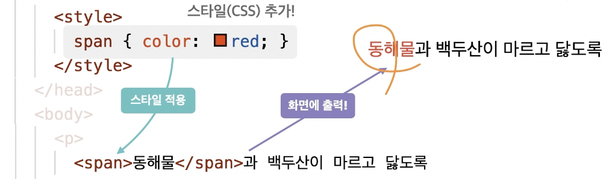
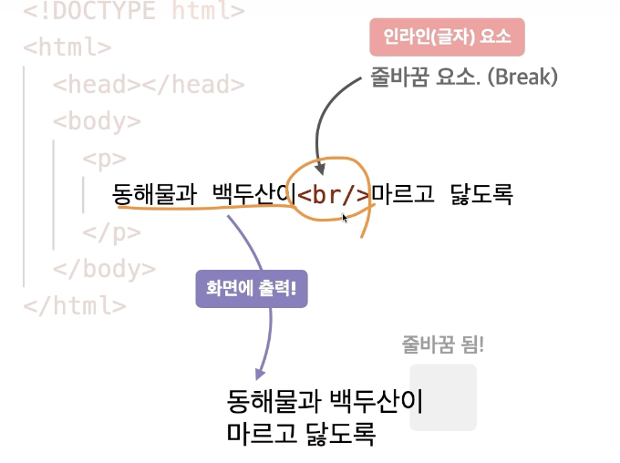
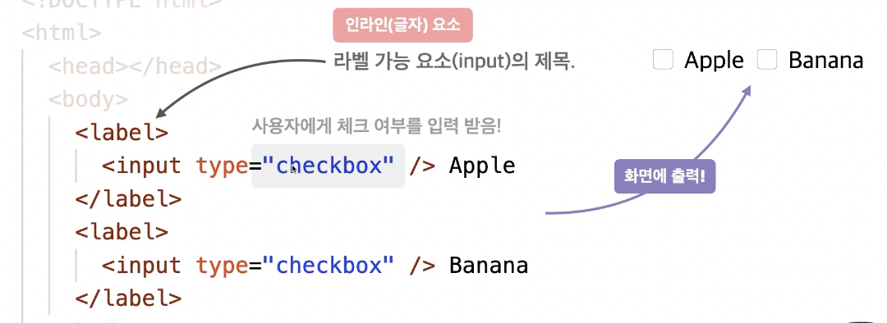
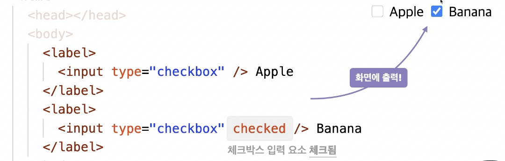
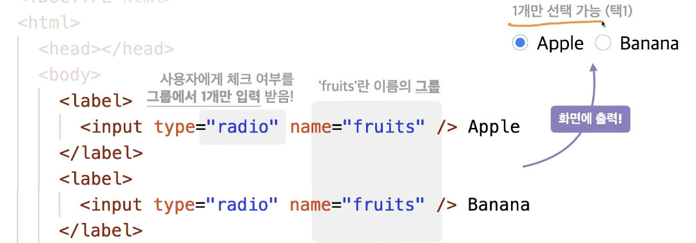
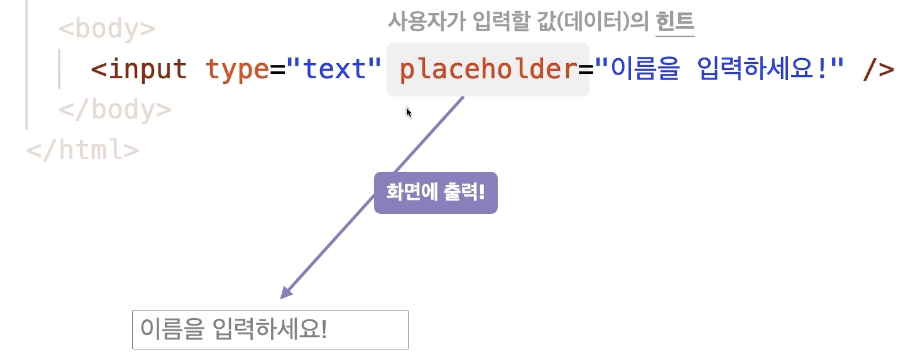
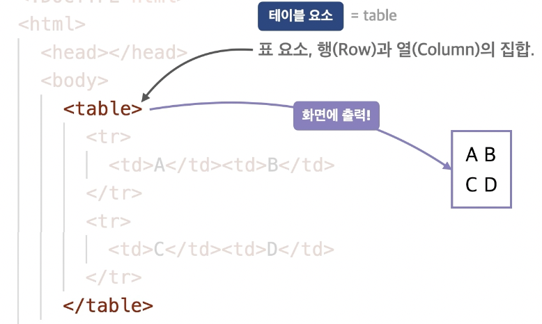

## 핵심 요소

### 블록(상자) 요소
#### `<div>`
- 특별한 의미가 없는 구분을 위한 요소(Division)

#### `<h1>~<h6>`
- 제목을 의미하는 요소 (Heading)
- 숫자가 작을수록 더 중요한 제목 정의

#### `<p>`
- 문장을 의미하는 요소 (Paragraph)

#### `<ul>`
- 순서가 필요 없는 목록의 집합 (Unordered List)
- `<li>` 태그를 최소 한 개 이상 가지고 있어야 함

#### `<li>`
- 목록 내 각 항목 (List Item)
- `<ul>` 태그로 감싸져야 함

#### `<ol>`
- 순서가 필요한 목록의 집합 (Ordered List)
- 사용 빈도가 적음

#### `<a>`
- 다른/같은 페이지로 이동하는 하이퍼링크를 저장하는 요소
- `href`: 링크 URL / `target`: 링크 URL의 표시(브라우저 탭) 위치

### 인라인(글자) 요소
#### ``
: 이미지를 삽입하는 요소(Image)
- 필수 속성: src(이미지 경로) alt(이미지 이름)
- 이미지가 정상적으로 출력되지 않을 경우 이미지 이름이 출력

#### `<span>`
- 특별한 의미가 없는 구분을 위한 요소



#### `<br>`
- 줄 바꿈 요소 (Break)



#### `<label>`
- 라벨 기능 요소(input)의 제목



### 인라인 블록 요소

#### `<input>`
- 사용자가 데이터를 입력하는 요소
- `type`: 입력받을 데이터의 타입

- `checkbox`: 체크박스 생성



- `radio`: 라디오박스 생성



- `value`: 미리 입력된 값(데이터)
- `placeholder`: 사용자가 입력할 값(데이터)의 힌트
- `disabled`: 입력 요소 비활성화




### 테이블 요소

#### `<table>`
- 표 요소, 행(row)과 열(column)의 집합



#### `<tr>`
- 테이블의 행 (Table Row), 제일 먼저 지정해야 함

#### `<td>`
- 테이블의 열 (Table Data)


## 전역 속성

1. `<태그 **title="설명"**></태그>`
: 요소의 정보나 설명을 지정

2. `<태그 **style="스타일"**></태그>`
: 요소에 적용할 스타일(CSS) 지정

3. `<태그 **class="이름"**></태그>`
: 요소를 지칭하는 중복 가능한 이름

4. `<태그 **id="이름"**></태그>`
: 요소를 지칭하는 고유한 이름

5. `<태그 **data-이름="데이터"**></태그>`
: 요소에 데이터를 지정

```html
<div data-fruit-name="apple">사과</div>
<div data-fruit-name="banana">바나나</div>
```

```jsx
const els = document.querySelectorAll('div')
els.forEach(el => {
  console.log(el.dataset.fruitName)
})
```