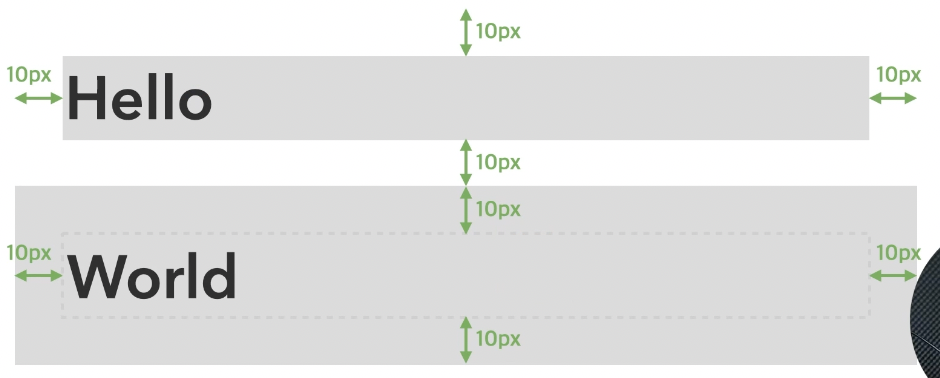

## 빈 태그

#### <태그>
- 편리함
- HTML 1/2/3/4/5

#### <태그 />
- 안전함
- XTML, HTML5

```html
<!-- <태그 속성="값">내용</태그> -->

 어떤 이미지를 삽입해야하는가

<input /> 어떤 데이터를 입력받을 것인가
<input type="text"> 사용자에게 일반 텍스트 입력받음
<input type="checkbox"> 사용자에게 체크 여부 입력받음
<br> <!-- 공백 삽입 태그 -->
```

## 글자와 상자

- 요소가 화면에 출력되는 특성
- 인라인(inline): 글자를 만들기 위한 요소
- 블록(block): 상자(레이아웃)를 만들기 위한 요소

#### 글자

```html
<span>Hello</span>
<span>World</span>
```


- 대표적인 인라인 요소
- 본질적으로 아무것도 나타내지 않는 콘텐츠 영역 설정하는 용도
- 요소가 수평으로 쌓임
- 포함한 콘텐츠 크기만큼 자동으로 줄어듦

```html
<span style="width: 100px;">Hello</span>
<span style="height: 100px;">World</span>
```


- 결과: 반응 없음
글자는 가로 세로 크기 지정 불가

```html
<!-- 외부 여백 -->
<span style="margin: 20px 20px;">Hello</span> 
<!-- 내부 여백 -->
<span style="padding: 20px 20px;">World</span> 
```


- 외부/내부 모두 좌우만 사용 가능, 위아래는 적용 X

```html
<!-- 글자 안 상자 요소 불가능 -->
<span><div></div></span> 
<!-- 가능 -->
<span><span></span></span>
```


#### 상자

```html
<div>Hello</div>
<div>World</div>
```


- 대표적인 블록 요소
- 본질적으로 아무것도 나타내지 않는 콘텐츠 영역 설정하는 용도
- 포함한 콘텐츠 크기만큼 자동으로 줄어듦
- 부모 요소의 크기만큼 자동으로 늘어남

```html
<!-- 가로 너비 -->
<div style="width: 100px;">Hello</div> 
<!-- 세로 너비 -->
<div style="height: 40px;">World</div> 
```


```html
<!-- 외부 여백 -->
<div style="margin: 10px;">Hello</div> 
<!-- 내부 여백 -->
<div style="padding: 10px;">World</div> 
```



