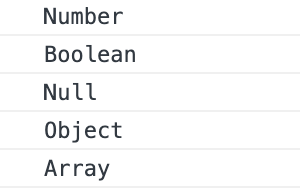

## 데이터 타입 확인

**typeof**  
: 특정 데이터 타입을 알 수 있음

```jsx
// main.js

console.log(typeof 'Hello World!')
// string
console.log(typeof 123)
// number
console.log(typeof true)
// boolean
console.log(typeof undefined)
// undefined
console.log(typeof null)
// object
console.log(typeof {})
// object
console.log(typeof [])
// object
```

- 해당 코드로 배열은 데이터 타입 확인이 어려움

확실한 데이터 타입 확인을 위해 함수 작성

```jsx
function getType(data) {
  return Object.prototype.toString.call(data).slice(8, -1)
}

console.log(getType(123))
// Number
console.log(getType(false))
// Boolean
console.log(getType(null))
// Null
console.log(getType({}))
// Object
console.log(getType([]))
// Array
```

- 이와 같이 한 파일에서 함수를 작성하고 다른 파일에서 가져와 사용해야 하는 경우 불러올 수 없으며 재작성해야 한다는 번거로움이 있음

`getType.js`라는 파일 생성으로 함수 입력

```jsx
// getType.js

export default function getType(data) {
  return Object.prototype.toString.call(data).slice(8, -1)
}
```

```jsx
// main.js

import getType from './getType'
// getType 뒤에 .js 생략 가능
```

작성 후 실행 시 오류 없이 실행


