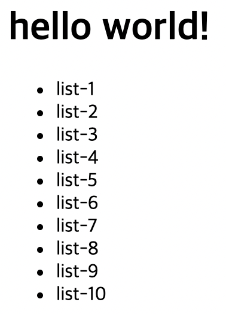
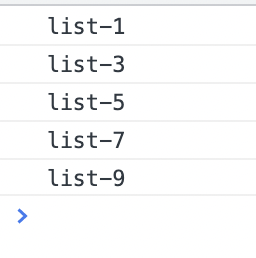
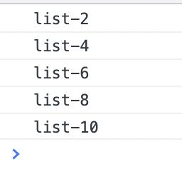
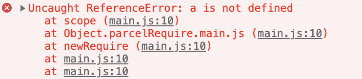
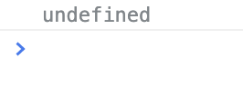
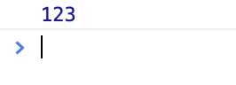
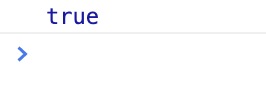
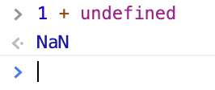

## 조건문
조건의 결과(truthy, falsy)에 따라 다른 코드를 실행하는 구문
- `if`, `else`

```jsx
let isShow = true;
let checked = false;

if (isShow) {
	console.log('Show!'); // Show!
}

if (checked) {
	console.log('Checked!'); 
  // false이므로 콘솔 실행 안 함
}
```

```jsx
let isShow = true;

if (isShow) {
	console.log('Show!'); // Show! 출력
} else {
	console.log('Hide?'); // 거짓이므로 출력 X
}
```

## 조건문 if else

```jsx
// getRandom.js

export default function random() {
  return Math.floor(Math.random() * 10)
}
// floor: 소숫점 버림
// 결과: 랜덤한 정수만 반환
```

```jsx
// main.js

import random from './getRandom'

console.log(random())  // 랜덤으로 숫자 반환
```

`if`문의 조건 만족하지 못할 경우 `else`로 넘어감

```jsx
// 조건문 (If statement)

const a = random()

if (a === 0) {
  console.log('a is 0')
} else {
  console.log('rest...')
}
```

`else if`로 중간 조건 추가 가능

```jsx
const a = random()

if (a === 0) {
  console.log('a is 0')
} else if (a === 2) {
  console.log('a is 2')
} else {
  console.log('rest...')
}
```

## 조건문 Switch

```jsx
// 조건문 (Switch statement)

const a = random()

switch (a) {
  case 0:
    console.log('a is 0')
    break // 하나의 케이스가 끝나면 break로 다른 내용 실행 방지
  case 2:
    console.log('a is 2')
    break
  case 4:
    console.log('a is 4')
    break
  default:
    console.log('rest...')    
    // else와 같은 기능을 하므로 break문 없어도 됨
}
```

장점: 특정한 데이터가 무엇인지 딱 떨어지는 조건문인 경우 유용

단점: `if`문보다 수직으로 코드가 길어질 수 있음


## 반복문 For

```jsx
const ulEl = document.querySelector('ul')

for (let i = 0; i < 10; i += 1) {
  const li = document.createElement('li')
  li.textContent = `list-${i + 1}`
  if (i % 2 === 0) {
    li.addEventListener('click', function () {
      console.log(li.textContent)
    })
  }
  ulEl.appendChild(li)
}
```




`i % 2` 연산을 이용해 짝수 번호 목록만 글자 뜨도록 설정했으나 홀수만 뜨게 됨

이유: `i + 1`로 시작하기 때문에 값이 0부터 시작하지 않음

```jsx
const ulEl = document.querySelector('ul')

for (let i = 0; i < 10; i += 1) {
  const li = document.createElement('li')
  li.textContent = `list-${i + 1}`
  if ((i + 1) % 2 === 0) {  // i + 1로 바꿔 줌
    li.addEventListener('click', function () {
      console.log(li.textContent)
    })
  }
  ulEl.appendChild(li)
}
```




## 변수 유효 범위

```jsx
// 변수 유효 범위 (Variable Scope)
// var, let const

function scope() {
  if (true) {  // 여기서부터
    const a = 123
  }  // 여기까지 유효 범위
  console.log(a)
}
scope()
```




```jsx
function scope() {
  console.log(a)
  if (true) {
    const a = 123
		// let a = 123
  }
}
scope()
```


- `let`과 `const` 모두 동일한 오류 발생

var로 변경

```jsx
function scope() {
  console.log(a)
  if (true) {
    var a = 123
  }
}
scope()
```




`var`: 함수 어디서든 사용할 수 있음

그러나 값이 지정되기 전에 출력했기 때문에 `undefined` 출력

```jsx
function scope() {
  if (true) {
    var a = 123
  }
  console.log(a)
}
scope()
```



위와 같은 이유로 출력문이 `if`문 밖에 있어도 범위가 함수 전체이므로 123 출력

## 형 변환

```jsx
// 형 변환(Type conversion)

const a = 1
const b = '1'

console.log(a == b) 
// 동등 연산자 사용 시 형 변환 실행
```




> 의도하지 않게 형 변환으로 인해 `true`값이 나올 수 있으므로 동등 연산자는 잘 쓰지 않고 `일치 연산자(===)`를 쓸 것을 권장

Truthy(참 같은 값)  
- true, {}, [], 1, 2, 'false', -12, '3.14' ...

Falsy(거짓 같은 값)  
- false, '', null, undefined, 0, -0, NaN(Not a Number)


```jsx
if ('false') {
  console.log(123)  // 123
}

if (undefined) {
  console.log(123)  // 값 출력 안 됨
}
```

**NaN(Not a Number)**




> 숫자 (+ - * / ) 숫자로 판단할 수 없는 특정 값 = 숫자 데이터지만 숫자는 아닌 값을 나타냄