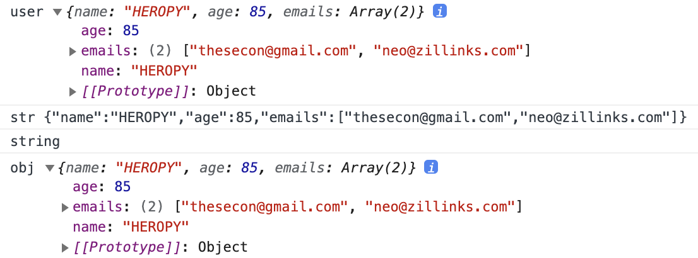
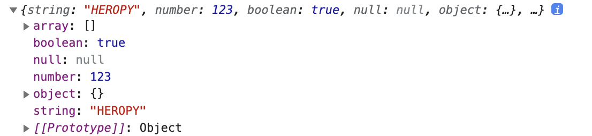

## JSON(JavaScript Object Notation)

자바스크립트의 객체 표기법

- 인간이 읽을 수 있는 텍스트를 사용하는 개방형 표준 포맷
- 동기 브라우저/서버 통신 (AJAX)을 위해, 넓게는 XML(AJAX가 사용)을 대체하는 주요 데이터 포맷
- JSON의 공식 인터넷 미디어 타입은 application/json
- 파일 확장자: `.json`
- [JSON에 대한 문서](https://ko.wikipedia.org/wiki/JSON)

기본 자료형

- 수(Number)
- 문자열(String): 0개 이상의 유니코드 문자들의 연속. 문자열은 큰 따옴표(")로 구분하며 역슬래시 이스케이프 문법을 지원
- 참/거짓(Boolean): `true` 또는 `false` 값
- 배열(Array): 0 이상의 임의의 종류의 값으로 이루어진 순서가 있는 리스트  
대괄호로 나타내며 요소는 쉼표로 구분
- 객체(Object): 순서가 없는 이름/값 쌍의 집합으로, 이름(키)이 문자열
- `null`: 빈 값으로, `null`을 사용

---

전체 코드 및 결과

```jsx
const user = {
  name: 'HEROPY',
  age: 85,
  emails: [
    'thesecon@gmail.com',
    'neo@zillinks.com'
  ]
}
console.log('user', user)

const str = JSON.stringify(user)
console.log('str', str)
console.log(typeof str)

const obj = JSON.parse(str)
console.log('obj', obj)
```



<br/>

속성 이름에 따옴표 사용하여 작성 가능

```jsx
const user = {
  'name': 'HEROPY',
  'age': 85,
  'emails': [
    'thesecon@gmail.com',
    'neo@zillinks.com'
  ]
}
```

속성 이름에 특수 기호 포함되는 경우 인식이 안 되는 경우가 있으므로 이 경우에 따옴표 사용하여 작성

```jsx
const user = {
  name: 'HEROPY',
  age: 85,
  emails: [
    'thesecon@gmail.com',
    'neo@zillinks.com'
  ]
	'company-name': {} // 따옴표 사용 가능
}
```

---

`myData.json` 파일 생성

```json
123
false
```

→ JSON 파일은 하나의 데이터이므로 여러 개의 데이터 동시 포함 불가능

객체 데이터 생성

```json
{
  "string": "HEROPY",
  "number": 123,
  "boolean": true,
  "null": null,
  "object": {},
  "array": []
}
```

`main.js`에 `myData.json` 파일 불러오기

```jsx
import myData from './myData.json' // 확장자 생략은 JS 파일만 가능
console.log(myData)
```



→ `JSON` 파일은 문자 데이터임을 알 수 있음


```jsx
const str = JSON.stringify(user)
// JSON: 자바스크립트 전체 영역에서 사용할 수 있는 전역 객체이므로 언제 어디서든지 사용 가능
console.log('str', str) 
// str의 내용 출력
console.log(typeof str) 
// str의 타입 출력
```

- `JSON`은 하나의 문자 데이터로 관리됨
- `stringify`: JS 파일 내부의 특정 데이터를 JSON의 형태로 문자 데이터화해 주는 것

```jsx
const obj = JSON.parse(str)
// JSON 파일을 parse를 이용하여 JS에서 사용할 수 있도록 함
console.log('obj', obj)
// obj의 내용 출력, JSON 파일 데이터와 동일하게 출력됨
```