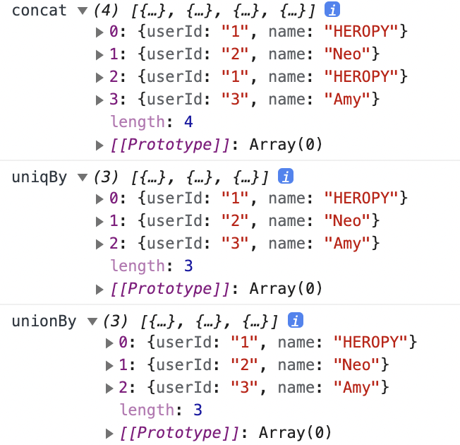
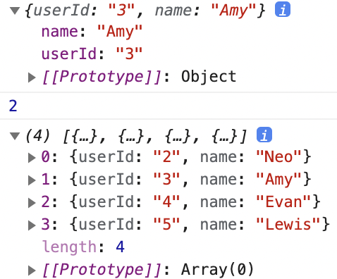

## Lodash

### _.uniq
: 중복되는 숫자 제거하여 고유 아이템만 나타냄

```jsx
_.uniq([2, 1, 2]);
// => [2, 1]
```

전체 코드 및 결과

```jsx
import _ from 'lodash'

const usersA = [
  { userId: '1', name: 'HEROPY'},
  { userId: '2', name: 'Neo'}
]
const usersB = [
  { userId: '1', name: 'HEROPY'},
  { userId: '3', name: 'Amy'}
]
const usersC = usersA.concat(usersB)
console.log('concat', usersC)
console.log('uniqBy', _.uniqBy(usersC, 'userId'))

const usersD = _.unionBy(usersA, usersB, 'userId')
console.log('unionBy', usersD)
```



### _.uniqBy

- 하나의 배열 데이터에서 특정 속성 이름으로 고유화시킴
- 사용하는 배열 데이터가 하나
- _.uniqBy(중복된 데이터가 존재하는 배열 데이터, 중복 구분할 고유한 속성)

```jsx
const usersC = usersA.concat(usersB)
console.log('concat', usersC)
console.log('uniqBy', _.uniqBy(usersC, 'userId'))
```

1. `concat` 이용하여 `usersB`를 `usersA`와 병합하여 `usersC`라는 새로운 배열로 생성
2. `usersC` 출력 시 `userId: 1, name: HEROPY`라는 중복 값 발생
3. `_.uniqBy`를 이용하여 `usersC`의 `userId`를 기준으로 중복되는 값 차치한 데이터 출력

### _.unionBy

중복이 발생할 수 있는 배열 데이터가 두 개이고 병합 전일 때 사용

```jsx
const usersD = _.unionBy(usersA, usersB, 'userId')
console.log('unionBy', usersD)
```

1. `usersA`와 `usersB`를 병합할 예정이며 `userId`를 고유값으로 지정
2. `usersD`로 병합 데이터를 받아 중복된 값 제거된 배열 생성

<br/>

ex 2) 전체 코드 및 결과

```jsx
import _ from 'lodash'

const users = [
  { userId: '1', name: 'HEROPY' },
  { userId: '2', name: 'Neo' },
  { userId: '3', name: 'Amy' },
  { userId: '4', name: 'Evan' },
  { userId: '5', name: 'Lewis' }
]

const foundUser = _.find(users, { name: 'Amy' })
const foundUserIndex = _.findIndex(users, { name: 'Amy' })
console.log(foundUser)
console.log(foundUserIndex)

_.remove(users, { name: 'HEROPY' })
console.log(users)
```



### _.find

특정 객체를 찾기 위해 조건을 이용해 찾기 가능

### _.findIndex
특정 객체의 인덱스 번호를 반환함

```jsx
const foundUser = _.find(users, { name: 'Amy' })
const foundUserIndex = _.findIndex(users, { name: 'Amy' })
console.log(foundUser)
console.log(foundUserIndex)
```

1. `Amy`라는 `name`을 가진 객체 반환
2. `Amy`라는 `name`을 가진 객체의 인덱스 번호 반환

### _.remove
특정 객체를 삭제함

```jsx
_.remove(users, { name: 'HEROPY' })
console.log(users)
```

`HEROPY`라는 `name`을 가진 객체를 삭제