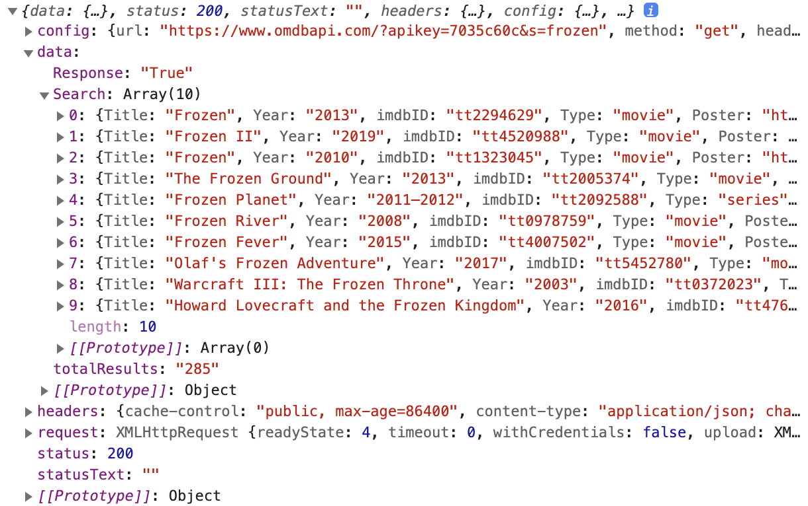
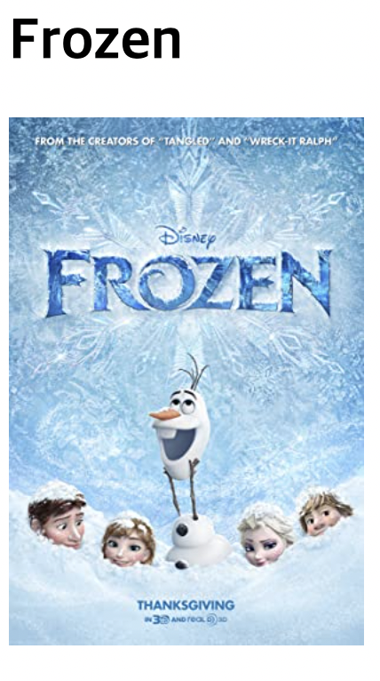

## OMDb API

[OMDb API에 대한 정보](https://www.omdbapi.com/)

### Query String

**주소?속성=값&속성=값&속성=값**

- 주소: 서버의 주소, 웹 사이트 주소
- `속성=값`
  1. apiKey=값을 통해 사용자 인증
  2. s=검색하고 싶은 영화

```html
http://www.omdbapi.com/?apikey=[yourkey]&
```

`http://www.omdbapi.com` → 주소

`apikey=[yourkey]` → 속성=값

```html
https://www.omdbapi.com/?apikey=7035c60c&s=frozen
```

---

### axios

[GitHub - axios/axios](https://github.com/axios/axios)

- 영화 정보 불러오기

```jsx
import axios from 'axios'

function fetchMovies() {
  axios
    .get('https://www.omdbapi.com/?apikey=7035c60c&s=frozen')
    .then((response) => {
      console.log(response)
    }) // 메소드 체이닝
}
fetchMovies()
```



<br/>

- 영화 제목과 포스터 불러오기

```jsx
import axios from 'axios'

function fetchMovies() {
  axios
    .get('https://www.omdbapi.com/?apikey=7035c60c&s=frozen')
    .then(res => {
      console.log(res)
      const h1El = document.querySelector('h1')
      const imgEl = document.querySelector('img')
      h1El.textContent = res.data.Search[0].Title
      imgEl.src = res.data.Search[0].Poster
    }) // 메소드 체이닝
}
fetchMovies()
```


