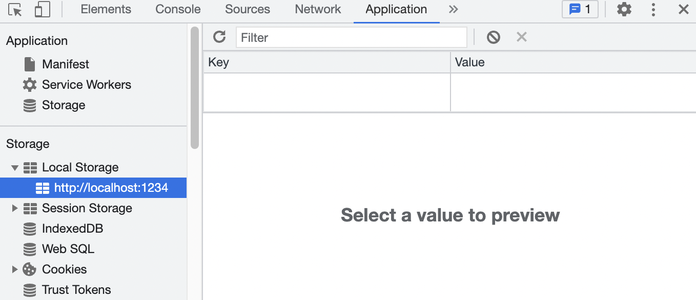
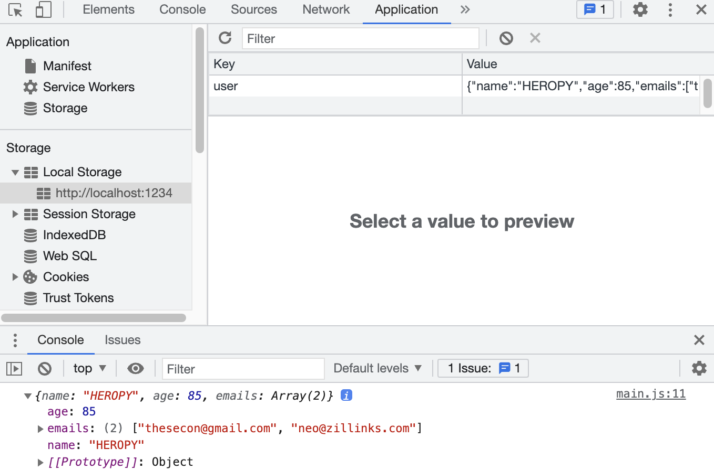
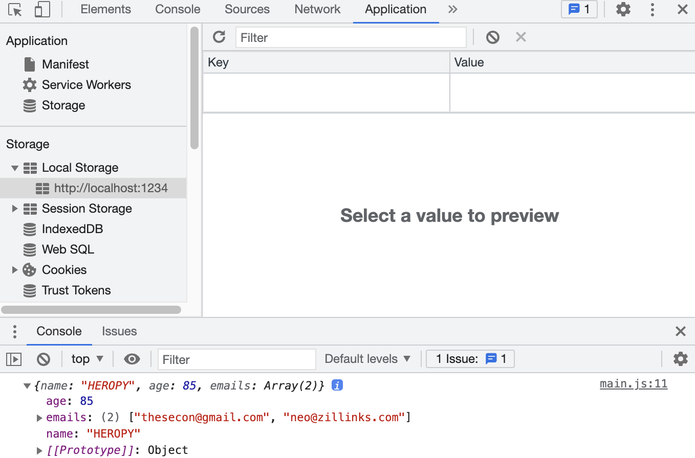
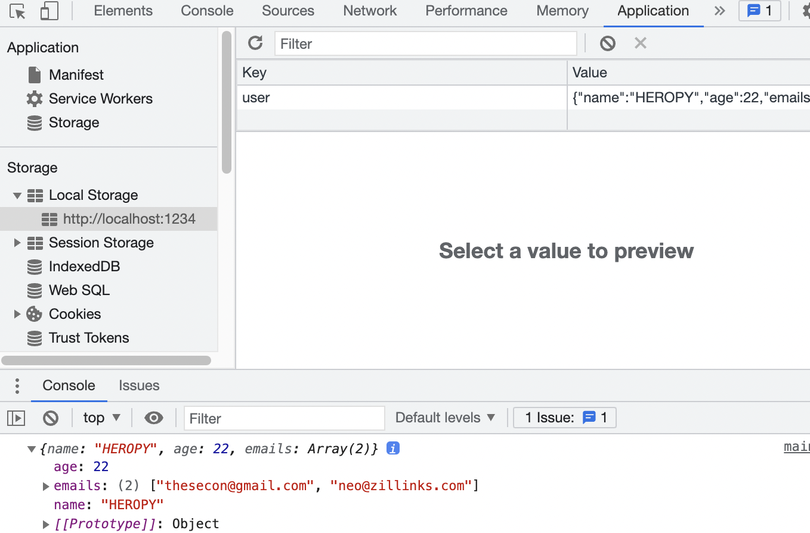

## Storage



- 개발자도구(F12)에서 `Application` 탭을 클릭하면 `Local Storage`에서 현재 개발 환경 확인 가능
- 클릭 시 보이는 창의 `Key와` `Value`는 브라우저에서 관리되는 데이터 저장소
- `Session Storage`에서도 동일한 구조 제공

### Window.localStorage

- `localStorage` 읽기 전용 속성을 사용하면 Document 출처의 Storage 객체에 접근 가능
- 저장한 데이터는 브라우저 세션 간에 공유
- localStorage에 저장되는 데이터는 해당 도메인 주소(사이트)에 종속되는 개념
- `localStorage`의 데이터는 만료되지 않음(반영구적)
→ 일반적인 상황에서는 `localStorage`가 더 활용성이 높음`sessionStorage`의 데이터는 페이지 세션이 끝날 때, 즉 페이지를 닫을 때 사라짐
- [localstorage mdn](https://developer.mozilla.org/ko/docs/Web/API/Window/localStorage)

---

예제 1

- 아이템 지정  
  → 데이터는 문자 데이터로 저장할 것을 권고

```jsx
localStorage.setItem('myCat', 'Tom');
// myCat: key, Tom: value
```


- `localStorage` 항목을 읽는 법

```jsx
const cat = localStorage.getItem('myCat');
// getItem은 속성(key)값만 알면 됨
```

- 항목 제거

```jsx
localStorage.removeItem('myCat');
```

---

예제 2

```jsx
const user = {
  name: 'HEROPY',
  age: 85,
  emails: [
    'thesecon@gmail.com',
    'neo@zillinks.com'
  ]
}

localStorage.setItem('user', JSON.stringify(user))
console.log(JSON.parse(localStorage.getItem('user')))
// JS 데이터로 변환하여 JSON 데이터 출력
```



- 제거하기

```jsx
const user = {
  name: 'HEROPY',
  age: 85,
  emails: [
    'thesecon@gmail.com',
    'neo@zillinks.com'
  ]
}

localStorage.setItem('user', JSON.stringify(user))
console.log(JSON.parse(localStorage.getItem('user')))

localStorage.removeItem('user') // 제거
```



→ 콘솔에서는 출력되지만 위의 `localStorage`에서는 제거됐음을 확인 가능

---

예제 3

```jsx
const user = {
  name: 'HEROPY',
  age: 85,
  emails: [
    'thesecon@gmail.com',
    'neo@zillinks.com'
  ]
}

const str = localStorage.getItem('user')
const obj = JSON.parse(str) // 가공 가능하도록 parse 사용
obj.age = 22  // age 값 변경
console.log(obj)
localStorage.setItem('user', JSON.stringify(obj)) // 문자 데이터화
```



---

### Lowdb

- 웹에서 사용할 수 있는 작은 JSON 기반의 데이터베이스

- [GitHub](https://github.com/typicode/lowdb)

```jsx
// This is pure JS, not specific to lowdb ;)
db.data.posts.push({ id: 1, title: 'lowdb is awesome' })

// Save to file
db.write()
```