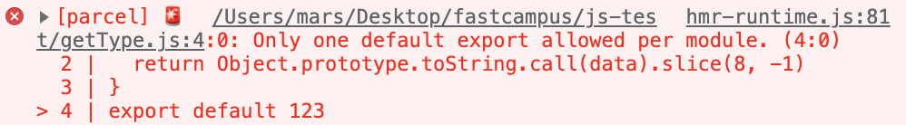

## 가져오기 / 내보내기

`import`: 외부에 있는 다른 자바스크립트 파일을 가져오는 문법 작성 시 사용

`Default export`: 이름을 지정하지 않아도 되는 기본 통로

`Named export`: 이름을 지정해야 하는 통로


`main.js`: 나가는 코드 없이 가져오는 코드만 지정

`module.js`: 가져오는 코드 없이 내보내는 코드만 존재

→ 통로가 막혀 있다고 해서 사용할 수 없는 것은 아님

---

ex1 ) 전체 코드 및 결과

```jsx
import _ from 'lodash'
import checkType from './getType'
import random from './getRandom'

console.log(_.camelCase('the hello world'))
console.log(checkType([1, 2, 3]))
console.log(random(), random())
```


getType.js

```jsx
export default function getType(data) {
  return Object.prototype.toString.call(data).slice(8, -1)
}
```

`export default`를 통해 하나의 함수를 내보내고 있음

`getType`이라는 이름의 함수인 것을 확인 가능, 그러나 `default`가 있으면 이름을 지정하지 않아도 됨

<br/>

변경

```jsx
export default function (data) {
  return Object.prototype.toString.call(data).slice(8, -1)
}
```

`main.js`에서 내가 원하는 이름으로 바꿔서 사용 가능

```jsx
import checkType from './getType' // getType.js
```

<br/>

getRandom.js

```jsx
export default function random() {
  return Math.floor(Math.random() * 10)
}
```

위의 함수에서도 `default`를 사용하고 있으므로 함수 이름 지정하지 않아도 됨

<br/>

변경

```jsx
export default function () {
  return Math.floor(Math.random() * 10)
}
```

`main.js`에서도 마음대로 이름 지정 가능

```jsx
import random from './getRandom' // getRandom.js
```

<br/>

이름이 지정된 통로로 나오는 데이터는 중괄호로 묶어서 사용

```jsx
import _ from 'lodash' // From `node_modules`!
import checkType from './getType' // getType.js
import { random, user } from './getRandom'  // getRandom.js
```

`getRandom.js`에 `user`라는 변수와 내부에 객체 데이터 작성

```jsx
export function random() {
  return Math.floor(Math.random() * 10)
}
export const user = {
  name: 'Heropy',
  age: 85
}
```

하나의 모듈에서 여러 개의 `default` 사용할 수 없음

```jsx
export default function (data) {
  return Object.prototype.toString.call(data).slice(8, -1)
}
export default 123
```



`export default`: 특정 내용을 한 번만 내보내도 되는 경우

`default` 키워드 없이 내보내기: 내보낼 내용이 많은 경우

<br/>

변수 이름 변경  
→ `as` 키워드를 사용하여 변경 가능

```jsx
import { random, user as heropy } from './getRandom'  // getRandom.js
```

한 번에 가져와야 할 때  
→ `*` 사용하여 여러 내용을 한꺼번에 지정하여 내보내기

```jsx
import _ from 'lodash' // From `node_modules`!
import checkType from './getType' // getType.js
import * as R from './getRandom'

console.log(_.camelCase('the hello world'))
console.log(checkType([1, 2, 3]))
console.log(R)
```


→ `random`과 `user`가 모두 포함되어 있음을 알 수 있음