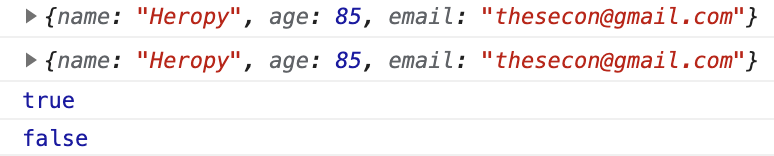

## 객체

### Object.assign()

출처 객체로부터 모든 열거할 수 있는(enumerable) 하나 이상의 속성(own properties)들을 목표 객체로 복사

```jsx
const target = { a: 1, b: 2 };
const source = { b: 4, c: 5 };

const returnedTarget = Object.assign(target, source);

console.log(target);
// expected output: Object { a: 1, b: 4, c: 5 }

console.log(returnedTarget);
// expected output: Object { a: 1, b: 4, c: 5 
```

1. `target` 객체에다 `source` 객체를 병합
2. 병합된 객체를 `returnedTarget`에다 반환
3. 출력할 경우 `target` 배열과 `source` 배열 내용이 합쳐져 출력(겹치는 `b` 항목은 `source` 내용으로 덮어씌움)

```jsx
const userAge = {
  // key: value
  name: 'Heropy',
  age: 85
}
const userEmail = {
  name: 'Heropy',
  email: 'thesecon@gmail.com'
}

const target = Object.assign(userAge, userEmail)
console.log(target)
console.log(userAge)
console.log(target === userAge)

const a = { k: 123 }
const b = { k: 123 }
console.log(a === b)
```




`a === b`가 `false`를 반환한 이유: 같은 내용이지만 서로 다른 객체라는 뜻

`target === userAge`는 서로 같은 곳을 바라보고 있기 때문에 `true` 반환, 내용이 같아서가 아님  

<br/>

- 원본 데이터를 훼손하지 않고 객체들을 병합하여 새로운 객체를 만드는 방법

```jsx
const target = Object.assign({}, userAge, userEmail)
console.log(target)
console.log(userAge)
console.log(target === userAge) // false
```

```jsx
const target = Object.assign({}, userAge)
console.log(target === userAge) // false
```

`userAge`가 빈 객체로 복사되고 빈 객체가 `target`으로 데이터 반환하므로 `target`과 `userAge`가 바라보는 곳이 달라 `false` 반환


### Object.keys()

속성 이름 추출하여 새로운 배열로 생성

```jsx
const user = {
  name: 'Heropy',
  age: 85,
  email: 'thesecon@gmail.com'
}

const keys = Object.keys(user)
console.log(keys)  // ['name', 'age', 'email']

console.log(user['email'])

const values = keys.map(key => user[key])
console.log(values)
```

`key` 데이터들은 `keys`로 반환하여 새로운 배열 `values`로 만들 수 있음  
→ `user`의 속성들과 똑같이 복사 가능