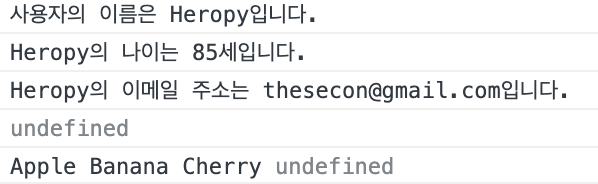

## 구조 분해 할당(Destructuring assignment)
비구조화 할당이라고도 함

```jsx
const user = {
  name: 'Heropy',
  age: 85,
  email: 'thesecon@gmail.com'
}
const { name, age, email, address } = user
// E.g, user.address

console.log(`사용자의 이름은 ${name}입니다.`)
console.log(`${name}의 나이는 ${age}세입니다.`)
console.log(`${name}의 이메일 주소는 ${email}입니다.`)
console.log(address)  // 정의되지 않았으므로 undefined 출력

const fruits = ['Apple', 'Banana', 'Cherry']
const [a, b, c, d] = fruits
console.log(a, b, c, d)
```



### 구조 분해

- 속성이 여러 개인 경우 필요한 것들만 꺼내서 사용할 수 있는 방법

```jsx
const { name, age, email, address } = user
```

### 할당

- 속성을 꺼내 오고 싶으나 값이 지정되지 않은 속성 address에 값을 지정하여 출력하고 싶을 때
- 속성 지정하지 않고 바로 기본값 할당 가능

```jsx
const user = {
  name: 'Heropy',
  age: 85,
  email: 'thesecon@gmail.com'
}
const { name, age, address = 'Korea' } = user

console.log(`사용자의 이름은 ${name}입니다.`)
console.log(`${name}의 나이는 ${age}세입니다.`)
console.log(`${name}의 이메일 주소는 ${user.email}입니다.`)  
// 위에서 email은 꺼내지 않았으므로 user.email로 사용
console.log(address)  // Korea
```

- 변수 이름 수정하고 싶을 때
  - 꺼낼 때는 처음 지정한 이름 name으로 꺼내 오지만 heropy로 변경하여 변수 사용, 변경됐으므로 name은 사용 불가능

```jsx
const user = {
  name: 'Heropy',
  age: 85,
  email: 'thesecon@gmail.com'
}
const { name: heropy, age, address = 'Korea' } = user

console.log(`사용자의 이름은 ${heropy}입니다.`)
console.log(`${heropy}의 나이는 ${age}세입니다.`)
console.log(`${heropy}의 이메일 주소는 ${user.email}입니다.`)  
// 위에서 email은 꺼내지 않았으므로 user.email로 사용
console.log(address)  // Korea
```

```jsx
const fruits = ['Apple', 'Banana', 'Cherry']
const [a, b, c, d] = fruits  // 구조 분해
console.log(a, b, c, d)
```

→ d에 해당하는 값이 없으므로 undefined 출력

```jsx
const fruits = ['Apple', 'Banana', 'Cherry']
const [, b] = fruits  // 구조 분해
console.log(b) // Banana
```

→ 변수 하나로 두 번째 인수를 가져오고 싶을 때 순서를 명확하게 지켜 줘야 하므로 콤마로 표시하여 `[, b]`로 작성

→ Cherry를 출력하고 싶을 때는 `[, , b]`로 사용 가능