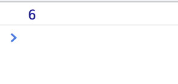

## 문자

`String` 전역 객체는 문자열(문자의 나열)의 생성자

리터럴 방식: 특정한 데이터를 따옴표 기호로 생성  
→ { }: 객체 데이터  
→ [ ]: 배열 데이터  
→ " ", ' ', ``: 문자 데이터  

[String MDN](https://developer.mozilla.org/ko/docs/Web/JavaScript/Reference/Global_Objects/String) 에서 다양한 메소드 확인 가능

<br/>

### String.prototype.indexOf()

`indexOf()` 메소드는 호출한 `String` 객체에서 주어진 값과 일치하는 첫 번째 인덱스를 반환
일치하는 값이 없으면 -1을 반환

- 매개변수 `searchValue`
  - 찾으려는 문자열  
  - 아무 값도 주어지지 않으면 문열 `"undefined"`를 찾으려는 문자열로 사용

- 반환값  
  `searchValue`의 첫 번째 등장 인덱스  
  찾을 수 없으면 -1 반환

ex)

```jsx
const paragraph = 'The quick brown fox jumps over the lazy dog. If the dog barked, was it really lazy?';

const searchTerm = 'dog';
const indexOfFirst = paragraph.indexOf(searchTerm);

console.log(`The index of the first "${searchTerm}" from the beginning is ${indexOfFirst}`);
// expected output: "The index of the first "dog" from the beginning is 40"

console.log(`The index of the 2nd "${searchTerm}" is ${paragraph.indexOf(searchTerm, (indexOfFirst + 1))}`);
// expected output: "The index of the 2nd "dog" is 52"
```

`paragraph` 변수의 문자열의 첫 번째 글자(T)를 시작으로 0부터 숫자가 증가하는데 `dog`가 검색된 숫자가 인덱스이며 그 숫자가 반환됨

`indexOfFirst`가 그 번호를 받아서 출력, `dog`는 40번째에 검색됨을 알 수 있음

<br/>

```jsx
const result = 'Hello world!'.indexOf('world')
console.log(result)
// String.prototype.indexOf()
// new String 대신에 리터럴 방식으로 작성 가능
```


<br/>


```jsx
const str = '0123'
console.log('0123'.length)  // 4
```

```jsx
const str = '0123'
console.log('01 23'.length)  // 공백도 문자로 치므로 5
```

```jsx
const str = 'Hello world!'
console.log(str.indexOf('HEROPY') !== -1)
// 부정선택자로 비교해서 'HEROPY'가 없으면 false 반환
```
---
### String.prototype.slice()

`slice()` 메소드는 문자열의 일부를 추출하며 새로운 문자열 생성

```jsx
const str = 'Hello world!'
console.log(str.slice(0, 3))  // Hel
```

```jsx
const str = 'Hello world!'
console.log(str.slice(6, 11))  // world
```
---
### String.prototype.replace()

첫 번째 인수를 두 번째 인수 단어로 교체해 버림

```jsx
const str = 'Hello world!'
console.log(str.replace('world', 'HEROPY'))  // Hello HEROPY
```

```jsx
const str = 'Hello world!'
console.log(str.replace(' world!', ''))  // Hello
```
---
### String.prototype.match()

```jsx
const str = 'thesecond@gmail.com'
console.log(str.match(/.+(?=@)/)[0])  // thesecond
```
---
### String.prototype.trim()

`trim()` 메소드는 문자열 양 끝의 공백을 제거  
공백이란 모든 공백문자(space, tab, NBSP 등)와 모든 개행문자(LF, CR 등)를 의미

```jsx
const str = '     Hello world  '
console.log(str)  // 공백 포함한 Hellow world 출력
```

```jsx
const str = '     Hello world  '
console.log(str.trim())  // 공백 문자 제거한 Hello world 출력
```