## 배열

JavaScript Array 전역 객체는 배열을 생성할 때 사용하는 리스트 형태의 고수준 객체

```jsx
const numbers = [1, 2, 3, 4]
const fruits = ['Apple', 'Banana', 'Cherry']

console.log(numbers[1]) // 2
console.log(fruits[2]) // Cherry
```

`인덱스(index)`: 배열 데이터 내부에 들어 있는 특정 데이터의 위치를 나타내는 숫자  
`인덱싱(indexing)`: 인덱스에 숫자를 넣어 조회하는 것  
ex) fruits[2]

`아이템(item)`, `요소(element)`: 배열 안의 데이터  
ex) 배열 `fruits` 안의 Apple, Banana, Cherry


### Array.prototype.find()

`find()` 메소드는 주어진 판별 함수를 만족하는 첫 번째 요소의 값을 반환, 그런 요소가 없다면 `undefined`를 반환

```jsx
const array1 = [5, 12, 8, 130, 44];

const found = array1.find(element => element > 10);

console.log(found);
// expected output: 12
```

- 매개변수

    `callback`: 배열의 각 값에 대해 실행할 함수, 아래의 세 인자를 받음

    `element`: 콜백 함수에서 처리할 현재 요소

    `index`: Optional 콜백 함수에서 처리할 현재 요소의 인덱스


### Array.prototype.length()

```jsx
const numbers = [1, 2, 3, 4]
const fruits = ['Apple', 'Banana', 'Cherry']

console.log(numbers.length) // 4
console.log(fruits.length)  // 3
console.log([1, 2].length)  // 2
```

→ 각각 `numbers`의 길이, `fruits`의 길이, `[1, 2]`의 길이 반환

```jsx
console.log([].length)
```

→ 배열이 비어 있으므로 0 반환


### Array.prototype.concat()

두 개의 배열 데이터를 병합하여 새로운 배열 데이터를 반환해 주는 메소드  
원본에는 영향이 가지 않고 새로운 배열만 생성

```jsx
const numbers = [1, 2, 3, 4]
const fruits = ['Apple', 'Banana', 'Cherry']

console.log(numbers.concat(fruits))
console.log(numbers)
console.log(fruits)
```

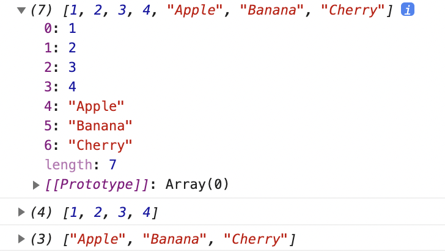

### Array.prototype.forEach()

메소드가 붙어 있는 배열 데이터의 아이템 개수만큼 인수로 사용된 콜백 함수가 반복적으로 실행

```jsx
const numbers = [1, 2, 3, 4]
const fruits = ['Apple', 'Banana', 'Cherry']

fruits.forEach(function (element, index, array) {  // element 대신 item으로 사용해도 됨
  console.log(element, index, array)
})
```

- `element`: `fruits`의 요소인 Apple, Banana, Cherry가 차례대로 대입  
- `index`: 0부터 증가  
    - `i`로 줄여서 사용하기도 함  
- `array`: 배열 데이터 반환  
    - `array`는 잘 사용하지 않음  

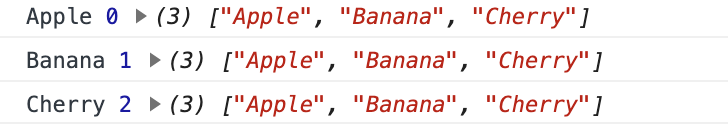


### Array.prototype.map()

```jsx
const numbers = [1, 2, 3, 4]
const fruits = ['Apple', 'Banana', 'Cherry']

const a = fruits.forEach(function (fruit, index) {
  console.log(`${fruit}-${index}`) // Apple-0, Banana-1, Cherry-2
})
console.log(a) // undefined

const b = fruits.map(function (fruit, index) {
  return `${fruit}-${index}`
})
console.log(b) // 
```

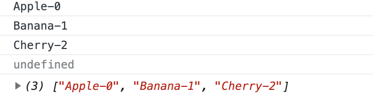

#### `forEach`와 `map`의 차이점  
`map` 메소드는 인수로 사용하는 콜백 함수의 내부에서 반환하는 데이터를 가지고 그 데이터를 모아 놓은 새로운 배열을 만들어서 반환

```jsx
const b = fruits.map(function (fruit, index) {
  return {
    id: index,
    name: fruit
  }
})
```

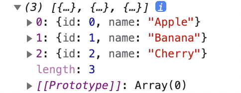

<br/>

화살표 함수 사용하여 작성

```jsx
const numbers = [1, 2, 3, 4]
const fruits = ['Apple', 'Banana', 'Cherry']

const a = fruits.forEach((fruit, index) => {
  console.log(`${fruit}-${index}`)
})
console.log(a)

const b = fruits.map((fruit, index) => ({
  id: index,
  name: fruit
}))
console.log(b)
```


### Array.prototype.filter()

배열 데이터 안에 들어 있는 각각의 아이템들을 특정 기준에 의해 필터링하여 새로운 배열 생성, 원본 데이터 훼손하지 않음

```jsx
const numbers = [1, 2, 3, 4]
const fruits = ['Apple', 'Banana', 'Cherry']

const a = numbers.map(number => { // 매개변수가 하나면 소괄호 생략 가능
  return number < 3
})
console.log(a)

const b = numbers.filter(number => {
  return number < 3
})
console.log(b)
```

1. `number`에 차례대로 1 2 3 4 대입하여 `number < 3`을 만족하는지 판단하여 `boolean` 데이터의 새로운 배열로 만들어 반환

2. `number < 3`을 만족하는 값을 반환

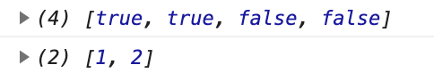

<br/>

화살표 함수 사용하여 작성

```jsx
const numbers = [1, 2, 3, 4]
const fruits = ['Apple', 'Banana', 'Cherry']

const a = numbers.map(number => number < 3)
console.log(a)

const b = numbers.filter(number => number < 3)
console.log(b)
```


### Array.prototype.find()

콜백 함수 내에서 찾고자 하는 데이터를 찾는다면 반복을 종료하고 해당 데이터 값 반환

```jsx
const numbers = [1, 2, 3, 4]
const fruits = ['Apple', 'Banana', 'Cherry']

const a = fruits.find(fruit => {
  return /^B/.test(fruit)
})
console.log(a) // Banana
```

`^문자`: 특정문자로 시작한다는 뜻  
ex) ^B: B로 시작하는 데이터 검색 후 `boolean` 값으로 반환

특정 문자로 시작하는 데이터 검색 후 `true`이면 데이터 값 반환


### Array.prototype.findIndex()

찾아진 아이템의 인덱스 번호 반환

```jsx
const numbers = [1, 2, 3, 4]
const fruits = ['Apple', 'Banana', 'Cherry']

const b = fruits.findIndex(fruit => {
  return /^C/.test(fruit) // Cherry가 검색됨, 인덱스 번호 2
})
console.log(b) // 2
```

화살표 함수 사용하여 작성

```jsx
const numbers = [1, 2, 3, 4]
const fruits = ['Apple', 'Banana', 'Cherry']

const a = fruits.find(fruit => /^C/.test(fruit))
console.log(a)

const b = fruits.findIndex(fruit => /^C/.test(fruit))
console.log(b)
```


### Array.prototype.includes()

인수로 사용되는 특정 데이터가 해당 배열에 포함되는지 아닌지 판단

```jsx
const numbers = [1, 2, 3, 4]
const fruits = ['Apple', 'Banana', 'Cherry']

const a = numbers.includes(3)
console.log(a) // true

const b = fruits.includes('HEROPY')
console.log(b) // false
```

1. `numbers` 안에 3이라는 숫자가 포함되므로 `true` 반환

2. `fruits` 안에 HEROPY라는 문자열이 없으므로 `false` 반환


---

배열 원본이 수정되는 함수들

### Array.prototype.push()

`push` 메소드가 사용되는 배열의 가장 마지막에 특정 인수 삽입

```jsx
const numbers = [1, 2, 3, 4]
const fruits = ['Apple', 'Banana', 'Cherry']

numbers.push(5)
console.log(numbers)
```

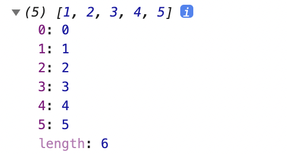


### Array.prototype.unshift()

`unshift` 메소드가 사용되는 배열의 가장 앞에 특정 인수 삽입

```jsx
const numbers = [1, 2, 3, 4]
const fruits = ['Apple', 'Banana', 'Cherry']

numbers.unshift(0)
console.log(numbers)
```

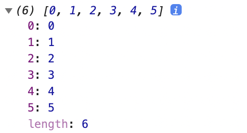


### Array.prototype.reverse()

`reverse` 메소드는 배열 아이템의 순서를 역순으로 정렬

```jsx
const numbers = [1, 2, 3, 4]
const fruits = ['Apple', 'Banana', 'Cherry']

numbers.reverse()
fruits.reverse()

console.log(numbers)
console.log(fruits)
```

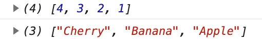


### Array.prototype.splice()

`splice` 메소드는 삭제와 끼워 넣기 개념으로 활용 가능

- 첫 번째 인수: 인덱스 번호
- 두 번째 인수: 인덱스 번호를 시작으로 지울 아이템 개수

```jsx
const numbers = [1, 2, 3, 4]
const fruits = ['Apple', 'Banana', 'Cherry']

numbers.splice(2, 1)

console.log(numbers)
```

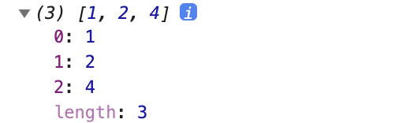

- 세 번쨰 인수: 끼워 넣을 값

두 번째 인수에 0을 넣어 지우지 않을 것을 지정한다면 첫 번째 인수에 해당하는 인덱스 번호 자리에 세 번째 인수에 해당하는 값을 데이터로 삽입

```jsx
const numbers = [1, 2, 3, 4]
const fruits = ['Apple', 'Banana', 'Cherry']

numbers.splice(2, 0, 999)

console.log(numbers)
```

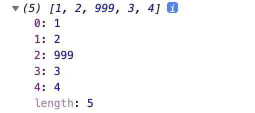

```jsx
const numbers = [1, 2, 3, 4]
const fruits = ['Apple', 'Banana', 'Cherry']

numbers.splice(2, 1, 999)
console.log(numbers)

fruits.splice(2, 0, 'Orange')
console.log(fruits)
```

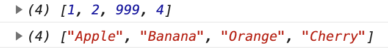