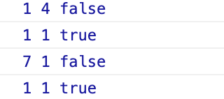

## 불변성

- 데이터 불변성(Immutability)
- 원시 데이터: String, Number, Boolean, undefined, null
- 참조형 데이터: Object, Array, Function

### 원시 데이터 예시

- 전체 코드 및 결과

```jsx
let a = 1
let b = 4
console.log(a, b, a === b)
b = a
console.log(a, b, a === b)
a = 7
console.log(a, b, a === b)
let c = 1
console.log(b, c, b === c)
```



```jsx
let a = 1
let b = 4
console.log(a, b, a === b) // false

// 메모리
// ----------------------------------------
// |1:  1    |2:  4    |3:       |4:
// ----------------------------------------
```

→ `a`와 `b`가 각각 다른 메모리에 저장되어 있으므로 `false` 반환

```jsx
b = a
console.log(a, b, a === b) // true

// 메모리
// ----------------------------------------
// |1:  1    |2:  4    |3:       |4:
// ----------------------------------------
```

→ `b = a`는 `a` 메모리의 주소를 `b`에게 할당한다는 뜻

→ `b`는 2번 메모리가 아닌 1번 메모리를 바라보게 되므로 `true` 반환

```jsx
a = 7
console.log(a, b, a === b) // false

// 메모리
// ----------------------------------------
// |1:  1    |2:  4    |3:  7    |4:
// ----------------------------------------
```

→ `a = 7`로 인해 `a`가 1번 메모리가 아닌 3번 메모리 주소를 갖게 됨

→ `b`는 1번, `a`는 3번 메모리 주소를 가지고 있으므로 `false` 반환

```jsx
let c = 1
console.log(b, c, b === c) // true

// 메모리
// ----------------------------------------
// |1:  1    |2:  4    |3:  7    |4:
// ----------------------------------------
```

→ `let c = 1`은 4번 메모리의 주소를 가지는 것이 아니라 기존의 1번 메모리 주소를 갖게 됨

→ `b`는 1번, `c`도 1번 주소를 가지므로 `true` 반환

```
새로운 원시 데이터를 사용했을 때 원시 데이터가 기존 메모리 주소에 들어 있다면 새로운 메모리를 생성하지 않고 기존 메모리 주소를 바라보도록 함
```

→ 원시 데이터들은 새로 만들어지지 않고 불변함

→ **데이터 불변성**

---

### 참조형 데이터 예시

- 전체 코드 및 결과

```jsx
let a = { k: 1 }
let b = { k: 1 }
console.log(a, b, a === b)
a.k = 7
b = a
console.log(a, b, a === b)
a.k = 2
console.log(a, b, a === b)
let c = b
console.log(a, b, c, a === c)
a.k = 9
console.log(a, b, c, a === c)
```


```jsx
let a = { k: 1 }
let b = { k: 1 }
console.log(a, b, a === b) // false

// 메모리
// -------------------------------------
// |1: { k: 1 } |2: { k: 1 } |3: {     }
// -------------------------------------
```

→ `a`와 `b`의 내용은 같지만 바라보는 메모리 주소가 다르므로 `false` 반환

```
참조형 데이터는 원시형 데이터와 다르게 새로운 값을 만들 때마다 새로운 메모리 주소에 할당되는 구조
```

```jsx
a.k = 7
b = a
console.log(a, b, a === b)  // true

// 메모리
// -------------------------------------
// |1: { k: 7 } |2: { k: 1 } |3: {     }
// -------------------------------------
```

→ `a`는 7로 수정, `b`는 `a`의 메모리 주소를 바라보도록 변경

→ `a`와 `b` 모두 1번 메모리 주소를 바라보므로 `true`

```jsx
a.k = 2
console.log(a, b, a === b) // true

// 메모리
// -------------------------------------
// |1: { k: 2 } |2: { k: 1 } |3: {     }
// -------------------------------------
```

→ `a`를 `2`로 수정

```
같은 메모리를 바라보고 있는 여러 개의 변수가 있을 때 하나의 값을 변경할 경우 다른 변수들의 값이 일괄적으로 변경
```

→ 위의 이유로 `b`의 값도 `2`로 출력

```jsx
let c = b
console.log(a, b, c, a === c) // true

// 메모리
// -------------------------------------
// |1: { k: 2 } |2: { k: 1 } |3: {     }
// -------------------------------------
```

→ `a`와 `b` 모두 1번 메모리 주소를 바라보고 있음

→ `b`를 `c`에다 할당하면 `c` 역시도 1번 메모리 주소를 갖게 됨

→ `a`, `b`, `c` 모두 1번 메모리 주소를 바라보고 있으므로 `true` 반환

```jsx
a.k = 9
console.log(a, b, c, a === c) // true

// 메모리
// -------------------------------------
// |1: { k: 9 } |2: { k: 1 } |3: {     }
// -------------------------------------
```

→ `a`의 값 9로 수정하면 1번 메모리 주소를 갖고 있던 `a`, `b`, `c` 모두 값이 9로 수정됨

결론

`b = a`

```
할당 연산자를 사용하면 `a`의 데이터가 복사되는 개념이 아닌 메모리 주소를 할당하여 같은 곳 바라보게 만듦

한 곳을 수정하면 불변하는 것이 아닌 같은 메모리 주소의 변수들은 다 변경됨
```