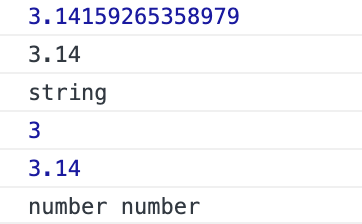
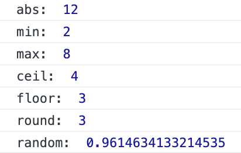

## 숫자와 수학

### 숫자

`toFixed()`: 소수 자리수 길이를 제한, 문자열로 반환

`parseInt`, `parseFloat`는 어디서든지 쓸 수 있는 자바스크립트의 전역 함수

`parseInt()`: 문자열의 숫자만 추출하여 정수로 반환  
`parseFloat()`: 문자열의 숫자만 추출하여 실수로 반환

```jsx
const pi = 3.14159265358979
console.log(pi)

const str = pi.toFixed(2)  // 소숫점 두 번째자리까지 출력
console.log(str)
console.log(typeof str)  // str의 데이터 타입 반환

const integer = parseInt(str)  // 정수 반환
const float = parseFloat(str)  // 실수 반환
console.log(integer)
console.log(float)
console.log(typeof integer, typeof float)
```



<br/>

### 수학

`Math`는 수학적인 상수와 함수를 위한 속성과 메소드를 가진 내장 객체, 함수 객체 아님  
`number` 자료형만 지원하며 `BigInt`와 사용할 수 없음

### Math.abs()

주어진 숫자의 절대값을 반환  
- `x`가 양수이거나 0이라면 `x`를 리턴  
  `x`가 음수라면 `x`의 반대값인 양수를 반환

- 매개변수: `x`
- 반환값: 주어진 숫자의 절대값

기타 수학 함수

```jsx
console.log('abs: ', Math.abs(-12))
// -12의 절대값 반환: 12

console.log('min: ', Math.min(2, 8))
// 인수 중 최소값 반환: 2

console.log('max: ', Math.max(2, 8))
// 인수 중 최대값 반환: 8

console.log('ceil: ', Math.ceil(3.14))
// 올림 처리 하여 반환: 4

console.log('floor: ', Math.floor(3.14))
// 내림 처리 하여 반환: 3

console.log('round: ', Math.round(3.14))
// 반올림 처리 하여 반환: 3

console.log('random: ', Math.random())
// 랜덤 숫자 반환
```



```jsx
export default function random() {
  return Math.floor(Math.random() * 10)
}
```

→ `random`을 사용하여 랜덤값 반환 후 10을 곱함  
→ `Math.random() * 10` 으로 계산된 값에서 `floor`를 사용하여 내림 처리 된 값 반환