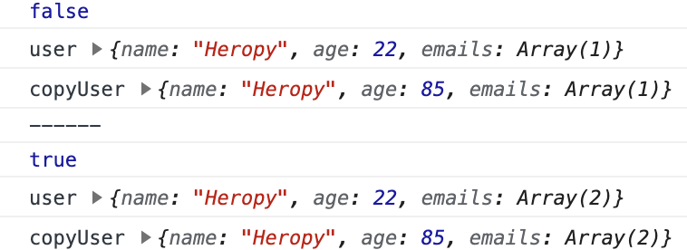
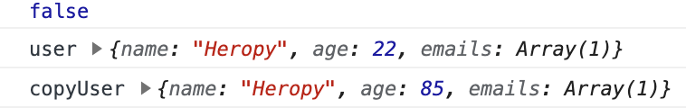
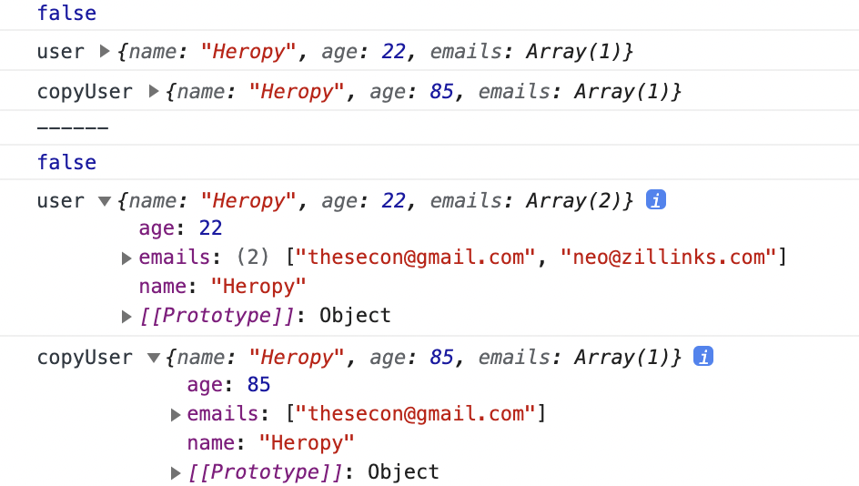

## 얕은 복사와 깊은 복사

얕은 복사(Shallow copy)  
: 참조형 데이터(객체, 배열)을 복사할 때 내부에 또 다른 참조형 데이터가 없다는 전제 하에 사용

깊은 복사(Deep copy)  
: 특정 참조형 데이터 내부에 또 다른 참조형 데이터가 존재하는 경우 사용(`cloneDeep` 사용)

전체 코드 및 결과

```jsx
const user = {
  name: 'Heropy',
  age: 85,
  emails: ['thesecon@gmail.com']
}
const copyUser = user
console.log(copyUser === user)

user.age = 22
console.log('user', user)
console.log('copyUser', copyUser)

console.log('------')

user.emails.push('neo@zillinks.com')
console.log(user.emails === copyUser.emails)
console.log('user', user)
console.log('copyUser', copyUser)
```



### 얕은 복사

```jsx
const copyUser = Object.assign({}, user)
console.log(copyUser === user) // false

// 메모리
// ----------------------------------------
// |1:       |2:       |3:       |4:
// ----------------------------------------
```

→ `Object.assign({}, user)`로 변경하게 될 경우 `user`의 객체 데이터가 아닌 새로운 객체 데이터 생성하게 됨

→ `user`의 내용을 새로운 객체 데이터로 복사해 오게 됨

→ 새로운 객체 데이터가 `copyUser`에 반환되므로 `user`와 서로 다른 메모리를 사용하므로 `false` 반환

```jsx
user.age = 22
console.log('user', user)
console.log('copyUser', copyUser)
```

→ `user`를 22로 수정

→ `copyUser`은 복사된 데이터를 가지고 있으므로 그대로 85 출력



<br/>

전개 연산자 이용하여 수정

```jsx
const copyUser = {...user}
console.log(copyUser === user)

user.age = 22
console.log('user', user)
console.log('copyUser', copyUser)
```

→ `user`의 속성과 값들을 `copyUser`에 넣으면 `user`의 `age`를 22로 수정해도 `copyUser` 데이터는 수정되지 않으므로 85 그대로 출력


### 깊은 복사

```jsx
const user = {
  name: 'Heropy',
  age: 85,
  emails: ['thesecon@gmail.com']
}
const copyUser = {...user}
console.log(copyUser === user)

user.age = 22
console.log('user', user)
console.log('copyUser', copyUser)

console.log('------')

user.emails.push('neo@zillinks.com')
console.log(user.emails === copyUser.emails)
console.log('user', user)
console.log('copyUser', copyUser)
```

→ 배열 데이터 역시 참조형 데이터

→ 참조형 데이터 `user` 안의 `emails`는 복사된 것이 아닌 같은 메모리 주소만 공유하고 있는 것

→ `const copyUser = {...user}`에서 `user`의 표면만 복사하고 깊게 복사하지 않았으므로 안의 데이터는 복사되지 않았음

<br/>

깊은 복사를 위한 `lodash` 라이브러리 설치

```bash
npm i lodash
```

코드 상단에 라이브러리 불러오기

```jsx
imprort _ from 'lodash'
// _는 객체 데이터를 의미함
```

전체 코드 및 결과

```jsx
import _ from 'lodash'

const user = {
  name: 'Heropy',
  age: 85,
  emails: ['thesecon@gmail.com']
}
const copyUser = _.cloneDeep(user) // 깊은 복사
console.log(copyUser === user)

user.age = 22
console.log('user', user)
console.log('copyUser', copyUser)

console.log('------')

user.emails.push('neo@zillinks.com')
console.log(user.emails === copyUser.emails)
console.log('user', user)
console.log('copyUser', copyUser)
```



→ `const copyUser = _.cloneDeep(user)`로 깊은 복사를 실행

→ `user`와 `copyUser`의 `email` 내용이 다른 것을 확인할 수 있음

참조형 데이터 복사 시 얕은 복사로도 충분히 가능하다고 판단되면 `Object.assgin()`이나 전개 연산자로 해당 데이터 복사 실행

참조형 데이터가 내부에 다른 참조형 데이터를 가지고 있는 경우 깊은 복사를 통해서 복사 실행하는 것이 더 안전  
→ `lodash`와 `cloneDeep` 이용


### cloneDeep

[lodash cloneDeep](https://lodash.com/docs/4.17.15#cloneDeep)

`clone` 메소드와 비슷하지만 정확히는 재귀적으로 값을 복사함

→ 재귀: 반복적으로 실행함

```jsx
_.cloneDeep(value)
```

ex)

```jsx
var objects = [{ 'a': 1 }, { 'b': 2 }];
 
var deep = _.cloneDeep(objects);
console.log(deep[0] === objects[0]);
// => false
```

→ `objects`를 깊은 복사 실행하여 `deep`으로 새로운 배열 데이터 생성

→ `deep[0]`과 `objects[0]`의 메모리 주소가 다르므로 `false` 반환

→ 내부 메모리까지 꼼꼼히 복사해 옴을 알 수 있음

[lodash에 대해 더 자세히 알아보기](https://lodash.com/)