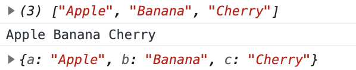

## 전개 연산자(Spread)

기호: `...`

```jsx
const fruits = ['Apple', 'Banana', 'Cherry']
console.log(fruits)
console.log(...fruits)  // ... 가 전개 연산자 기호
// console.log('Apple', 'Banana', 'Cherry')

function toObject(a, b, c) {
  return {
    a: a,
    b: b,
    c: c
  }
}
console.log(toObject(...fruits))
```




→ 전개 연산자를 이용해 전개된 아이템들을 `toObject`의 매개변수에 차례대로 대입하여 출력

```jsx
console.log(toObject(fruits[0], fruits[1], fruits[2]))
```

→ 이와 같은 방법으로 사용 시 정확하고 결과는 같으나 인수가 많은 경우에 코드가 길어지므로 전개 연산자로 축소하여 사용

```jsx
const fruits = ['Apple', 'Banana', 'Cherry', 'Orange']
console.log(fruits)
console.log(...fruits)

function toObject(a, b, ...c) {
  return {
    a: a,
    b: b,
    c: c
  }
}
console.log(toObject(...fruits))
```


`toObject(a, b, ...c)`에서 `...c`에 나머지 배열 데이터를 다 받아 저장하여 사용, 이를 **나머지 매개변수**라고 함

→ `c`에 Cherry와 Orange 둘 다 들어가므로 배열 객체로 저장

매개변수에서 전개 연산자를 사용할 때는 개수에 상관없이 순서대로 받아 본 후 순서가 명확하지 않을 때 나머지를 전부 배열로 받아 사용

```jsx
const toObject = (a, b, ...c) => ({a, b, c})
console.log(toObject(...fruits))
```

→ 속성 이름과 변수 이름이 같으므로 `a, b, c`와 같이 작성 가능  
→ 객체 데이터를 축약형으로 작성하고 싶을 때는 소괄호 안에다 `({a, b, c})`와 같이 작성