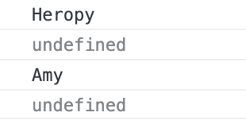

일반(Normal) 함수는 **호출 위치**에 따라 `this` 정의  
화살표(Arrow) 함수는 **자신이 선언된 함수 범위**에서 `this` 정의

```jsx
const heropy = {
  name: 'Heropy',
  normal: function () {
    console.log(this.name)
  },
  arrow: () => {
    console.log(this.name)
  }
}
heropy.normal() // 호출
heropy.arrow()
```


일반 함수에서는 `Heropy` 출력, 화살표 함수는 `undefined` 출력
→ 화살표 함수에서 `this` 사용 시 범위가 함수 내부로 국한되는 것이 아니라 어디서든지 정의될 수 있으므로 어디서 정의된 `this` 인지 알 수 없음

<br/>

```jsx
// 위 코드에 이어서 작성

const amy = {
  name: 'Amy',
  normal: heropy.normal,
  arrow: heropy.arrow
}
amy.normal()
amy.arrow()
```

 `heropy.normal()`의 형태가 아니므로 함수 호출 개념이 아님
→ `heropy` 에서 생성된 함수가 `heropy.normal` 에서 실행, 그 결과가 `amy` 의 `normal` 에 할당됨



일반 함수로 실행된 부분만 출력되는 것을 확인할 수 있음

<br/>

```jsx
function User(name) {
  this.name = name
}
User.prototype.normal = function () {
  console.log(this.name)
}
User.prototype.arrow = () => {
  console.log(this.name)
}

const heropy = new User('Heropy')

heropy.normal()
heropy.arrow()
```

→ `normal` 메소드가 실행되는 호출 위치에 연결되어져 있는 `heropy` 라는 생성자에 연결된 인스턴스 `const heropy = new User` 에 연결되며 `this` 키워드가 됨

→ 밖에서 들어온 `Heropy` 라는 문자 데이터가 `name` 에 들어와 매개변수로 전달 후 할당

→ 결과: 일반 함수는 `Heorpy` 출력, 화살표 함수는 `undefined` 출력

<br/>

```jsx
const timer = {
  name: 'Heropy!!',
  timeout: function () {
    setTimeout(function () {
      console.log(this.name)
    },2000)
  }
}
timer.timeout()
```

`setTimeout` 의 콜백으로 일반 함수 사용하여 `this` 정의할 경우 `setTimeout` 내부에서만 실행되기 때문에 `Heropy!!` 를 받아오지 못함

<br/>

```jsx
const timer = {
  name: 'Heropy!!',
  timeout: function () {
    setTimeout(() => {  // 화살표 함수로 수정
      console.log(this.name)
    },2000)
  }
}
timer.timeout()
```

→ 화살표 함수를 감싸고 있는 `timeout` 메소드를 정의하고 있는 함수가 있으므로 그 함수 내에서 `this` 정의

→ 감싸고 있는 일반 함수가 정의된 `timer`를 가리키기 때문에 `this`는 `timer`가 되어 `Heropy!!` 출력

상황에 따라 일반 함수와 화살표 함수를 잘 활용하여 `this` 를 정의해야 함