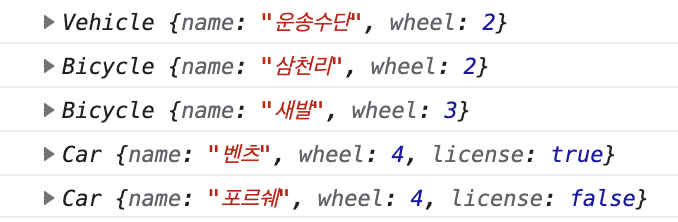

## 상속(확장)

미리 만들어진 정보에 추가적인 내용 추가로 새로운 기능을 확장하여 관리 가능

```jsx
class Vehicle {
  constructor(name, wheel) {
    this.name = name
    this.wheel = wheel
  }
}
const myVehicle = new Vehicle('운송수단', 2)
console.log(myVehicle)

class Bicycle extends Vehicle { // Vehicle의 내용을 상속받아 사용하겠다는 뜻
  constructor(name, wheel) {
    super(name, wheel)  // super은 Vehicle을 의미, Vehicle의 매개변수 전달
  }
}
const myBicycle = new Bicycle('삼천리', 2)
const daughterBicyle = new Bicycle('새발', 3)
console.log(myBicycle)
console.log(daughterBicyle)

class Car extends Vehicle {  // Vehicle 내용 상속
  constructor(name, wheel, license) {
    super(name, wheel)
    this.license = license  // 추가적인 내용 작성으로 확장
  }
}
const myCar = new Car('벤츠', 4, true)  // 각각 name, wheel, license를 받음
const daughtersCar = new Car('포르쉐', 4, false)
console.log(myCar)
console.log(daughtersCar)
```


