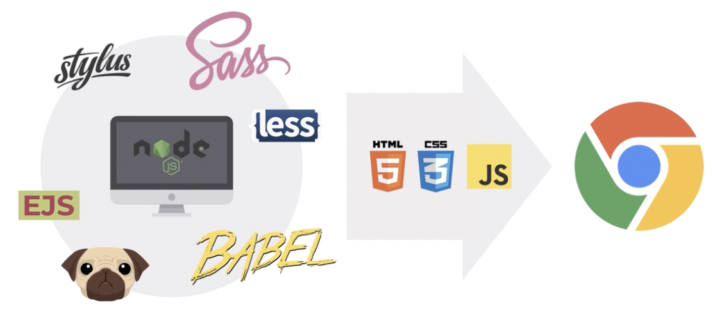

## Node.js

- Chrome V8 JavaScript 엔진으로 빌드된 <u>JavaScript 런타임</u>
- 컴퓨터를 제어
- 컴퓨터와 브라우저에서 모두 실행 가능

설치(신뢰도가 높은 LTS를 권장)
- 보통 짝수 버전이 신뢰도가 높음
- 내가 원하는 버전을 사용할 수 있는 노드 버전 매니저 사용 권장
- [Node.js](https://nodejs.org/ko/)