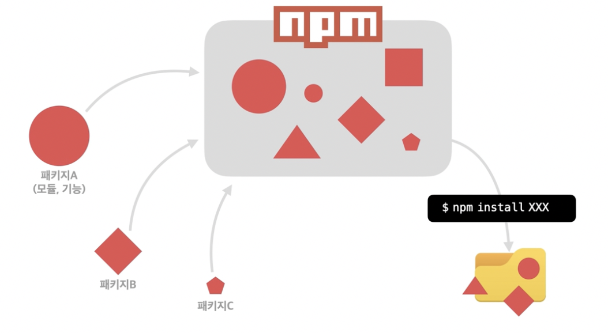
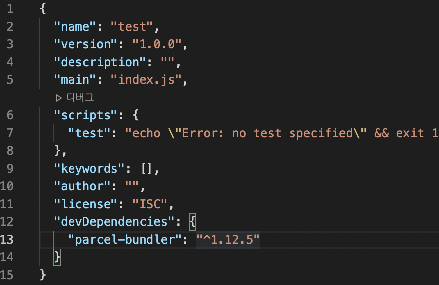
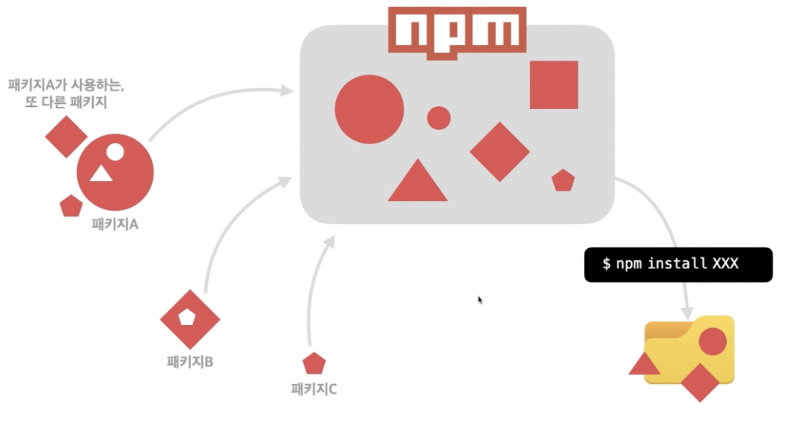
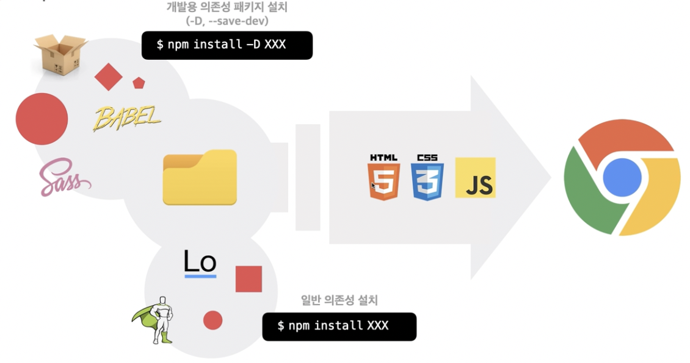

## npm 개요

NPM(Node Package Manager)
- 전 세계의 개발자들이 만든 다양한 기능(패키지, 모듈)들을 관리




- npm으로 패키지 관리

```bash
npm init -y
```

- package.json 파일 생성됨

```json
{
  "name": "test",
  "version": "1.0.0",
  "description": "",
	"main": "index.js",
  "scripts": {
    "test": "echo \"Error: no test specified\" && exit 1"
  },
  "keywords": [],
  "author": "",
  "license": "ISC"
}
```

- 패키지에 필요한 파일 설치

```bash
npm install parcel-bundler -D
```



devDependencies 밑에 설치된 parcel-bundler 표시됨

- lodash 패키지 설치

```bash
npm install lodash
```

- node_modules 패키지 지워졌을 때 설치

```bash
npm install
npm i
```

package-lock.json 파일은 자동으로 관리되는 파일





개발용 의존성 패키지: 개발할 때는 필요하지만 웹 브라우저에서는 동작 X
일반 의존성: 웹 브라우저에서 사용되기도 함


## npm 프로젝트의 버전 관리(.gitignore)

node_modules, dist, .cache 폴더는 각각 `npm i` `npm run build` 를 통해 필요할 때마다 생성할 수 있으므로 버전 관리 할 필요가 없음 오히려 버전 관리 시 비효율적이게 됨

버전 관리에 제외하기 위해 `.gitignore` 파일 생성 후 다음과 같이 입력

```bash
.cache/
dist/
node_modules/
```